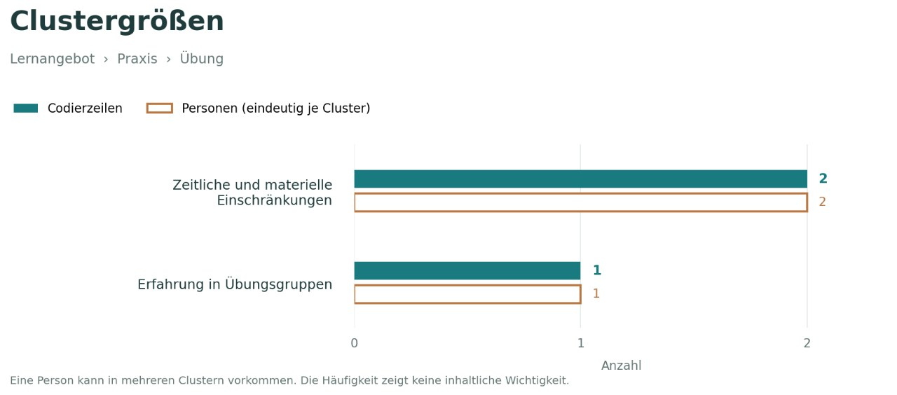
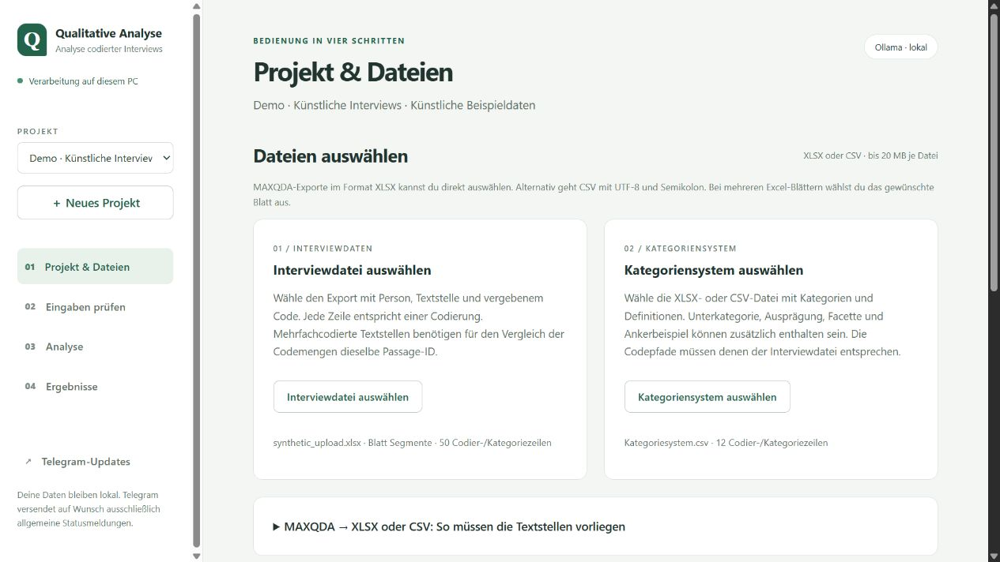
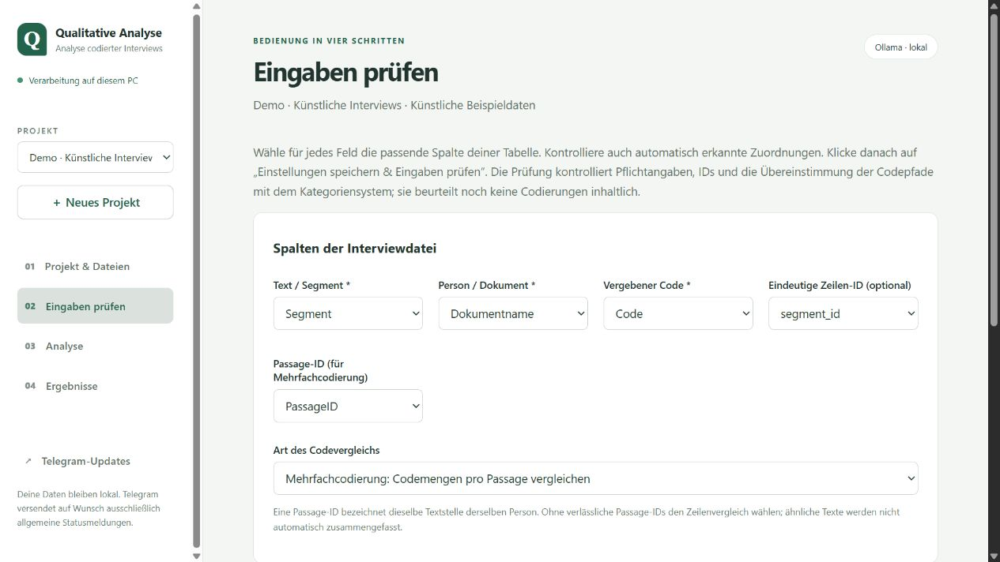
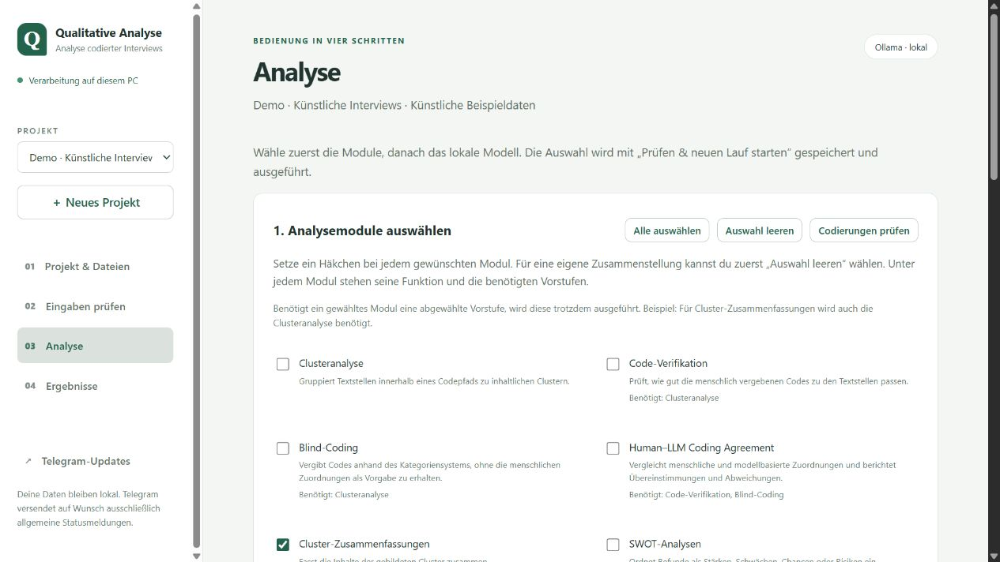
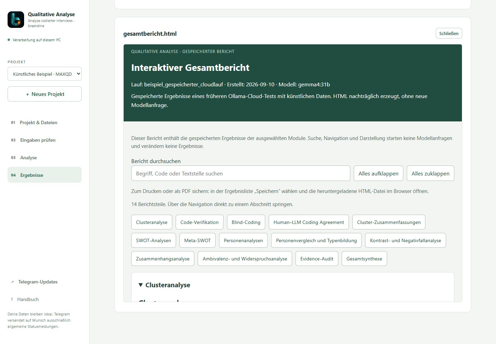
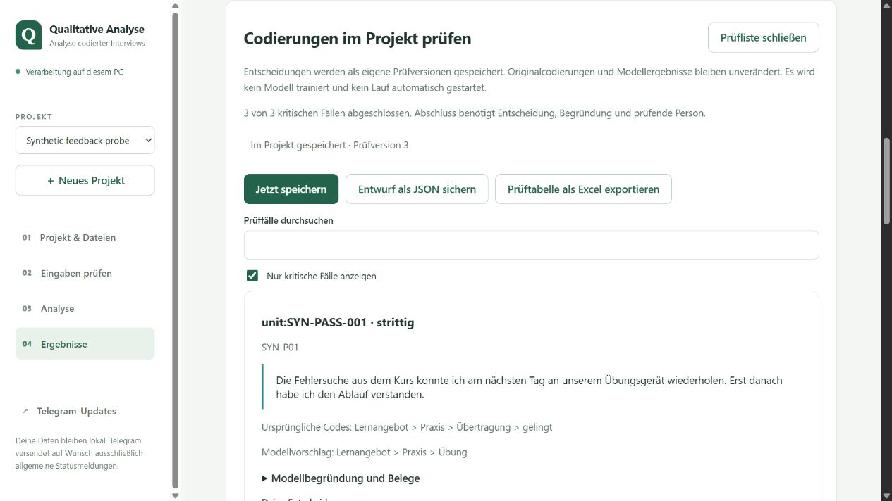
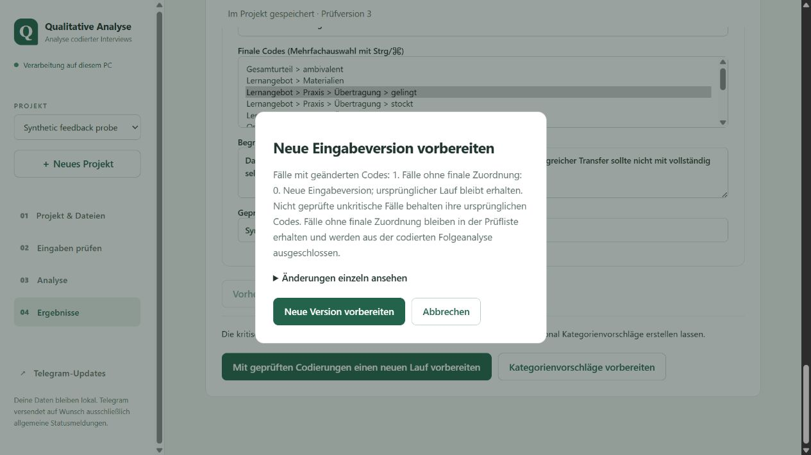
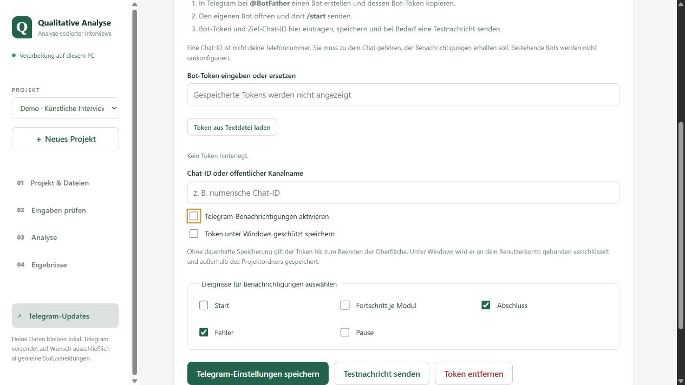
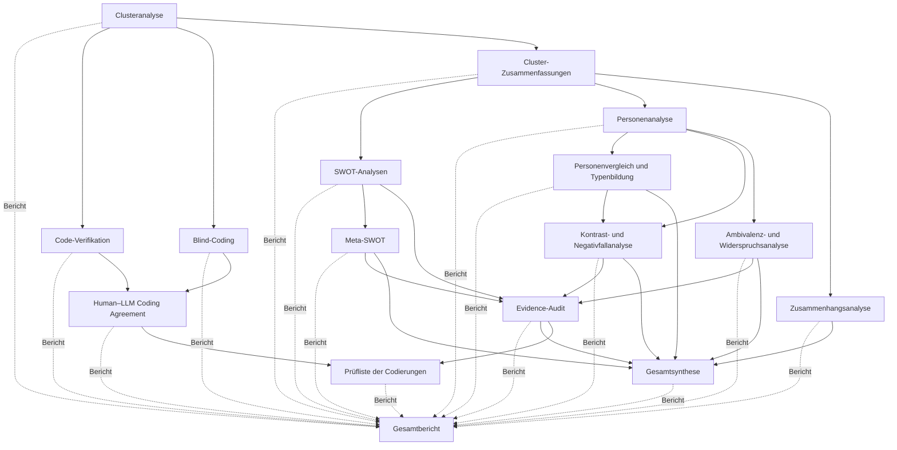

# Qualitative Analyse mit Ollama

Mit diesem Programm kannst du bereits codierte Interviewstellen auswerten und menschliche Codierungen mit Modellvorschlägen vergleichen. Die lokale Bedienoberfläche führt durch Dateiimport, Eingabeprüfung, Modulauswahl und Ergebnisse. Für die normale Bedienung musst du keine Python- oder YAML-Dateien bearbeiten.

Die Auswertung läuft standardmäßig mit lokalem Ollama. Für freigegebene Inhalte sind optional Ollama Cloud, OpenAI, Anthropic und Hugging Face verfügbar; die DSGVO-Sperre ist pro Projekt zunächst aktiviert. Modellvorschläge und Berichte müssen fachlich geprüft werden; sie ersetzen keine eigenständige qualitative Analyse.

**Aktuelle Vorabversion: [0.3.1 · SVG-Patch](https://github.com/braendma/Qualitative-Analyse-mit-Ollama/releases/tag/v0.3.1).** Mit Prüf- und Rückmeldungsfunktion, interaktiven Berichten und optionalen Cloud-Anbietern. OpenAI, Anthropic und Hugging Face sind technisch mit Mocks geprüft, aber noch nicht live getestet.

Das gefaltete **b** von braendma ist jetzt als lokales Programmsignet eingebunden. Über **Handbuch** neben **Telegram-Updates** öffnet sich die vollständige Anleitung mit Bildern und Beispielen, auch ohne Internet.

Neu in 0.3.1: Clusterdiagramme und Konfusionsmatrix zusätzlich als SVG. Der HTML-Bericht bettet bevorzugt Vektorgrafiken ein und bietet „SVG speichern“; PNG bleibt verfügbar.

Seit Beta 3: lesbarere Clusterdiagramme und Konfusionsmatrix, anklickbare Personen–Kategorien-Übersicht und Fallklassifikation im HTML-Bericht. Cloud-Schlüssel werden separat gespeichert und können je Anbieter ersetzt oder entfernt werden. [Anbieter, Datenfreigabe und Grenzen](docs/KI_ANBIETER.md).



## Einstieg

- [Vollständiges Handbuch mit Bildern und Beispielen](docs/HANDBUCH.md) · offline: `docs/HANDBUCH.html`
- [Beta 3 und frühere Versionen: Änderungen und Hinweise zum Umstieg](docs/RELEASE_NOTES.md)
- [Geprüfte Installation und Paketversionen](docs/INSTALLATION_TEST.md)
- [Einrichten und öffnen](#einrichten-und-öffnen)
- [1. Projekt und Dateien auswählen](#1-projekt-und-dateien-auswählen)
- [2. Spalten zuordnen und Eingaben prüfen](#2-spalten-zuordnen-und-eingaben-prüfen)
- [3. Module auswählen und Analyse starten](#3-module-auswählen-und-analyse-starten)
- [4. Ergebnisse ansehen und Entscheidungen sichern](#4-ergebnisse-ansehen-und-entscheidungen-sichern)
- [Optional: Telegram-Updates](#optional-telegram-updates)
- [Ausführliche Bedienungsanleitung und MAXQDA-Exportformat](docs/BEDIENOBERFLAECHE.md)

## Einrichten und öffnen

1. Das **gesamte Repository** über GitHub **Code → Download ZIP** herunterladen und entpacken. Dateien und Unterordner zusammenlassen.
2. Python **3.10 oder neuer** und Ollama installieren, falls sie noch fehlen. Für die spätere Analyse muss ein geeignetes lokales Ollama-Modell vorhanden sein. Der Speicherbedarf hängt vom Modell und Kontextfenster ab.
3. Unter Windows einmal **`Einrichtung.cmd`** doppelklicken. Dabei werden die benötigten Python-Pakete aus dem Internet installiert. Es wird noch kein Modell ausgeführt.
4. **`Start_Oberflaeche.cmd`** doppelklicken. Die Oberfläche öffnet sich im Browser. Das zugehörige Startfenster während eines Analyselaufs geöffnet lassen.

Zum Kennenlernen **„Künstliche Beispieldaten laden“** wählen. Die Demo enthält 50 erfundene Codierzeilen aus 43 Passagen. Das Laden und die Eingabeprüfung benötigen keinen Modellaufruf. Erst **„Prüfen & neuen Lauf starten“** startet die Analyse.

Bei einer bereits eingerichteten Python-Umgebung ist alternativ `python -X utf8 src/local_app.py` möglich. Die Oberfläche verwendet standardmäßig lokales Ollama. Optionale Cloud-Verbindungen werden unter **Analyse → Datenfreigabe und Modell** freigeschaltet. Einrichtung, Betrieb auf anderen Systemen und Datenablage: [Bedienungsanleitung](docs/BEDIENOBERFLAECHE.md).

**Zu den Bildern:** Alle Screenshots zeigen die tatsächliche Oberfläche mit künstlichen Beispieldaten. Sie enthalten keine Interviewdaten einer realen Studie und keine Zugangsdaten. Die Bilder lassen sich für eine größere Ansicht anklicken. Einige zeigen einen Ausschnitt einer längeren Seite; zum nächsten Bereich in der Oberfläche nach unten scrollen.

## 1. Projekt und Dateien auswählen

Über **„＋ Neues Projekt“** ein Projekt anlegen und einen Namen vergeben. Anschließend zwei Dateien auswählen:

| Datei | Benötigter Inhalt |
|---|---|
| Interviewdatei | Pro Codierzeile: Dokument/Person, vollständiger Codepfad und Originaltext der Textstelle |
| Kategoriensystem | Kategorien und Definitionen; bei Bedarf Unterkategorie, Ausprägung, Facette und Ankerbeispiel |

**XLSX und CSV können auch gemischt verwendet werden.** Einen MAXQDA-Excel-Export der **Liste der codierten Segmente** kannst du direkt als `.xlsx` auswählen. Bei mehreren Tabellenblättern erscheint eine Blattauswahl. Die erste Zeile muss eindeutige Überschriften enthalten. Eine reine Liste von Codenamen ohne Textstellen reicht nicht aus.

CSV bleibt möglich: **UTF-8 und Semikolon** als Trennzeichen. Jede Datei darf höchstens 20 MB groß sein. Die Anwendung arbeitet mit lokalen Kopien; die Originaldateien bleiben unverändert. Unter **„Dateivorschau“** kannst du die ersten fünf Datenzeilen kontrollieren.

[](docs/screenshots/01-projekt-dateien.jpg)

Unterhalb der Dateiauswahl Thema und Fragestellung, Teilnehmende und Methodik eintragen. Diese Angaben werden später als Kontext an das Modell übergeben. Details zu Tabellenstruktur, Codepfaden und Mehrfachcodierung: [Textstellen aus MAXQDA vorbereiten](docs/BEDIENOBERFLAECHE.md#textstellen-aus-maxqda-vorbereiten).

## 2. Spalten zuordnen und Eingaben prüfen

Fehlende Zeilen-IDs erzeugt das Programm automatisch. Für MAXQDA-Exporte ohne Passage-ID gibt es **Passage-IDs vorbereiten**: gleiche Dokumentgruppe, Dokumentkennung, Anfang, Ende und exakter Text ergeben Vorschläge. Bestätigte Gruppen teilen anschließend eine ID; die Anwendung erstellt eine neue Arbeitskopie. Die Originaldatei bleibt erhalten. Details und Grenzen: [IDs im Handbuch](docs/HANDBUCH.md#4-ids-ohne-händisches-nummerieren).

Unter **„Eingaben prüfen“** kontrollieren, ob die automatisch vorgeschlagenen Spalten stimmen. Abweichende Spaltennamen lassen sich über die Auswahllisten zuordnen.

| Feld in der Oberfläche | Typische Spalte im MAXQDA-Export |
|---|---|
| Text / Segment | `Segment` |
| Person / Dokument | `Dokumentname` |
| Vergebener Code | `Code` |
| Eindeutige Zeilen-ID | Optional, beispielsweise `segment_id` |
| Passage-ID | Nur zuordnen, wenn eine verlässliche ID für dieselbe tatsächliche Textstelle vorliegt |

Eine **Passage-ID** verbindet mehrere Codierungen derselben Textstelle derselben Person. Sie ist etwas anderes als eine eindeutige Zeilen-ID. Fehlen verlässliche Passage-IDs, das Feld unzugeordnet lassen und **„Zeilenvergleich: eine Codierung pro Zeile, ohne Kappa“** wählen. Gleiche Wörter oder Absatznummern allein reichen nicht zur Zusammenfassung mehrerer Zeilen.

[](docs/screenshots/02-spalten-zuordnen.jpg)

Darunter die Spalten des Kategoriensystems zuordnen, mindestens **Kategorie** und **Definition**. Dann **„Einstellungen speichern & Eingaben prüfen“** anklicken. Die Prüfung meldet beispielsweise fehlende Pflichtangaben, unpassende IDs oder Codes, die im Kategoriensystem fehlen. Sie zeigt bei Erfolg die Zahl der Codierzeilen, Passagen, Personen und Codepfade. Es wird noch keine inhaltliche Modellanalyse durchgeführt.

Unter **„Kategorienversionen vergleichen“** lässt sich eine neue Datei vor dem Speichern mit einer früheren Version vergleichen: neue bzw. entfernte Codes, geänderte Definitionen und betroffene Codierzeilen. Die Vorschau verändert keine Codierungen.

## 3. Module auswählen und Analyse starten

Unter **„Analyse“** kannst du zunächst mit **„Systemprüfung ohne Modellaufruf“** Pakete, Schreibrechte, Speicher und die gewählte KI-Verbindung kontrollieren. Ein gesonderter kurzer Modelltest startet erst nach Bestätigung.

Unter **„Analyse“** stehen die verfügbaren Module mit Häkchen, kurzer Erklärung und benötigten Vorstufen. Mit **„Auswahl leeren“** kannst du eine eigene Zusammenstellung beginnen. **„Alle auswählen“** und **„Codierungen prüfen“** setzen eine Vorauswahl, die du anschließend anpassen kannst.

**Abhängigkeiten werden zusätzlich ausgeführt.** Wenn du beispielsweise nur **„Cluster-Zusammenfassungen“** ankreuzt, läuft vorher trotzdem die Clusteranalyse. Die Anzeige unter der vollständigen Modulliste nennt die tatsächlich auszuführende Anzahl und automatisch benötigte Vorstufen. Auch eine einzelne Auswahl kann deshalb mehrere Module auslösen.

[](docs/screenshots/03-module-auswaehlen.jpg)

Weiter unten ein **lokal installiertes Modell** auswählen. **„Installierte Modelle anzeigen“** fragt nur die Modellliste ab; es lädt kein Modell herunter und startet keine Inferenz. Zusätzliche Einstellungen wie Kontextfenster, Antwortlimit, Temperatur und Thinking liegen unter **„Erweiterte Modelleinstellungen“**.

Mit **„Prüfen & neuen Lauf starten“** werden die Einstellungen gespeichert, die Eingaben erneut geprüft und anschließend die ausgewählten Module samt Vorstufen ausgeführt. Unter dem Startknopf erscheinen Fortschritt, aktuelles Modul und empfangene Modellantworten. Die Codierprüfungen und Kategorienvorschläge zeigen zusätzlich bearbeitete Zeilen, Passagen oder Prüfblöcke.

**„Nach diesem Modul pausieren“** wartet das laufende Modul ab. **„Diesen Lauf fortsetzen“** setzt einen pausierten oder fehlgeschlagenen Lauf mit seinen ursprünglichen Dateien und Einstellungen fort. Nach Änderungen am Programm kann ein neuer Lauf erforderlich sein; ältere Checkpoints werden nicht automatisch migriert.

## 4. Ergebnisse ansehen und Entscheidungen sichern

Nach erfolgreichem Lauf erscheint **Interaktiven Bericht öffnen**. Suche, Inhaltsnavigation und eingebettete Grafiken funktionieren auch in der heruntergeladenen HTML-Datei offline. Der Bericht bleibt beim Lauf gespeichert und lässt sich später unter **Ergebnisse** erneut öffnen. Einzelberichte und Datendateien sind in einer aufklappbaren Liste gesammelt.

[](docs/screenshots/08-interaktiver-bericht.jpg)

Unter **„Ergebnisse“** einen Lauf und dann **„Ansehen“** oder **„Speichern“** bei der gewünschten Datei wählen. Je nach ausgeführten Modulen entstehen Gesamtbericht, Einzelberichte, Grafiken und die interaktive Prüfliste. Die Prüfliste erscheint nur, wenn ihr Modul einschließlich der benötigten Vorstufen ausgeführt wurde.

In **„Codierungen im Projekt prüfen“** Originaltext und Zuordnungen vergleichen, eine Entscheidung wählen sowie Begründung und Prüfkürzel eintragen. Die Oberfläche speichert Änderungen automatisch als eigene Prüfversionen. Auf **„Im Projekt gespeichert“** achten. Excel und JSON können zusätzlich exportiert werden.

[](docs/screenshots/05-pruefentscheidungen.jpg)

Sind alle kritischen Fälle abgeschlossen, kannst du einen **Folgelauf mit geprüften Codierungen vorbereiten** oder optional **Kategorienvorschläge** durch das Modell erstellen lassen. Beide Schritte verlangen einen ausdrücklichen Start. Der Folgelauf erhält neue Eingaben und Ergebnisse; Modellvorschläge ändern das Kategoriensystem nicht automatisch. Beurteilungen trainieren das Modell nicht.

[](docs/screenshots/06-folgelauf-vorbereiten.jpg)

Die separate Offline-Datei `review_queue.html` benötigt weiterhin manuelles Speichern und Laden ihrer JSON-Entscheidungen. Ein automatischer Rückimport nach MAXQDA ist nicht enthalten. [Vollständige Anleitung zu Prüfung, Export, Folgelauf und Kategorienvorschlägen](docs/PRUEFUNG_UND_FOLGELAUF.md).

## Optional: Telegram-Updates

Diesen Bereich überspringen, wenn du keine Benachrichtigungen möchtest. Andernfalls Bot-Token und Ziel-Chat-ID eintragen. Der Token kann aus einer Textdatei geladen, ersetzt oder entfernt werden. Unter Windows lässt er sich für das aktuelle Benutzerkonto verschlüsselt speichern.

[](docs/screenshots/04-telegram-optional.jpg)

Gewünschte Ereignisse auswählen und **„Telegram-Einstellungen speichern“** anklicken. Ein neuer Token ersetzt den bisherigen; ein leeres Tokenfeld behält einen vorhandenen Token bei. **„Testnachricht senden“** versendet ausdrücklich eine Nachricht an den gespeicherten Ziel-Chat. Automatische Meldungen enthalten nur allgemeinen Status und Modulfortschritt sowie höchstens alle zwei Minuten veränderte Zwischenstände, keine Interviewtexte oder Projektnamen. Vollständige Einrichtung: [Telegram-Anleitung](docs/BEDIENOBERFLAECHE.md#telegram-optional-einrichten).

## Wenn etwas nicht funktioniert

| Meldung oder Situation | Nächster Schritt |
|---|---|
| Python-Paket fehlt, etwa `openpyxl` | `Einrichtung.cmd` erneut ausführen; für die Paketinstallation ist Internet nötig. |
| XLSX wird abgewiesen | Erste Zeile auf Überschriften prüfen; Formeln in einer Kopie durch Werte ersetzen. Alte `.xls`-Dateien als `.xlsx` speichern. |
| Passage-ID fehlt | Verlässliche IDs ergänzen oder den Zeilenvergleich ohne Kappa wählen. |
| Ein Code fehlt im Kategoriensystem | Vollständigen Codepfad mit den Kategorieebenen abgleichen und die Eingaben erneut prüfen. |
| Ollama oder Modell nicht verfügbar | Ollama starten und prüfen, ob der im Modellfeld eingetragene Name lokal installiert ist. |
| Eine Änderung erscheint nicht | Oberfläche und Startfenster schließen und `Start_Oberflaeche.cmd` neu öffnen. Laufende Analysen zuvor beenden lassen oder pausieren. |

Die Projektdaten liegen unter Windows standardmäßig in `%LOCALAPPDATA%\QualitativeOllama`. Für eine Sicherung die Oberfläche nach Abschluss eines Laufs schließen und den Projektordner kopieren. Die öffentliche Projektversion und die Screenshots enthalten ausschließlich künstliche Daten. Mehr zu [Datenablage und Zugriffsschutz](docs/BEDIENOBERFLAECHE.md#wo-liegen-meine-daten), [Robustheit und Wiederaufnahme](docs/ROBUSTNESS.md) und [Tests samt Grenzen](docs/TEST_REPORT.md).

## Technische Referenz

Die folgenden Abschnitte beschreiben den Workflow, die YAML-Konfiguration und den direkten Aufruf einzelner Programme. **Der Kommandozeilen-Runner erwartet weiterhin CSV**; die Oberfläche übernimmt den XLSX-Import und erstellt die interne CSV-Arbeitskopie.

# 🧩 Aktueller Analyse-Workflow



---

# ✅ Coding-Validierung und Human–LLM Agreement

Mehrfachcodierung, die lokale Prüfliste mit getrennten Entscheidungen und die mehrstufige Gesamtsynthese sind in [EXTENSIONS.md](docs/EXTENSIONS.md) beschrieben.

Die drei Coding-Module werden wie alle anderen Schritte ausschließlich über `config/config_v2.yaml` eingebunden:

1. **`code_verification`** prüft den menschlich vergebenen vollständigen Codepfad gegen Definition und Ankerbeispiel des externen Kategoriesystems. Ergebnisse sind `bestätigt`, `teilweise_passend`, `nicht_passend` oder `unklar`.
2. **`blind_coding`** erhält Segment und Codebuch, aber nicht den menschlichen Code. Im Multi-Label-Modus erhält jede Passage eine unabhängige Codemenge; Single-Label bleibt ebenfalls verfügbar.
3. **`coding_agreement`** vergleicht im Multi-Label-Modus ganze Codemengen pro Passage: exakte Mengenübereinstimmung, Micro-Präzision, Recall, F1, Jaccard und fehlende/zusätzliche Codes. Im Single-Label-Modus bleiben hierarchische Übereinstimmung, Verwechslungspaare und unter den dokumentierten Voraussetzungen exploratives Kappa verfügbar.

Alle LLM-genannten Codepfade und Segment-IDs werden gegen die tatsächlichen Eingaben validiert. Erfundene Alternativcodes werden verworfen und protokolliert. Nach Reparatur weiterhin ungültige Hauptantworten werden als technische Fehler ausgewiesen; ein unvollständiges Modul stoppt den Workflow. Inhaltliche Unsicherheit bleibt davon getrennt.

Die Kennzahlen werden ausdrücklich als **Human–LLM Coding Agreement** bezeichnet und nicht als klassische Interrater-Reliabilität zwischen unabhängigen menschlichen Ratern.

Während der Verifikation und des zeilenweisen Single-Label-Blind-Codings zeigt die Konsole dynamisch:

```text
[Code-Verifikation] [########------------] 20/50 (40.00%) | Laufzeit 00:02:00 | Restzeit ca. 00:03:00
```

Optional können die unveränderten LLM-Antworten als append-only JSONL-Audit gespeichert werden:

```yaml
coding_validation:
  log_raw_llm_output: false  # auf true setzen für Raw-Audit
```

Bei `true` entstehen `code_verification_raw.jsonl` und `blind_coding_raw.jsonl`. Diese Dateien können sensible, aus Interviewmaterial abgeleitete Inhalte enthalten und sollten nicht ungeprüft geteilt werden.

## Passage-IDs für Mehrfachcodierungen

Die öffentliche YAML verwendet `coding_agreement.label_mode: multi_label` und `columns.unit_id: PassageID`. Mehrfach codierte Passagen besitzen dieselbe Passage-ID, exakt denselben Text und dieselbe Person; jede Codierzeile behält eine eigene Segment-ID. Fehlende oder widersprüchliche Passage-IDs werden vor Modellaufrufen abgewiesen. Gleiche Texte werden nicht automatisch zusammengelegt.

Das Modell sagt einmal pro Passage eine Codemenge vorher. Technische Fehler und Enthaltungen werden getrennt von einer begründet leeren Zuordnung ausgewiesen. Cohen's Kappa wird im Multi-Label-Modus nicht berechnet.

## Codierungen lokal prüfen

Das zusätzliche Modul `review_queue` erzeugt nach Coding-Agreement und Evidence-Audit `review_queue.html`, `review_queue.json` und `review_queue.md`. Die HTML-Datei lässt sich direkt im Browser öffnen und zeigt Originalpassagen, menschliche Codes, Modellvorschläge, Begründungen und zugehörige Audit-Gegenbelege.

In der separaten Offline-HTML-Prüfliste werden Prüfentscheidungen über **„Entscheidungen speichern“** als separate JSON-Datei heruntergeladen und über **„Entscheidungen laden“** wieder eingelesen. Diese Offline-Variante speichert nicht automatisch. Die Projektansicht besitzt dagegen eine eigene automatische Speicherung; siehe [Prüfung und Folgelauf](docs/PRUEFUNG_UND_FOLGELAUF.md). Original-CSV und Modelloutputs werden nicht verändert. Die Validierung einer gespeicherten Prüfversion ist in [EXTENSIONS.md](docs/EXTENSIONS.md) beschrieben.

---

# 🔬 Die Module

## 1. Clusteranalyse

Die Pipeline zerlegt den konfigurierten Codepfad in:

```text
Hauptkategorie > Unterkategorie > Ausprägung > Facette
```

Cluster werden **innerhalb des vollständigen Hierarchiepfades** gebildet. Gleichnamige Facetten unter unterschiedlichen Haupt- oder Subkategorien bleiben dadurch getrennt.

Konfigurierte externe Segment-IDs bleiben erhalten. Ohne konfigurierte ID-Spalte werden global eindeutige Ersatzkennungen erzeugt:

```text
Dokumentname#SEG00000
Dokumentname#SEG00001
Dokumentname#SEG00002
...
```

Die Nummerierung läuft über den gesamten Datensatz und startet nicht pro Person oder Facette neu.

**Outputs:**

```text
clusterer_output.md
clusters_output.json
id_to_text.json
plots/
```

---

## 2. Cluster-Zusammenfassungen

Für jedes Cluster wird eine datenbasierte Zusammenfassung erzeugt. Hierarchie, Clusterdefinition und Segmentreferenzen bleiben erhalten.

**Outputs:**

```text
summary_v1.md
summary_v1.json
```

---

## 3. SWOT pro vollständigem Codepfad

SWOT wird nicht nur auf Hauptkategorie-Ebene durchgeführt, sondern auf Ebene des vollständigen Pfades:

```text
Hauptkategorie > Unterkategorie > Ausprägung > Facette
```

Analysiert werden:

- **Stärken**
- **Schwächen**
- **Chancen**
- **Risiken**

Jeder Befund wird strukturiert mit Thema, Analyse und validierten Segment-IDs gespeichert.

Chancen und Risiken dürfen vorsichtige analytische Ableitungen sein, müssen aber unmittelbar im Material angelegt sein.

**Outputs:**

```text
swot_v1.md
swot_v1.json
```

---

## 4. Meta-SWOT

Die Meta-SWOT verdichtet die einzelnen SWOT-Befunde über mehrere Codepfade hinweg.

Dabei wird unterschieden zwischen:

- **übergreifenden Mustern**, die von mehreren Analysepfaden getragen werden,
- **quellenspezifischen Einzelbefunden**, die bewusst erhalten bleiben.

Jeder SWOT-Befund erhält dafür eine stabile `finding_id`, die später auch vom Evidence-Audit verwendet werden kann.

**Outputs:**

```text
meta_swot_v1.md
meta_swot_v1.json
```

---

## 5. Personenanalyse

Für jede im Datensatz vorkommende Person wird eine qualitative Fallanalyse erstellt.

Mögliche Bestandteile:

- zentrale Themen
- wiederkehrende Perspektiven
- empirisch belegte Spannungsfelder
- kontrastierende Aspekte innerhalb des Falls
- kurze Gesamtverdichtung

Die Analyse ist ausdrücklich **kein psychologisches Persönlichkeitsprofil**.

**Outputs:**

```text
person_analysis_v1.md
person_analysis_v1.json
```

---

## 6. Personenvergleich und Typenbildung

Die einzelnen Fallanalysen werden miteinander verglichen.

Analysiert werden unter anderem:

- gemeinsame Muster
- zentrale Unterschiede
- vorsichtige qualitative Typen
- nicht eindeutig zuordenbare Fälle

Die Typenbildung ist deskriptiv und datenbasiert – keine psychologische Klassifikation.

**Outputs:**

```text
person_comparison_v1.md
person_comparison_v1.json
```

---

## 7. Kontrast- und Negativfallanalyse

Dieses Modul sucht gezielt nach Fällen, die dominante Muster nicht bestätigen oder relativieren.

Dadurch werden Ausnahmen und abweichende Perspektiven nicht durch zu starke Verdichtung unsichtbar.

**Outputs:**

```text
contrast_analysis_v1.md
contrast_analysis_v1.json
```

---

## 8. Zusammenhangsanalyse

Die Zusammenhangsanalyse untersucht Beziehungen zwischen unterschiedlichen Themen bzw. Codepfaden.

Beziehungen können beispielsweise als:

- gemeinsames Auftreten
- inhaltliche Ergänzung
- Spannungsverhältnis
- von Befragten explizit hergestellte Verbindung

beschrieben werden.

Die Pipeline soll dabei **keine unbelegten Kausalbeziehungen erzeugen**.

Für größere Codesysteme kann die Zahl analysierter Paare in der YAML begrenzt werden:

```yaml
analysis_settings:
  relation_analysis:
    max_pairs: 80
    max_segments_per_path: 6
```

**Outputs:**

```text
relation_analysis_v1.md
relation_analysis_v1.json
```

---

## 9. Ambivalenz- und Widerspruchsanalyse

Dieses Modul untersucht **intrapersonelle Spannungen**.

Im Mittelpunkt steht nicht der Unterschied zwischen zwei Personen, sondern die Frage, ob dieselbe Person unterschiedliche, widersprüchliche oder ambivalente Perspektiven äußert.

Die Segmentbelege werden über vorhandene IDs validiert und anschließend auf den Originaltext zurückgeführt.

**Outputs:**

```text
ambiguity_analysis_v1.md
ambiguity_analysis_v1.json
```

---

## 10. Evidence-Audit

Der Evidence-Audit prüft, **wie breit zentrale Befunde im vorhandenen qualitativen Material abgestützt sind**.

Dabei können unter anderem berücksichtigt werden:

- Zahl stützender Personen
- Zahl stützender Segmente
- Zahl beteiligter Analysepfade
- vorhandene Gegenbelege
- Ambivalenzen und Relativierungen

Wichtig:

> **Empirische Breite ist keine statistische Signifikanz.**

Die Kennzahlen dienen der Nachvollziehbarkeit qualitativer Befunde und nicht der inferenzstatistischen Bewertung.

Zählbare Evidenzmerkmale werden in Python berechnet. Das LLM darf diese Zahlen nicht frei erfinden.

**Outputs:**

```text
evidence_audit_v1.md
evidence_audit_v1.json
```

---

## 11. Gesamtsynthese

Die letzte Analyseebene verbindet aktuell:

- Meta-SWOT
- Personenvergleich
- Kontrastanalyse
- Zusammenhangsanalyse
- Ambivalenzanalyse
- Evidence-Audit

Die Gesamtsynthese arbeitet damit auf bereits verdichteten Analysen und erzeugt eine übergreifende Ergebnisdarstellung.

Bei zu großem Kontext werden analytische Teilbefunde in begrenzten Stufen verdichtet. Das Ergebnis-JSON dokumentiert die Eingaben und Herkunftsverweise jeder Stufe unter `hierarchical_reduction`. Die Grenzen stehen in `llm.hierarchical_synthesis`; bereits ein zu großer fester Prompt wird vor Teilanalyse-Aufrufen abgewiesen. Diese Verarbeitung betrifft die Gesamtsynthese. Vorgelagerte Module behalten ihre eigenen Kontextgrenzen, und Herkunftsverweise garantieren keine semantisch vollständige Verdichtung. Details: [EXTENSIONS.md](docs/EXTENSIONS.md).

**Outputs:**

```text
overall_synthesis_v1.md
overall_synthesis_v1.json
gesamtbericht.md
```

---

# 🚀 Quickstart

## 1. Repository klonen

```bash
git clone https://github.com/braendma/Qualitative-Analyse-mit-Ollama.git
cd Qualitative-Analyse-mit-Ollama
```

## 2. Virtuelle Umgebung erstellen

```bash
python -m venv .venv
```

Linux/macOS:

```bash
source .venv/bin/activate
```

Windows:

```powershell
.venv\Scripts\activate
```

## 3. Dependencies installieren

```bash
pip install -r requirements.txt
```

Aktuell werden verwendet:

```text
pandas
numpy
matplotlib
PyYAML
ollama
```

## 4. Ollama vorbereiten

Ollama installieren und ein geeignetes Modell laden. Die Pipeline unterstützt
sowohl Thinking- als auch klassische Non-Thinking-Modelle. Für aktuelle
Thinking-Modelle sollte auch der Ollama-Python-Client aktuell sein:

```bash
python -m pip install --upgrade ollama
```

Die Modellparameter werden zentral in `config/config_v2.yaml` eingestellt. Es gibt
keine universell optimale Konfiguration: Insbesondere `temperature`, `think`
und `max_tokens` können beeinflussen, ob ein Modell nach dem Reasoning
zuverlässig eine Endantwort liefert. Reasoning und Endantwort teilen sich das
mit `max_tokens` gesetzte Ausgabelimit.

Die folgenden Konfigurationen sind Startpunkte. Je nach Quantisierung,
Promptlänge, Hardware sowie Ollama- und Modellversion kann eine Anpassung
erforderlich sein.

### Beispiel: Granite 4.1 30B ohne Thinking

`granite4.1:30b` ist ein geeignetes Non-Thinking-Beispiel für direkte,
strukturierte Antworten. Die niedrige Temperatur dient als stabiler
Ausgangspunkt für möglichst reproduzierbare qualitative Auswertungen:

```bash
ollama pull granite4.1:30b
```

```yaml
llm:
  model: "granite4.1:30b"
  temperature: 0.05
  max_tokens: 10000
  think: false
  log_thinking: false
```

Je nach verfügbarer Hardware kann stattdessen `granite4.1:8b` oder
`granite4.1:3b` verwendet werden. `think: false` macht hier ausdrücklich klar,
dass eine direkte Endantwort ohne separate Reasoning-Phase erwartet wird.

### Beispiel: Qwen 3.8 27B

```bash
ollama pull qwen3.8:27b
```

```yaml
llm:
  model: "qwen3.8:27b"
  temperature: 1.0
  max_tokens: 16000
  think: true
  log_thinking: false
```

### Beispiel: Gemma 4

Diese Konfiguration wurde mit `gemma4:12b` erfolgreich getestet und lieferte
sowohl separates Reasoning als auch eine reguläre JSON-Endantwort:

```bash
ollama pull gemma4:12b
```

```yaml
llm:
  model: "gemma4:12b"
  temperature: 1.0
  # Reasoning und Endantwort teilen sich dieses Ausgabelimit.
  max_tokens: 16000
  think: true
  log_thinking: false
```

Falls im Log `Reasoning vorhanden, aber keine Endantwort` erscheint, sollte
zunächst dieselbe Konfiguration mit `think: false` getestet werden. Funktioniert
die direkte Antwort, kann Thinking anschließend wieder isoliert aktiviert
werden. Ein höheres `max_tokens` kann bei besonders langem Reasoning helfen.

### Beispiel: Granite 4.2

```bash
ollama pull granite4.2:30b
```

```yaml
llm:
  model: "granite4.2:30b"
  temperature: 1.0
  max_tokens: 16000
  think: "low"
  log_thinking: false
```

Je nach Hardware kann stattdessen `granite4.2:8b` oder `granite4.2:3b`
verwendet werden. Granite 4.2 akzeptiert boolesche Werte und Reasoning-Stufen:

```yaml
think: false   # Thinking vollständig deaktivieren
think: true    # Thinking mit der Modell-Voreinstellung aktivieren
think: "low"   # kürzeres Reasoning
think: "high"  # ausführliches Reasoning
```

Für die qualitative Clusterbildung ist `think: "low"` ein guter erster Test.
Bei schwierigen Analyseaufgaben kann anschließend `think: "high"` verglichen
werden.

### Parameter kontrolliert abstimmen

Bei Problemen empfiehlt sich ein Vergleich, bei dem jeweils nur ein Parameter
verändert wird:

1. Mit der vom Modell empfohlenen Temperatur beginnen.
2. `think: false` testen, um eine direkte Endantwort zu prüfen.
3. Thinking danach mit `true` oder einer unterstützten Stufe aktivieren.
4. `max_tokens` erhöhen, wenn Reasoning vorhanden ist, aber die Endantwort fehlt.

Die im Log gemeldete Reasoning-Länge wird in Zeichen angegeben und ist daher
nicht mit der Tokenzahl gleichzusetzen. Gemma 4 verwendet modellseitig unter
anderem `top_p: 0.95` und `top_k: 64`; Qwen 3.8 verwendet unter anderem
`top_p: 0.95` und `top_k: 20`. Diese Werte sind bereits im jeweiligen
Ollama-Modell hinterlegt. Die Pipeline übergibt aus der YAML derzeit
`temperature`, `max_tokens` und `think`; zusätzliche YAML-Zeilen für `top_p`
oder `top_k` hätten ohne eine Programmerweiterung noch keine Wirkung.

Wird `think` weggelassen, entscheidet die Modell-Voreinstellung. Das deaktiviert
Thinking bei Modellen mit standardmäßig aktivem Reasoning nicht sicher. Für
einen eindeutigen Test ohne Reasoning sollte `think: false` gesetzt werden.

### Verarbeitung und Rückwärtskompatibilität

- Moderne Ollama-Versionen liefern Reasoning in `message.thinking` und die
  Endantwort in `message.content`. Nur die Endantwort gelangt in die fachliche
  Auswertung.
- Eingebettete `<think>...</think>`-Blöcke älterer Modelle oder Templates werden
  vor der JSON-Auswertung entfernt.
- Ein abgebrochener Think-Block wird als unvollständige Antwort behandelt,
  sodass die vorhandene Wiederholungslogik greift.
- Akzeptiert ein älterer Python-Client, Server oder ein Non-Thinking-Modell den
  Parameter `think` nicht, wird der Request automatisch ohne diesen Parameter
  wiederholt.
- `log_thinking: false` verhindert die vollständige Ausgabe des Reasonings. Das
  Reasoning wird unabhängig davon nicht Bestandteil der Ergebnis-JSONs.

## 5. Beispieldaten

Das Repository enthält bereits zwei aufeinander abgestimmte fiktive UTF-8-Testdateien mit Semikolon-Trennung:

```text
maxqda_export.csv    # 50 Codierzeilen, 43 Passagen, 6 fiktive Personen
Kategoriesystem.csv # 12 passende Codepfade mit Definitionen und Ankerbeispielen
```

Damit kann der Workflow nach Installation von Ollama und Modell direkt gestartet werden. Für eigene Daten werden beide Dateien ersetzt oder die Pfade in `config/config_v2.yaml` angepasst.

Bei eigenen Daten müssen außerdem die Spaltenzuordnung und die Passage-IDs zum gewählten Coding-Modus passen. Eingaben und Workflow lassen sich ohne Modellaufruf vorprüfen:

```bash
python run_workflow.py --validate-only
```

## 6. Workflow starten

```bash
python run_workflow.py
```

Mit einer anderen Interview-CSV:

```bash
python run_workflow.py --csv eigener_export.csv
```

Mit eigenem Output-Verzeichnis:

```bash
python run_workflow.py \
  --csv eigener_export.csv \
  --output-dir meine_analyse
```

---

# 📥 Erwartete Eingabedaten

Die Pipeline arbeitet auf **bereits kodierten Segmenten**.

Mindestens benötigt werden die in der YAML konfigurierten Spalten für:

```text
Code
Segment
Dokumentname
```

Beispiel:

```csv
Dokumentname;Code;Segment
Interview_01;Hauptthema > Unterthema > Facette A;"Beispielsegment aus einem Interview."
Interview_02;Hauptthema > Unterthema > Facette A;"Weiteres Beispielsegment."
```

Die tatsächlichen Spaltennamen können in der Oberfläche zugeordnet oder bei direktem CLI-Aufruf in `config/config_v2.yaml` angepasst werden.

Bei direkter Nutzung des Runners wird für Code-Verifikation und Blind-Coding zusätzlich eine Kategoriensystem-CSV erwartet. Sie muss diese Spaltenüberschriften enthalten; optionale Inhalte dürfen leer sein. Die Oberfläche ergänzt fehlende optionale Spalten in ihrer Arbeitskopie:

```text
Kategorie
Unterkategorie
Ausprägung
Facette
Definition
Ankerbeispiel
```

Leere Hierarchieebenen sind zulässig. Der vollständige Codepfad wird aus allen nichtleeren Ebenen in der Reihenfolge `Kategorie > Unterkategorie > Ausprägung > Facette` gebildet. Jeder im Interviewexport verwendete Code sollte exakt einem solchen Pfad entsprechen.

---

# ⚙️ YAML-gesteuerte Pipeline

Der zentrale Unterschied zur früheren festen Workflow-Architektur ist die Deklaration unter:

```yaml
pipeline:
  modules:
```

Ein Modul sieht beispielsweise so aus:

```yaml
- id: ambiguity_analysis
  name: Ambivalenz- und Widerspruchsanalyse
  script: ambiguity_analysis.py
  enabled: true
  depends_on:
    - person_analysis

  args:
    - --config
    - "{config}"
    - --person-json
    - person_analysis_v1.json
    - --idmap-json
    - id_to_text.json
    - --out-md
    - ambiguity_analysis_v1.md
    - --out-json
    - ambiguity_analysis_v1.json

  outputs:
    - ambiguity_analysis_v1.md
    - ambiguity_analysis_v1.json

  report:
    title: Ambivalenz- und Widerspruchsanalyse
    markdown: ambiguity_analysis_v1.md
```

`00_WORKFLOW_RUNNER.py`:

1. liest die Moduldefinitionen,
2. prüft Abhängigkeiten,
3. bestimmt automatisch eine gültige Ausführungsreihenfolge,
4. startet die Module,
5. prüft deklarierte Outputs,
6. protokolliert den Status,
7. baut den Gesamtbericht aus den aktivierten Report-Modulen.

---

# ➕ Neues Analysemodul ergänzen

Ein neues Modul benötigt im einfachsten Fall:

```text
mein_modul.py
mein_modul_core.py
```

Danach wird nur die YAML erweitert:

```yaml
- id: mein_modul
  name: Mein neues Analysemodul
  script: mein_modul.py
  enabled: true
  depends_on:
    - summarizer

  args:
    - --config
    - "{config}"
    - --input-json
    - summary_v1.json
    - --out-md
    - mein_modul_v1.md
    - --out-json
    - mein_modul_v1.json

  outputs:
    - mein_modul_v1.md
    - mein_modul_v1.json

  report:
    title: Mein neues Analysemodul
    markdown: mein_modul_v1.md
```

**`00_WORKFLOW_RUNNER.py` muss dafür nicht verändert werden.**

Das macht die Pipeline zu einem kleinen erweiterbaren Framework für qualitative LLM-gestützte Analysebausteine.

---

# 📂 Typische Output-Struktur

```text
workflow_output/<Lauf-ID>/
│
├── clusterer_output.md
├── clusters_output.json
├── id_to_text.json
│
├── code_verification_v1.md
├── code_verification_v1.json
├── code_verification.log
├── blind_coding_v1.md
├── blind_coding_v1.json
├── blind_coding.log
├── coding_agreement_v1.md
├── coding_agreement_v1.json
├── coding_agreement_confusion.jpg  # optional, Single-Label
├── coding_agreement.log
│
├── summary_v1.md
├── summary_v1.json
│
├── swot_v1.md
├── swot_v1.json
│
├── meta_swot_v1.md
├── meta_swot_v1.json
│
├── person_analysis_v1.md
├── person_analysis_v1.json
│
├── person_comparison_v1.md
├── person_comparison_v1.json
│
├── contrast_analysis_v1.md
├── contrast_analysis_v1.json
│
├── relation_analysis_v1.md
├── relation_analysis_v1.json
│
├── ambiguity_analysis_v1.md
├── ambiguity_analysis_v1.json
│
├── evidence_audit_v1.md
├── evidence_audit_v1.json
│
├── review_queue.html
├── review_queue.json
├── review_queue.md
│
├── overall_synthesis_v1.md
├── overall_synthesis_v1.json
│
├── gesamtbericht.md
├── workflow_manifest.json
├── config_snapshot.yaml
├── workflow.log
│
└── plots/
    └── *.jpg
```

---

# 🛡️ Forschungsintegrität und technische Schutzmechanismen

Die Pipeline versucht LLM-Ausgaben möglichst eng an das vorhandene Material zu binden.

Dazu gehören:

- keine externen empirischen Informationen
- keine unbelegten theoretischen Ergänzungen
- keine erfundenen Ursachen oder Wirkungen
- keine psychologischen Diagnosen
- keine frei erfundenen Segment-IDs
- Validierung zurückgegebener Segment-IDs gegen den tatsächlichen Input
- Originaltext-Mapping über `id_to_text.json`
- strukturierte JSON-Outputs
- robuste JSON-Extraktion
- Normalisierung abweichender Modellantworten
- Retry- und Self-Repair-Mechanismen
- separate JSON-Zwischenprodukte
- Workflow-Manifest und Logs
- Validierung sämtlicher LLM-genannter Codes gegen `Kategoriesystem.csv`
- deterministische Rückführung von Originaltexten statt frei erzeugter Zitate
- technische Fehler bei weiterhin ungültigen Antworten; inhaltliches `unklar` bleibt getrennt

Ein LLM kann dennoch Fehler machen. Die Pipeline reduziert bestimmte Fehlertypen, ersetzt aber keine wissenschaftliche Prüfung.

---

# 📊 Visualisierung

Der Clusterer erzeugt Diagramme zu:

- Segmentanzahl pro Cluster
- Zahl unterschiedlicher Personen pro Cluster

Plot-Dateinamen berücksichtigen den vollständigen Analysepfad, damit gleichnamige Facetten aus unterschiedlichen Bereichen keine Dateien überschreiben.

---

# 🔐 Datenschutz

Bei lokaler Nutzung von Ollama kann das Interviewmaterial grundsätzlich auf dem eigenen Rechner verarbeitet werden.

Trotzdem gilt:

> **Lokale Verarbeitung ersetzt keine datenschutzrechtliche und forschungsethische Prüfung.**

Vor Veröffentlichung, Weitergabe, Cloud-Uploads oder dem Teilen von Debug-Dateien sollten personenbezogene Inhalte geprüft und gegebenenfalls anonymisiert oder pseudonymisiert werden.

Das gilt besonders für die optionalen Dateien `code_verification_raw.jsonl` und `blind_coding_raw.jsonl`, da sie unveränderte Modellausgaben enthalten.

Auch Prüflisten und exportierte Prüfentscheidungen gehören bei echten Daten in die private Ablage. Die ausgelieferte Standardkonfiguration verwendet lokales Ollama; die dokumentierten Cloud-Tests wurden ausschließlich mit künstlichem Material durchgeführt.

Die mitgelieferte `config/config_v2.yaml`, `maxqda_export.csv` und `Kategoriesystem.csv` sind neutralisierte bzw. vollständig fiktive öffentliche Beispiele.

---

# ⚠️ Methodische Grenzen

Die Pipeline unterstützt qualitative Analyse, automatisiert aber keine wissenschaftliche Wahrheit.

Insbesondere gilt:

- LLM-Ausgaben können fehlerhaft oder instabil sein.
- Clusterbildung bleibt modell- und promptabhängig.
- Qualitative Häufigkeit ist nicht automatisch qualitative Bedeutung.
- Evidence-Breite ist keine statistische Signifikanz.
- Meta-SWOT-Cluster sind analytische Verdichtungen und keine statistischen Faktoren.
- Typenbildung ist explorativ und keine psychologische Klassifikation.
- Zusammenhangsanalyse darf nicht automatisch als Kausalmodell gelesen werden.
- Ambivalenzen benötigen überprüfbare Belege im Material.
- Chancen und Risiken einer SWOT bleiben interpretative Kategorien.
- Die finale Interpretation und wissenschaftliche Verantwortung liegen bei den Forschenden.

---

# 🧪 Testbarkeit

Stand 2026-09-10: **95 Python-Tests und acht Browserlogik-Tests** bestehen. Zusätzlich wurden alle **15 Workflow-Module** mit Gemma in Ollama Cloud auf dem künstlichen Datensatz geprüft, eine Gesamtsynthese über zwei Verdichtungsstufen ausgeführt und das Speichern/Laden von Prüfentscheidungen im Browser getestet. Die Cloud-Entwicklungsläufe enthielten dokumentierte Abbrüche und Wiederaufnahmen; sie sind kein unabhängiger Qualitätsbenchmark. Zwei weitere Cloud-Abläufe prüften Kategorienvorschläge aus drei künstlich beurteilten Passagen und eine Folgeanalyse mit korrigierten Codes. Der Windows-Verschlüsselungstest benötigte Zugriff auf das normale Benutzerprofil. Ergebnisse und Grenzen: [TEST_REPORT.md](docs/TEST_REPORT.md).

Durch die modulare JSON-basierte Architektur lassen sich einzelne Stufen unabhängig testen.

Unter anderem können kontrolliert geprüft werden:

- Datenfluss
- Segment-ID-Konsistenz
- JSON-Schnittstellen
- Prompt-Platzhalter
- Modulabhängigkeiten
- topologische Ausführungsreihenfolge
- Output-Dateien
- Zitat-Mapping
- Meta-Clustering
- Evidence-Berechnungen
- automatische Berichtserstellung
- Trennung von Reasoning und Endantwort
- Bereinigung vollständiger und abgebrochener `<think>`-Blöcke
- Fallback für Non-Thinking-Modelle und ältere Ollama-Clients

LLM-Antworten können für Integrationstests gemockt werden, sodass ein Großteil der Programmlogik unabhängig vom lokal installierten Modell testbar bleibt.

Die Coding-Validierungs- und Thinking-Tests laufen ohne Ollama-Server und ohne
geladenes Modell:

```bash
python -m unittest discover -s tests -v
```

Zusätzliche Tests für verspätete Browserantworten und Projektwechsel (Node.js wird nur für diese Entwicklungstests benötigt):

```bash
node --test tests/test_local_app_frontend.cjs tests/test_review_frontend.cjs
```

---

# 🧰 Einzelne Module manuell starten

Für Entwicklung oder Debugging können die Module weiterhin einzeln ausgeführt werden:

```bash
python src/clusterer.py
python src/summarizer.py
python src/swot.py
python src/meta_swot.py
python src/person_analysis.py
python src/person_comparison.py
python src/contrast_analysis.py
python src/relation_analysis.py
python src/ambiguity_analysis.py
python src/evidence_audit.py
python src/code_verification.py
python src/blind_coding.py
python src/coding_agreement.py
python src/review_queue.py
python src/overall_synthesis.py
```

Im normalen Betrieb ist jedoch der modulare Runner vorgesehen:

```bash
python run_workflow.py
```

---

# Projektstruktur

```text
Qualitative-Analyse-mit-Ollama/
├── README.md                 Einstieg und bebilderte Anleitung
├── Einrichtung.cmd           Python-Pakete einrichten (Windows)
├── Start_Oberflaeche.cmd      Oberfläche starten (Windows)
├── start_local.ps1           Hilfsskript der Windows-Startdateien
├── run_workflow.py           Direkter CLI-Einstieg
├── requirements.txt          Python-Abhängigkeiten
├── src/                      Analyseprogramme, Oberfläche und Vorlagen
├── config/                   Öffentliche Beispielkonfiguration
├── demo/                     Ausschließlich künstliche Beispieldaten
├── tests/                    Automatisierte Tests und Testfixtures
└── docs/                     Fachliche Dokumentation und Screenshots
```

Vom Projektordner aus startet `python run_workflow.py` den CLI-Workflow. Die Standardkonfiguration liegt in `config/config_v2.yaml`; ihre relativen Eingabepfade zeigen auf `demo/`. Explizite `--config`- und `--output-dir`-Pfade des Runners werden relativ zum aktuellen Arbeitsordner aufgelöst. Ohne `--output-dir` liegt die Ausgabe unter `workflow_output/` im Projektordner. Die Oberfläche speichert Projekte weiterhin in ihrer privaten lokalen Datenablage.

**Umstieg von der bisherigen flachen Ablage:** Das vollständige Projekt in einen neuen Ordner entpacken. Benutzerdefinierte YAML-Dateien bei Bedarf übernehmen und ihre Eingabepfade prüfen; relative Eingabepfade beziehen sich auf den Ordner der YAML-Datei. Der bisherige direkte Aufruf von `00_WORKFLOW_RUNNER.py` wird durch `run_workflow.py` ersetzt. Einzelne Module liegen jetzt unter `src/`. Nach diesem Programmwechsel einen neuen Analyselauf starten; vorhandene Projektdateien und Ergebnisse bleiben erhalten, alte Checkpoints werden nicht automatisch migriert.

---

# 🛠️ Mögliche nächste Erweiterungen

Durch die modulare Architektur können zusätzliche qualitative Analysebausteine relativ einfach ergänzt werden, zum Beispiel:

- Fall × Thema-Matrix
- zeitliche / sequenzielle Interviewanalyse
- analytische Memo-Generierung
- Code-Ko-Okkurrenz-Matrix
- Gruppen- oder Kohortenvergleich
- Stabilitätsanalyse über mehrere LLM-Läufe
- Modellvergleich zwischen verschiedenen Ollama-Modellen
- HTML-/DOCX-/PDF-Reporting
- interaktive Ergebnisexploration
- methodischer Audit-Trail

Contributions und neue Analyseideen sind willkommen.

---

# 🧾 Lizenz

[MIT License](LICENSE)

Frei nutzbar für Forschung, Lehre und Entwicklung entsprechend den Bedingungen der Lizenz.

---

# 🙌 Contributors

### Marcus Brändle

**Konzeption · Forschungsdesign · fachliche Anforderungen · Implementierung · Testing · methodische Validierung**

Initiierung und fachliche Weiterentwicklung des Projekts aus dem Anwendungskontext qualitativer Interviewforschung.

### ChatGPT und OpenAI Codex · OpenAI

**Softwarearchitektur · Code-Co-Authoring · Refactoring · Debugging · Testdesign · Promptarchitektur · Dokumentation**

Mitarbeit an wesentlichen Teilen der modularen Architektur, der Analysebausteine, JSON-Schnittstellen, Fehlerbehandlung, Tests und Dokumentation.

> **Hinweis zur KI-gestützten Entwicklung:** Teile des Codes und der Dokumentation – einschließlich der Coding-Validierungsmodule – wurden in Zusammenarbeit mit ChatGPT und OpenAI Codex entwickelt. KI-generierter oder KI-überarbeiteter Code sollte vor produktiver oder wissenschaftlicher Nutzung geprüft und validiert werden.

---
