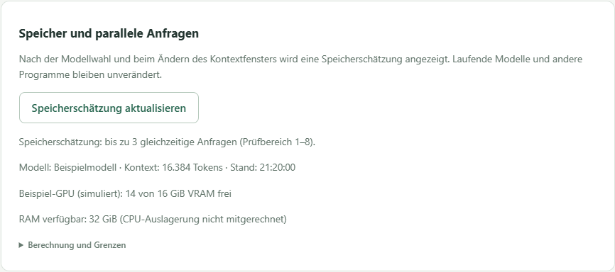
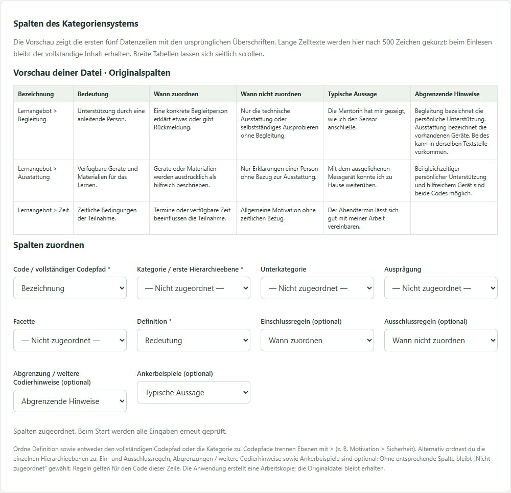
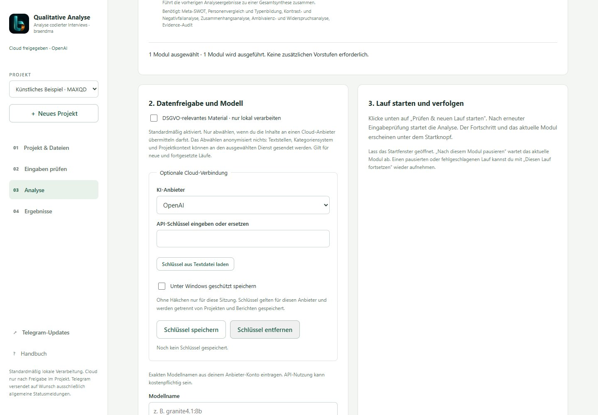
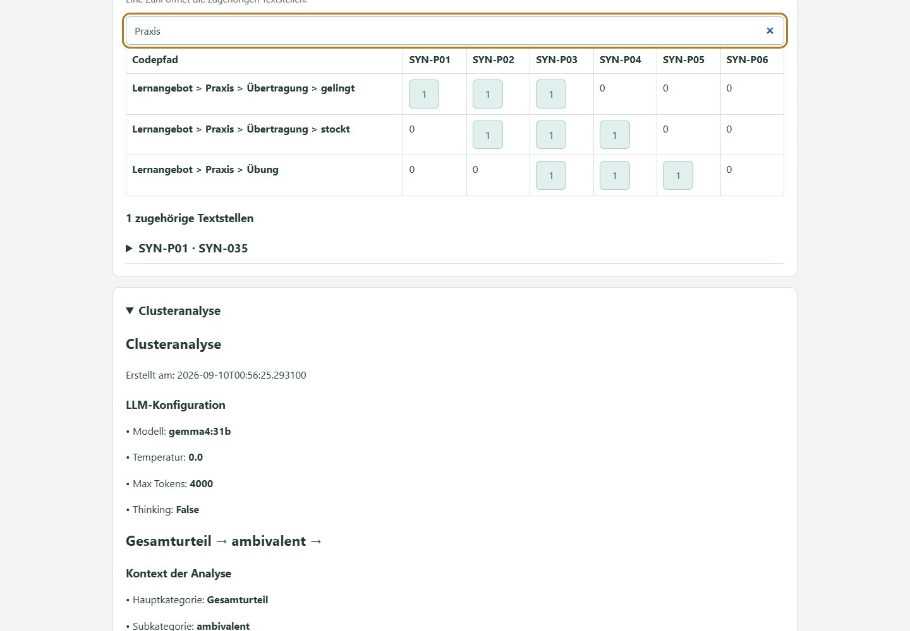
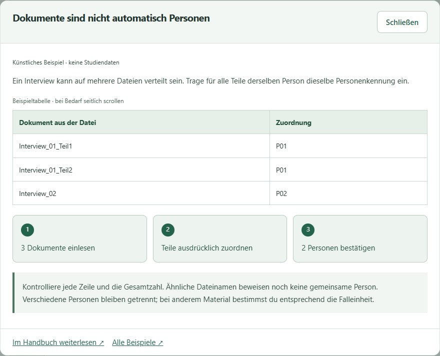
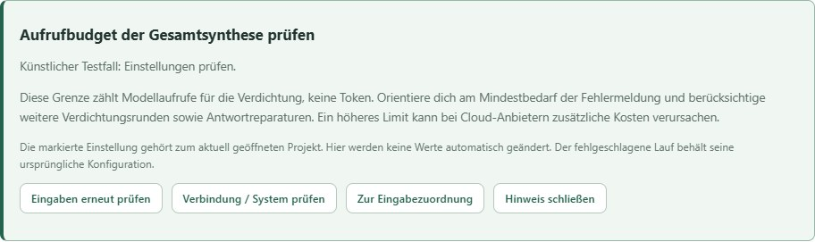
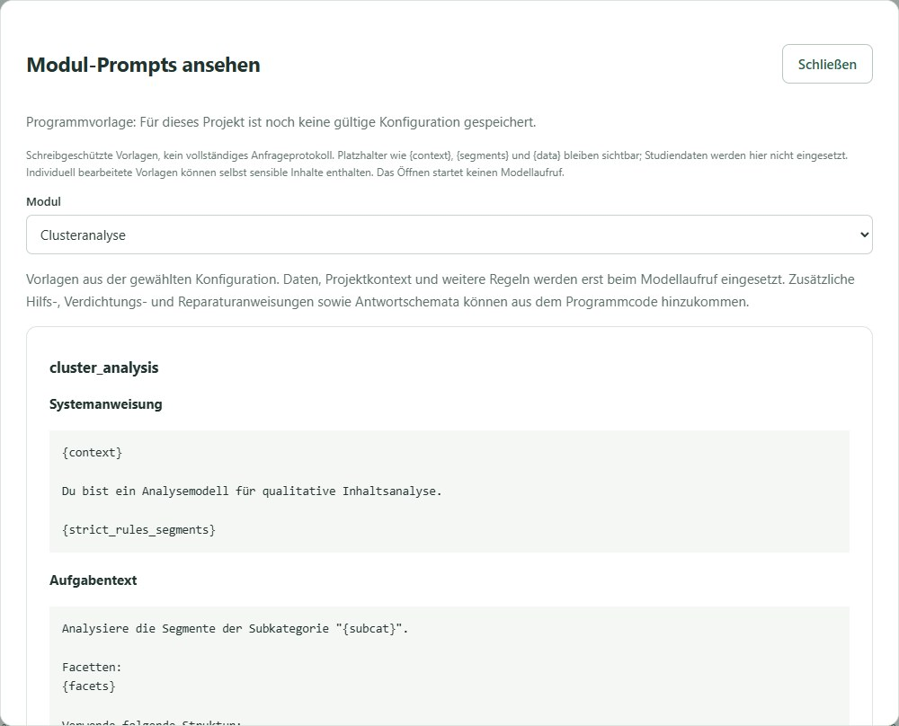

# Handbuch · Qualitative Analyse mit Ollama

Dieses Handbuch begleitet dich vom ersten Start bis zum erneuten Analyselauf mit geprüften Codierungen. Alle Personen, Texte und Beurteilungen in den Beispielen sind erfunden. Stand: 0.4.0-beta.1 · Personenzuordnung und Analysehilfen.

Du erreichst die bebilderte Fassung jederzeit über **Handbuch** neben **Telegram-Updates** in der Seitenleiste. Sie öffnet sich in einem eigenen Tab, damit deine aktuelle Arbeit geöffnet bleibt. Ohne laufende Oberfläche kannst du `docs/HANDBUCH.html` doppelklicken. Den Programmordner einschließlich der Bilder zusammenlassen.

## 1. Einrichten und starten

1. Das vollständige Programm von GitHub herunterladen und entpacken. Einzelne Python-Dateien reichen nicht aus.
2. Python ab Version 3.10 und Ollama installieren. Ein lokales Modell in Ollama bereitstellen; dessen Namen anschließend in der Oberfläche eintragen. Der Speicherbedarf hängt vom Modell und vom Kontextfenster ab.
3. Unter Windows einmal `Einrichtung.cmd` starten. Der Schritt installiert Python-Pakete und benötigt Internet, führt aber keine Interviewanalyse aus.
4. `Start_Oberflaeche.cmd` öffnen. Die Bedienung erfolgt im Browser; das Startfenster während eines Laufs geöffnet lassen.
5. Unter **Analyse → Systemprüfung ohne Modellaufruf** die Einrichtung prüfen. **Kurzen Modelltest vorbereiten** ist eine getrennte, optionale Aktion, die eine künstliche Anfrage beim gewählten Anbieter ausführt.

Die Standardkonfiguration verwendet lokales Ollama. Optional lassen sich Cloud-Anbieter je Projekt freigeben; die Datenfreigabe wird im folgenden Abschnitt erklärt. Für eine reine Cloud-Nutzung ist kein lokales Modell nötig. Die API-Zugangsdatei gehört weder ins Repository noch in Beispielprojekte.

### Speicher und parallele Anfragen

Unter **Analyse → Speicher und parallele Anfragen** erscheint nach Wahl eines lokalen Ollama-Modells automatisch eine Schätzung. Änderungen am Kontextfenster lösen eine neue Prüfung aus. **Speicherschätzung aktualisieren** liest eine neue Momentaufnahme ein, etwa wenn ein anderes GPU-Programm beendet wurde. Es werden keine Modelle geladen, entladen oder Testtexte gesendet.

Die Anzeige nennt beispielsweise **„Speicherschätzung: bis zu 3 gleichzeitige Anfragen“**, das gewählte Kontextfenster sowie freien VRAM je NVIDIA-GPU und verfügbaren RAM. Das folgende Bild verwendet simulierte Hardware- und Modellwerte, keine Messung eines bestimmten PCs.



Die Schätzung prüft 1 bis 8 Anfragen für vollständig auf GPUs geladene Modelle. Sie berücksichtigt Modellgröße, Kontextcache in f16 und Reserven. Mehr Kontext oder andere GPU-Belegung kann die Zahl verringern. CPU-Auslagerung, AMD und Apple werden nicht geschätzt. Bei fehlenden Modelldaten, nicht unterstützten Architekturen oder einem bereits geladenen Modell erscheint eine Erklärung statt einer ungesicherten Zahl. Ein Wert von 0 bedeutet nur, dass mit der aktuellen Belegung und den Reserven keine reine GPU-Ausführung abgeschätzt werden kann.

Unter **Gleichzeitige Anfragen** wählst du 1 bis 8. **1 ist der Standard** und verwendet deinen bestehenden Ollama-Server. Ab **2** startet der Workflow eine eigene, nur auf diesem PC erreichbare Ollama-Instanz mit `OLLAMA_NUM_PARALLEL` in der gewählten Höhe. Du brauchst dafür keine Servereinstellung von Hand zu ändern. Ollama muss lokal installiert sein; die eigene Instanz verwendet denselben Modellordner (`OLLAMA_MODELS`, falls gesetzt). Es wird kein Modell heruntergeladen.

1. Lokales Modell und Kontext wählen und die Schätzung abwarten.
2. Beispielsweise **2** wählen, wenn die Schätzung mindestens 2 ergibt.
3. Einstellungen speichern, Eingaben prüfen und den Lauf starten. Direkt vor dem Start wird der Speicher erneut geprüft. Bei unbekannter oder zu geringer Kapazität wird der Parallelstart mit einer Erklärung abgewiesen; du kannst mit **1** arbeiten oder Modell, Kontext und Belegung anpassen.

**Was parallel läuft:** Die Clusterbildung arbeitet kategorienweise; Code-Verifikation und Blindcodierung arbeiten mit unabhängigen Textstellen bzw. vollständigen Passage-Gruppen. Pro Einheit bleibt die Verarbeitung samt nötiger Antwortreparatur zusammen. Ergebnisse behalten ihre ursprüngliche Reihenfolge. Abhängige Analysestufen und die Erstellung der Grafiken laufen nacheinander; nicht jede Phase kann daher die gewählte Zahl auslasten. Cloud-Anbieter bleiben bei einer Anfrage.

Die eigene Instanz wird nach Abschluss, Fehler oder einer Pause zwischen Modulen beendet. Bestehende Ollama-Server werden nicht umkonfiguriert. Bei einem Programmabbruch beendet ein Wächter die eigene Instanz; bereits geprüfte Zwischenstände bleiben für die Wiederaufnahme erhalten. Im Laufmanifest steht die verwendete Parallelität. Eine geänderte Einstellung gilt für einen neuen Lauf; eine Wiederaufnahme verwendet die eingefrorene Konfiguration.

Die Anzeige bleibt eine **Speicherschätzung**, keine garantierte Höchstleistung. Andere Prozesse können Speicher belegen, und Ollamas GPU-Verteilung kann die nutzbare Parallelität begrenzen. Zwei echte parallele Slots wurden mit Granite 4.2:8b getestet; andere Modelle und höhere Werte sind damit nicht als Belastungsgrenze bestätigt. Für einen ersten Versuch 2 wählen. Nach einem Programmupdate einen neuen Lauf beginnen, da sich die Code-Prüfsumme ändert.

Grundlagen: [Ollama: parallele Anfragen und Speicher](https://docs.ollama.com/faq#how-does-ollama-handle-concurrent-requests), [Modellmetadaten](https://docs.ollama.com/api-reference/show-model-details).

## 2. Zuerst die Demo kennenlernen

Auf der Startseite **Künstliche Beispieldaten laden** wählen. Das erzeugt ein eigenes Projekt mit 50 Codierzeilen, 43 Passagen und sechs erfundenen Personen. Das Laden sowie die Eingabeprüfung benötigen kein LLM. Unter **Eingaben prüfen** die Spalten kontrollieren und **Einstellungen speichern & Eingaben prüfen** anklicken. Bei Erfolg erscheinen die Zahlen für Codierzeilen, Passagen, Personen und Codepfade.

Für eine überschaubare erste Analyse unter **Analyse → Auswahl leeren** nur **Clusteranalyse** auswählen. Module mit Abhängigkeiten können weitere Vorstufen hinzufügen; die Zusammenfassung unter den Häkchen zeigt die tatsächlich ausgeführten Schritte. Erst **Prüfen & neuen Lauf starten** führt die Modellauswertung aus.

## 3. Eigenes Projekt und MAXQDA-Dateien

**＋ Neues Projekt** wählen, benennen und zwei Dateien laden: Interviewdatei sowie Kategoriensystem. Du kannst `.xlsx` und `.csv` mischen. Jede Datei darf maximal 20 MB groß sein. Das Programm legt Arbeitskopien an und verändert die ausgewählten Originaldateien nicht.


### Textstellen direkt aus MAXQDA exportieren

In MAXQDA die Übersicht/Liste der **codierten Segmente** öffnen und als Excel-Tabelle exportieren. Benötigt wird die Tabelle mit den tatsächlichen Textstellen, nicht nur das Codesystem mit Codenamen. Behalte nach Möglichkeit auch **Dokumentgruppe**, **Anfang** und **Ende** im Export. Die Schaltflächen und Menünamen können je nach MAXQDA-Version abweichen.

Die XLSX-Datei direkt bei **Interviewdatei auswählen** laden. Bei mehreren Tabellenblättern das Datenblatt mit Kopfzeile auswählen; die Blätter werden nicht zusammengeführt. Falls du die Tabelle nach Excel kopiert hast, muss sie dieselbe Struktur haben: eindeutige Spaltenüberschriften in Zeile 1, keine Titelzeilen darüber, keine verbundenen Zellen und keine leeren Fortsetzungszeilen anstelle von Dokumentnamen. Formeln in einer Kopie durch Werte ersetzen.

CSV geht weiterhin: als **UTF-8 mit Semikolon** speichern. Zeilenumbrüche innerhalb einer Textstelle müssen in derselben Zelle bleiben; Excel setzt beim CSV-Export die nötigen Anführungszeichen.

| Feld | Beispiel | Zuordnung |
|---|---|---|
| Dokumentname | Interview_01 | Person / Dokument |
| Code | Lernangebot > Praxis > Übung | Vergebener Code |
| Segment | Die gemeinsame Übung half mir beim Anwenden. | Text / Segment |
| Anfang, Ende | 12, 12 | Automatisch für Passage-Vorschläge erkannt |
| Dokumentgruppe | Gruppe_A | Automatisch zur Trennung der Vorschläge verwendet |
| segment_id | Z001 | Optional: ohne Spalte automatisch erzeugt |
| PassageID | P001 | Vorhandene ID verwenden oder vorbereiten lassen |

Jede Zeile enthält **eine Codierung**. Bei mehreren Codes für dieselbe Textstelle gibt es mehrere Zeilen. Codepfade verwenden ` > ` zwischen den Ebenen. Mehrere Codes in einer Sammelzelle werden nicht automatisch aufgeteilt. Dokument-/Personenkennungen müssen im Projekt eindeutig sein; gleich benannte Dokumente aus unterschiedlichen Gruppen sollten vorher unterscheidbare Namen erhalten.

### Kategoriensystem vorbereiten

Die separate Tabelle braucht mindestens **Code / vollständiger Codepfad oder Kategorie** sowie **Definition**. Optional sind **Unterkategorie**, **Ausprägung**, **Facette**, **Ankerbeispiele**, **Einschlussregeln**, **Ausschlussregeln** und **Abgrenzung / weitere Codierhinweise**. Jede Zeile beschreibt einen vollständigen Codepfad. Höhere Ebenen je Zeile wiederholen; nicht benötigte tiefere Ebenen bleiben leer.

| Kategorie | Unterkategorie | Ausprägung | Definition | Ankerbeispiel |
|---|---|---|---|---|
| Lernangebot | Praxis | Übung | Aussagen über das eigene praktische Erproben. | Ich konnte das Verfahren selbst ausprobieren. |
| Zusammenarbeit | Gruppe | Austausch | Aussagen über gegenseitige fachliche Hilfe. | Die Erklärung eines anderen Teilnehmers half mir. |

Nach dem CSV-Import (UTF-8, Semikolon) öffnet sich die Vorschau der ersten fünf Zeilen. Direkt über der Spaltenzuordnung unter **Eingaben prüfen** wird dieselbe CSV-Vorschau mit Originalüberschriften und den ersten fünf Zeilen angezeigt. Lange Zelltexte werden nur in der Vorschau auf 500 Zeichen begrenzt. Wähle dort selbst aus, welche Quellspalte zu welchem Feld gehört. Die Überschriften müssen nicht den Feldnamen im Programm entsprechen. Nicht vorhandene optionale Felder bleiben **Nicht zugeordnet**. Gespeicherte Zuordnungen werden wiederhergestellt; bei einer neu hochgeladenen Datei beginnt deren Zuordnung erneut.



| Feld im Programm | Beispiel für eine Überschrift in deiner Datei | Erforderlich |
| --- | --- | --- |
| Code / vollständiger Codepfad | Bezeichnung | Codepfad oder Kategorie |
| Kategorie | Hauptkategorie | Kategorie oder Codepfad |
| Definition | Bedeutung | Ja |
| Einschlussregeln | Wann zuordnen | Nein |
| Ausschlussregeln | Wann nicht zuordnen | Nein |
| Ankerbeispiele | Typische Aussage | Nein |
| Abgrenzung / weitere Codierhinweise | Abgrenzende Hinweise | Nein |

Ein vollständiger Codepfad verwendet `>` zwischen bis zu vier Ebenen, beispielsweise `Lernangebot > Begleitung`. Alternativ wählst du Kategorie und die benötigten Hierarchiespalten. Wenn du beides zuordnest, müssen die Pfade übereinstimmen. Jede Quellspalte darf nur einmal zugeordnet werden. Zusätzliche, nicht zugeordnete Spalten fließen nicht in die Analyse ein.

Fehlt Code/Kategorie oder Definition, bleibt **Prüfen & neuen Lauf starten** gesperrt. Die Meldung benennt die fehlende Zuordnung. **Einstellungen speichern & Eingaben prüfen** kontrolliert zusätzlich die vollständige Datei und die Codepfade. Bei Erfolg zeigt die Oberfläche, wie viele Codes Ein-/Ausschlussregeln, weitere Codierhinweise und Ankerbeispiele enthalten. Auch beim Start werden die Eingaben erneut geprüft, bevor Modellanfragen möglich sind.

Die Regeln werden bei Blindcodierung und Codeprüfung berücksichtigt. Einschlussregeln beschreiben, wann der Code zutrifft; Ausschlussregeln grenzen ihn ab. Leere Felder bedeuten keine zusätzlichen Regeln. Ankerbeispiele illustrieren die Bedeutung. Regeln gelten für den Code ihrer Zeile und werden nicht automatisch an Untercodes vererbt. Benötigte übergeordnete Regeln daher ausdrücklich in den betroffenen Zeilen aufführen. Regeländerungen erscheinen im Kategorienvergleich und bleiben in Folgeläufen erhalten. Alte Ergebnisdateien ändern sich dadurch nicht.

Das vollständige Demo-Codebuch enthält Ein-/Ausschlussregeln und Abgrenzungen für alle zwölf Codes und passt zu den 50 mitgelieferten Codierzeilen. In einem neu angelegten Demo-Projekt sind diese Standardspalten bereits zugeordnet. Bestehende Projekte behalten ihre bisherigen Eingabekopien.

Das [künstliche CSV-Formatbeispiel](../demo/Kategoriesystem_mit_Regeln.csv) verwendet bewusst andere Überschriften. Es ist ein eigenständiges Beispiel und passt nicht zu allen Codes des allgemeinen Demo-Interviews. CSV-Felder mit Semikolon, Anführungszeichen oder Zeilenumbrüchen müssen korrekt in Anführungszeichen gesetzt sein; Excel übernimmt das beim CSV-Export. Tabellen aus Word mit verbundenen Zellen müssen vorher in eine Zeile je vollständigem Codepfad überführt werden. Regeln oder Differenzierungen, die in Word als Absätze hinter der Tabelle stehen, müssen vor dem CSV-Export in eigene Spalten beim zugehörigen Code übertragen werden. Sie werden nicht aus dem Begleittext erraten. Der Programmimport akzeptiert weiterhin CSV und XLSX, keine DOCX-Dateien.

Die Definition legt die inhaltliche Bedeutung fest. Ein Beispiel illustriert sie. Offene redaktionelle Notizen wie „überlegen“ gehören nicht unbeabsichtigt in Codepfade. Das Programm muss jeden Code aus der Interviewdatei im Kategoriensystem wiederfinden.

## 4. IDs ohne händisches Nummerieren

**Zeilen-IDs entstehen bereits automatisch**, wenn keine ID-Spalte vorhanden ist. Vorhandene eindeutige IDs können zugeordnet bleiben. Sie kennzeichnen einzelne Codierzeilen, auch wenn derselbe Text mehrfach codiert wurde.

Eine **Passage-ID** verbindet dagegen die Codierzeilen derselben tatsächlichen Textstelle. Für diese Zuordnung gibt es unter **Eingaben prüfen → Passage-IDs vorbereiten** einen Assistenten:

1. Person/Dokument, Text und Code zuordnen. Die Passage-ID zunächst nicht zuordnen, wenn sie fehlt.
2. **Passage-IDs vorbereiten** anklicken. Das Programm vergleicht Dokumentgruppe, Dokumentname, Anfang, Ende und den exakten Segmenttext. Es verwendet kein LLM und keine Ähnlichkeitssuche.
3. Die vorgeschlagenen Gruppen prüfen. Nur Gruppen anhaken, die dieselbe tatsächliche Textstelle abbilden. Bei vielen Vorschlägen mit **Weitere Gruppen** weitergehen; gesetzte Häkchen bleiben erhalten.
4. **IDs mit dieser Gruppierung erstellen** wählen. Alle Zeilen erhalten automatisch IDs in einer neuen Arbeitskopie. Bestätigte Gruppen teilen eine Passage-ID; nicht bestätigte Zeilen bleiben getrennt. Keine Zeile wird gelöscht. Die Oberfläche ordnet die neuen Spalten zu und wählt den Mehrfachvergleich.
5. Anschließend **Einstellungen speichern & Eingaben prüfen** anklicken.


**Warum kurz prüfen?** Bei Textdokumenten sind Anfang und Ende in MAXQDA Absatznummern. Derselbe kurze Satz kann innerhalb eines Absatzes mehrfach vorkommen. Daher beweisen selbst identische Positionen und Texte keine eindeutige gemeinsame Zeichenposition. Die endgültige Gruppierung wird bewusst bestätigt. Bei Unsicherheit den **Zeilenvergleich** verwenden; dieser benötigt keine Passage-ID. Quelle: [MAXQDA: Übersicht codierter Segmente](https://www.maxqda.com/help/segment-retrieval/overview-of-coded-segments).

Beispiel: Zwei Zeilen aus Interview_01, Absatz 12, mit genau demselben Text und den Codes „Übung“ und „Austausch“ können eine Passage bilden. Derselbe Wortlaut in Interview_02 oder Absatz 30 wird nicht vorgeschlagen. Überlappende Ausschnitte mit unterschiedlichem Text bleiben ebenfalls getrennt. Bestehende Passage-IDs werden vom Assistenten nicht überschrieben.

## 5. Spalten und Untersuchung prüfen

Unter **Projekt & Dateien** die Beschreibung der Studie, Teilnehmende und Methodik ausfüllen. Diese Angaben werden später dem Modell mitgegeben. Unter **Eingaben prüfen** alle Spalten kontrollieren; nicht vorhandene optionale Ebenen als **Nicht zugeordnet** belassen.


Die Eingabeprüfung kontrolliert Pflichtfelder, IDs und Codepfade. Sie bewertet noch nicht die fachliche Qualität einer Codierung. Bei Fehlern steht beispielsweise, welche Spalte oder welcher Code fehlt. Nach jeder Änderung erneut prüfen. Ein früherer grüner Prüfbefund gilt nicht für geänderte Eingaben.

Mit **Kategorienversionen vergleichen** lassen sich eine vorher gültige und die aktuelle Tabelle gegenüberstellen. Die Ansicht nennt neue, entfernte und geänderte Kategorien sowie betroffene Codierzeilen. Sie codiert nichts automatisch um.

## 6. Module auswählen


| Modul | Nutzen |
|---|---|
| Clusteranalyse | Gruppiert Inhalte innerhalb eines Codepfads. |
| Code-Verifikation | Prüft die vorhandene menschliche Zuordnung. |
| Blindcodierung | Codiert anhand des Kategoriensystems ohne Vorgabe des menschlichen Codes. |
| Coding Agreement | Vergleicht Zuordnungen rechnerisch, einschließlich Abweichungen. |
| Cluster-Zusammenfassungen | Fasst Cluster inhaltlich zusammen. |
| SWOT und Meta-SWOT | Ordnet und verdichtet Stärken, Schwächen, Chancen und Risiken. |
| Personenanalyse und Personenvergleich | Untersucht einzelne Personen sowie Gemeinsamkeiten und Unterschiede. |
| Kontrast-, Relations- und Ambivalenzanalyse | Sucht Gegenfälle, Zusammenhänge und gegenläufige Aussagen. |
| Evidenz-Audit | Prüft Befunde auf vorhandene Gegenbelege. |
| Prüfliste | Stellt Fälle für die menschliche Nachprüfung zusammen. |
| Gesamtsynthese | Führt vorgelagerte Befunde zusammen. |

Die Oberfläche zeigt die genaue Bezeichnung und benötigte Vorstufen unter jedem Häkchen. Nicht jeder Schritt passt zu jeder Fragestellung. **Codierungen prüfen** stellt eine Auswahl zur Validierung zusammen; für die Rückmeldungsfunktion zusätzlich **Prüfliste** auswählen. Mehr Module können mehr Modellaufrufe und Laufzeit verursachen.

### Datenfreigabe, Anbieter und Schlüssel

Unter **Analyse → 2. Datenfreigabe und Modell** ist **DSGVO-relevantes Material · nur lokal verarbeiten** zunächst angehakt. Damit sind Cloud-Anbieter gesperrt. Lokales Ollama und ein auf diesem PC installiertes Modell bleiben der Standard.

Für Material, das du an einen Cloud-Dienst übermitteln darfst (zum Beispiel geeignete öffentliche Dokumente oder künstliche Testdaten):

1. Das DSGVO-Häkchen abwählen. Die Freigabe gilt für dieses Projekt und wird sofort gespeichert. Sie anonymisiert keine Inhalte und stellt keine datenschutzrechtliche Prüfung dar.
2. **Ollama Cloud**, **OpenAI**, **Anthropic** oder **Hugging Face** wählen. Auch nach Freigabe kann **Ollama · lokal** weiterverwendet werden.
3. Den API-Schlüssel des Anbieters eingeben oder aus einer `.txt`-Datei mit einer einzigen Schlüsselzeile laden. **Schlüssel speichern** anklicken. Ein Chat-Abonnement allein ist kein API-Schlüssel.
4. Ohne Speicher-Häkchen bleibt der Schlüssel nur bis zum Beenden der Oberfläche verfügbar. Unter Windows kann er optional mit deinem Benutzerkonto verschlüsselt gespeichert werden. **Schlüssel entfernen** löscht ihn für diesen Anbieter; zum Wechseln einen neuen Schlüssel eingeben und speichern. Andere Anbieter-Schlüssel bleiben erhalten.
5. Den exakten Modellnamen aus deinem Anbieter-Konto übernehmen. Bei Cloud wird keine Liste lokaler Modelle verwendet. Optional den kurzen Modelltest ausführen, anschließend **Prüfen & neuen Lauf starten**.



Cloud-Anfragen können Textstellen, Kategoriensystem, Projektkontext und frühere Analyseschritte enthalten und API-Kosten verursachen. Hugging Face kann zu weiteren Inference Providern weiterleiten. Das Programm übergibt keine Schlüssel in Projekt-YAML, Bericht oder Prüfexport. Dauerhafte Schlüssel liegen separat in `llm_keys.private.json` im Datenverzeichnis der Oberfläche.

Das DSGVO-Häkchen wieder aktivieren, um neue und fortgesetzte Cloud-Läufe zu sperren. Ein bereits laufender Cloud-Lauf muss vorher abgeschlossen oder nach seinem aktuellen Modul pausiert sein. Bereits übermittelte Daten werden dadurch nicht zurückgerufen. Kategorienvorschläge verwenden den Anbieter des Ursprungslaufs und werden ebenfalls durch die aktuelle Projektsperre geschützt. Der Anbieter eines pausierten Laufs bleibt an seine gespeicherte Konfiguration gebunden; für einen Anbieterwechsel einen neuen Lauf starten.

Bei OpenAI, Anthropic und Hugging Face gelten die jeweiligen Modellstandards für Temperatur und Reasoning; die Ollama-Schalter sind dort deaktiviert. Das Kontextfenster ist bei Cloud eine lokale Eingabegrenze und erweitert kein Anbieterlimit. [Technische Details und Grenzen](KI_ANBIETER.md).

## 7. Start, Fortschritt und Wiederaufnahme

Unter **Lokales Modell auswählen** den installierten Namen eintragen. **Installierte Modelle anzeigen** fragt nur die Liste ab. Kontextfenster und Antwortlimit zunächst aus der passenden Konfiguration übernehmen. Das Antwortlimit muss kleiner als das Kontextfenster sein; Thinking muss zum Modell passen.

**Prüfen & neuen Lauf starten** speichert die aktuellen Einstellungen, prüft nochmals und erzeugt einen eigenen Lauf. In der Browseransicht siehst du abgeschlossene Module, das aktuelle Modul und – sofern vom Modul gemeldet – bearbeitete Fälle und Modellantworten. Eine längere Modellantwort kann Zeit beanspruchen, ohne dass die Fallzahl steigt.

**Nach diesem Modul pausieren** beendet zuerst das laufende Modul. **Diesen Lauf fortsetzen** verwendet dessen gespeicherte Eingaben und Einstellungen. Ein neuer Lauf verwendet dagegen den aktuellen Projektstand. Erfolgreiche Teilschritte werden bei zulässiger Wiederaufnahme weiterverwendet; geänderte Eingaben oder Programmstände können eine Wiederaufnahme ausschließen. Dann einen neuen Lauf starten und die vorherigen Ergebnisse behalten.

## 8. Berichte öffnen und später wiederfinden

Unter **Ergebnisse** bleiben die Läufe des ausgewählten Projekts gespeichert. Nach einem erfolgreichen Abschluss erscheint **Interaktiven Bericht öffnen**. Der Gesamtbericht enthält die Markdown-Berichtsteile der ausgeführten Module und eingebettete unterstützte Diagramme. Rohdaten, Excel-Exporte und die bearbeitbare Prüfliste werden separat geöffnet.


- **Bericht durchsuchen:** Filtert Berichtsteile nach dem Suchbegriff. Navigation zu einem Abschnitt hebt den Suchfilter auf.
- **Alles aufklappen / zuklappen:** Steuert die sichtbaren Abschnitte.
- **Speichern:** Lädt die HTML-Datei herunter. Sie funktioniert offline, einschließlich der eingebetteten Grafiken.
- **Drucken / PDF:** In der heruntergeladenen HTML-Datei verfügbar. Beim Drucken werden alle Berichtsteile aufgeklappt, auch zuvor ausgefilterte.

Zum späteren Wiederöffnen die Oberfläche starten, dasselbe Projekt auswählen und **Ergebnisse** öffnen. Es ist kein erneuter Modellaufruf nötig. HTML entsteht nur nach vollständigem erfolgreichem Lauf; bei Fehler oder Pause stehen bereits fertige Einzelergebnisse zur Verfügung. Fehlende oder zu große Grafiken werden im Bericht kenntlich gemacht.

Alte Läufe vor diesem Patch besitzen noch keinen automatisch erzeugten HTML-Gesamtbericht. Fortgeschrittene können ihn ohne LLM nacherstellen: `python src/html_report.py --run-dir "Pfad zum abgeschlossenen Lauf"`. Eine bestehende HTML-Datei bleibt erhalten; ein weiterer Export erhält einen neuen Namen. Die reguläre Ergebnisansicht kennt den Standardnamen `gesamtbericht.html`.

### Grafiken lesen, als SVG speichern und Textbelege öffnen

Ab 0.3.1 werden Clusterdiagramme und Konfusionsmatrix sowohl als PNG als auch als SVG erzeugt. Im neuen HTML-Bericht wird SVG bevorzugt eingebettet: Konturen und Schrift bleiben beim Vergrößern scharf. Unter dem Diagramm öffnet **SVG speichern** den Einzeldatei-Download. In den Einzeldateien des Laufs lassen sich beide Formate ansehen und speichern. Die SVG-Dateien enthalten auch bei der Konfusionsmatrix echte Vektorformen und benötigen keine externen Schriftdateien.

Vorhandene gespeicherte HTML-Berichte bleiben unverändert. Ohne passende SVG-Datei verwendet der Bericht weiterhin PNG. Das Handbuch enthält zur Erklärung weiterhin Screenshots; diese werden durch SVG nicht zu Vektorgrafiken.

Clusterdiagramme zeigen **Codierzeilen** als ausgefüllte türkisfarbene Balken und **eindeutige Personen je Cluster** als umrandete Balken. Ganzzahlige Skalen, direkt beschriftete Werte und umgebrochene Namen erleichtern das Lesen. Nicht zuordenbare Personen werden als unbekannt ausgewiesen. Eine Person kann in mehreren Clustern vorkommen; Häufigkeit bedeutet keine inhaltliche Wichtigkeit.


Der HTML-Bericht ergänzt bei vorhandenen Clusterergebnissen **Personen und Kategorien**. Eine Zahl öffnet die zugehörigen Textbelege; das Suchfeld filtert vollständige Codepfade. Liegt eine Prüfliste vor, zeigt **Prüfbedarf im Modellergebnis** die Fallklassen. Dieser gespeicherte Stand zeigt nicht den späteren Fortschritt deiner manuellen Prüfung. Dessen aktueller Stand steht weiterhin bei **Codierungen im Projekt prüfen**.



## 9. Codierungen prüfen und Rückmeldung geben

Wenn das Modul **Prüfliste** ausgeführt wurde, unter **Ergebnisse → Codierungen im Projekt prüfen** öffnen. Die kritischen Fälle sind zunächst gefiltert. Suche und Seitennavigation helfen bei größeren Listen.


Pro Fall die Originalstelle, menschliche Codes und Modellvorschläge lesen. Entscheidung, finale Codes und gegebenenfalls Begründung eintragen. Die Anwendung speichert Entscheidungen lokal als Prüfversionen. Den Speicherstatus beachten; **Jetzt speichern** ist zusätzlich möglich. Bei einem Speicherfehler die Meldung beheben und den Entwurf als JSON sichern. **Prüftabelle als Excel exportieren** bietet eine lesbare Arbeits-/Dokumentationsfassung; sie ist kein automatischer MAXQDA-Rückimport.

Die herunterladbare HTML-Prüfliste ist eine separate Offline-Variante. Dortige Änderungen sind nicht automatisch mit dem Projekt synchronisiert. Für die integrierten Folgeläufe die Prüfung innerhalb der Oberfläche verwenden.

## 10. Mit Entscheidungen weiterarbeiten

Nach Abschluss der kritischen Prüfungen bietet die Oberfläche an, **mit geprüften Codierungen einen neuen Lauf vorzubereiten**. Zuerst erscheint eine Vorschau der tatsächlichen Änderungen. Fälle ohne finale Codes müssen gegebenenfalls ausdrücklich aus der neuen codierten Eingabe ausgeschlossen werden.


**Neue Version vorbereiten** erstellt eine neue Eingabeversion und bewahrt Ursprungslauf und Originalcodierungen. Danach die Module prüfen und den neuen Lauf bewusst starten. Deine Entscheidungen ändern die Codierungen der neuen Eingabe; sie trainieren das Modell nicht. Das LLM sieht die korrigierte Grundlage erst bei diesem erneuten Lauf.

**Kategorienvorschläge vorbereiten** ist eine zweite, optionale Funktion. Ein gesonderter Modelllauf verwendet Originalstellen, abgeschlossene Entscheidungen und das bisherige Kategoriensystem. Er schlägt mögliche Definitionsergänzungen, Trennungen oder Zusammenfassungen vor. Nichts davon wird automatisch übernommen. Prüfe die Vorschläge fachlich, bearbeite eine neue Version deiner Kategorientabelle und vergleiche sie anschließend unter **Eingaben prüfen**.

## 11. Telegram-Updates einrichten

Die Fortschrittsmeldung enthält einen Balken für das aktuelle Modul mit Prozent und bearbeiteten Einheiten. Darunter stehen Modellantworten, gleichzeitig aktive Anfragen, das Alter der letzten Antwort und wiederverwendete Zwischenergebnisse, sofern verfügbar. Phasenwechsel und untergeordnete Prüfblöcke werden getrennt angezeigt; auch Fortschritt innerhalb eines Teilabschnitts kann eine neue Meldung auslösen. Ohne belastbare Gesamtzahl wird kein Prozentwert erfunden. Der Balken gilt für das Modul, nicht für die gesamte Laufzeit. Zwischenstände kommen bei Änderungen höchstens alle zwei Minuten; Modulabschlüsse werden zusätzlich zeitnah gemeldet.

Beispiel mit künstlichen Zählern:

```text
📊 Qualitative Analyse · 14:30
Module abgeschlossen: 2/15

Personenanalyse
▰▰▰▰▰▱▱▱▱▱ 50 %
4 von 8 Personen
Davon 2 aus geprüften Zwischenergebnissen wiederverwendet.
Modellantworten: 6
Modellanfragen gleichzeitig aktiv: 2
```


Telegram ist optional. Der Browser zeigt den Fortschritt auch ohne Bot. Bei **Telegram-Updates** einen Bot-Token eingeben oder aus einer Textdatei laden, die Ziel-Chat-ID eintragen, Ereignisse auswählen und speichern. Der Bot muss zuvor im eigenen Telegram-Chat mit `/start` angesprochen worden sein. Die Chat-ID ist nicht die Telefonnummer.

Ein leeres Tokenfeld behält den gespeicherten Token. Eine neue Eingabe ersetzt ihn beim Speichern; **Token entfernen** deaktiviert Benachrichtigungen. Unter Windows kann der Token benutzergebunden verschlüsselt gespeichert werden; sonst gilt er nur für die Sitzung. Die Testnachricht wird erst durch den entsprechenden Knopf versendet. Telegram erhält allgemeine Statusmeldungen, keine Interviewtexte, Codes, Projektnamen oder Dateipfade.

## 12. Aufbewahren, teilen und Probleme lösen

Die Oberfläche speichert Projekte normalerweise im Ordner `local_app_data` beim Programm; ein über `--data-dir` gewählter Speicherort kann davon abweichen. Für eine Sicherung die Anwendung nach Ende aller Läufe schließen und den vollständigen Datenordner sichern. Einzelne Ergebnisdateien enthalten nicht alle Eingabe- und Prüfversionen. Das Löschen von Programm-/Projektordnern entfernt möglicherweise gespeicherte Arbeit.

| Situation | Nächster Schritt |
|---|---|
| Oberfläche nicht erreichbar | Startdatei erneut öffnen; den frisch geöffneten Link verwenden. |
| XLSX abgewiesen | Datenblatt, Kopfzeile, Dateigröße und Formeln prüfen; alte XLS als XLSX speichern. |
| Code unbekannt | Vollständigen Pfad einschließlich aller Ebenen und Schreibweise mit dem Kategoriensystem vergleichen. |
| Passage-IDs fehlen | Assistent mit MAXQDA-Positionsspalten verwenden oder Zeilenvergleich wählen. |
| Gleiche Passage-ID mit abweichendem Text | Gruppierung im Export korrigieren; überlappende Ausschnitte nicht künstlich gleichsetzen. |
| Ollama nicht erreichbar | Ollama starten, Systemprüfung ausführen und installierten Modellnamen prüfen. |
| Lauf fehlgeschlagen | Laufprotokoll speichern und Fehlermeldung prüfen; nach Behebung fortsetzen oder neuen Lauf starten. |
| Gesamtbericht fehlt | Status prüfen: HTML entsteht nach erfolgreichem Abschluss; ältere Läufe gegebenenfalls nacherstellen. |
| Bild fehlt im HTML | Hinweis im Bericht lesen und einzelne Grafik öffnen; Exportgrenzen bzw. fehlende Datei prüfen. |

Vor dem Teilen HTML, Excel und Berichte auf enthaltene Originaltexte und Beurteilungen prüfen. Die HTML-Datei enthält die eingebetteten Daten selbst. Reale Studienunterlagen, private Konfigurationen und Schlüssel gehören nicht in ein öffentliches GitHub-Repository. Weitere technische Details: [Bedienoberfläche](BEDIENOBERFLAECHE.md), [Erweiterungen](EXTENSIONS.md) und [Versionshinweise](RELEASE_NOTES.md).


## Große Zusammenfassungen und Antwortreparatur (ab 0.3.5)

Bei einer großen Cluster- oder Gesamtzusammenfassung teilt das Programm den Text automatisch passend zum Kontextfenster auf. Es fasst zunächst alle Teile zusammen und verdichtet sie bei Bedarf erneut, bevor die eigentliche Zusammenfassung entsteht. Dafür brauchst du keine zusätzliche Einstellung. Im Laufprotokoll erscheinen Stufe und Anzahl der Teile. Es entstehen zusätzliche Modellanfragen; bei Cloud-Anbietern können diese Kontingent oder Kosten verbrauchen.

Eine Verdichtung ist eine methodische Zwischenstufe: Alle Textstücke gehen in die Verarbeitung ein, aber einzelne Details können in den Zusammenfassungen verloren gehen. Prüfe zentrale Aussagen, Unterschiede und Gegenbeispiele deshalb weiterhin anhand der Originalstellen. SWOT und Personenanalyse werden durch diesen Patch nicht automatisch aufgeteilt.

Abgeschnittene kurze Zwischenantworten werden mit reserviertem Platz für eine längere Antwort wiederholt. Erfolgreiche Teile werden gespeichert; ein fehlgeschlagener Teil kann bei unverändertem Lauf nachgeholt werden. Kann das Programm keine vollständige Antwort erzeugen oder den Text nicht ausreichend verkleinern, meldet es einen Fehler. Ein größeres Kontextfenster benötigt mehr Speicher, besonders bei mehreren gleichzeitigen Anfragen.

Bei ungültigen Codierantworten bekommt der Reparaturversuch auch die ursprüngliche Textstelle, das Codebuch und seine zugeordneten Regeln. Erfundene Codes werden weiterhin zurückgewiesen. Auch diese längere Reparaturanfrage muss ins eingestellte Kontextfenster passen.

**Lokal geprüft:** `granite4.2:30b` in Q4_K_M mit zwei gleichzeitigen Anfragen bei 8.192 Tokens Kontext auf 12 GB + 16 GB GPU-Speicher. Das ist ein technischer Test mit künstlichen Beispielen, keine Garantie für andere Hardware, größere Kontexte oder die fachliche Qualität. Vor dem Start die aktuelle Speicherschätzung prüfen.

Nach einem Programmupdate einen neuen Lauf anlegen. Alte Berichte bleiben nutzbar; ein unter einer älteren Code-Prüfsumme begonnener Lauf kann nicht unverändert mit neuem Code fortgesetzt werden.


## Kontext vor dem Start prüfen (0.3.5)

**Einstellungen speichern & Eingaben prüfen** kontrolliert nun auch die Größe der bereits bekannten Anfragen. Geprüft werden vollständige Kategoriengruppen beim Clustering und die Textstellen beziehungsweise Passagen mit dem vollständigen Codebuch und den zugeordneten Regeln bei der Codierprüfung. Antwortlimit und eine Reserve zählen mit. Übersteigt eine Anfrage die konservative Rechengrenze, bleibt der Start gesperrt. Das gilt auch bei einem direkten Start des Python-Runners.

Die Meldung nennt das betroffene Modul und seine größte Rechengrenze. Wähle mehr Kontext und prüfe anschließend den GPU-Speicher erneut. Gegebenenfalls sind weniger parallele Anfragen nötig. Ein kleineres Antwortlimit schafft ebenfalls Platz, kann aber Antworten abschneiden. Kürze keine Textstellen oder fachlichen Codierregeln nur, um eine Fehlermeldung zu umgehen.

Unter dem Prüfergebnis stehen **Kontextprüfung vor dem Start** und Hinweise zur Antwortreparatur sowie zu späteren Modulen. Deren Modellbefunde gibt es vorab noch nicht: Ein bestandener Startcheck garantiert deshalb nicht, dass jede spätere Anfrage passt. Die Laufzeitprüfung bleibt aktiv. Die Rechengrenze basiert auf UTF-8-Bytes, nicht auf einer exakten Tokenisierung; sie kann strenger sein als die tatsächliche Modellgrenze. Es wird kein Modell gestartet und keine Datei an einen Anbieter gesendet.

**Lokaler Kapazitätsversuch:** Mit `granite4.2:30b` (Q4_K_M) auf 12 GB + 16 GB GPU-Speicher gelangen zwei gleichzeitige Anfragen bei je 12.288 Tokens vollständig auf den GPUs. Bei je 16.384 Tokens wurden Teile in RAM ausgelagert. Die kurzen künstlichen Testanfragen benötigten ungefähr 13 beziehungsweise 17 Sekunden; das ist kein allgemeiner Benchmark und kein Test mit vollständig gefüllten Kontextfenstern. Die produktive Speicherschätzung ist weiterhin konservativ und kann weniger Parallelität freigeben als ein einzelner kontrollierter Versuch. Der Test überschreibt diese Sperre nur im Entwicklungsversuch; es gibt keine automatische Freigabe unsicherer Einstellungen.


## Fortschritt und Teilfehler (vorbereiteter Patch nach 0.3.5)

Die unter **Speicher und parallele Anfragen** gewählte Anzahl gilt künftig auch für unabhängige SWOT-Kategorien und Personenanalysen. Beispiel: Bei zwei Anfragen werden bis zu zwei Kategorien oder zwei Personen gleichzeitig bearbeitet. Die Gesamtzahl der Verarbeitungsplätze wird dadurch nicht vervielfacht. Abhängige Module warten weiterhin auf ihre benötigten Ergebnisse. Cloud-Anbieter bleiben bei einer Anfrage.

Unter dem Modulfortschritt erscheint beispielsweise **3 von 8 Kategorien bearbeitet**. Darunter steht, wie viele fertige Einheiten aus geprüften Zwischenergebnissen wiederverwendet wurden. Diese zählen als abgeschlossen, erzeugen aber keine neue Modellantwort. Der Balken zeigt Arbeitseinheiten, keine genaue Restzeit: Eine umfangreiche Kategorie kann länger dauern als mehrere kleine.

Bei einem Teilfehler erscheint sofort ein Hinweis. Bereits laufende Anfragen werden noch abgeschlossen und erfolgreiche Teilergebnisse gespeichert. Weitere Teilaufgaben starten nicht. Daher können ein Fehlerhinweis und laufende Modellanfragen gleichzeitig sichtbar sein. Der Gesamtbericht wird erst nach erfolgreichem Abschluss aller gewählten Module erstellt. Ist bei Telegram **Fehler** aktiviert, meldet der vorbereitete Patch auch diesen Teilfehler mit einer allgemeinen Nachricht ohne Studieninhalte.

Nach einem vorübergehenden Fehler kannst du den unveränderten Lauf fortsetzen. Das Programm prüft Eingaben, Code, Modellparameter und gespeicherte Ergebnisse. Veränderte oder beschädigte Zwischenergebnisse werden nicht ungeprüft übernommen. Wenn du Einstellungen oder das Programm geändert hast, lege einen neuen Lauf an.

## Entstandene Eingaben und gemeinsame Clusterkontexte

Vor den SWOT- und Personenanfragen prüft das Programm sämtliche fertig aufgebauten Prompts des jeweiligen Moduls. Die zentrale Anfrageprüfung prüft außerdem jede tatsächliche Anfrage einschließlich ihrer jeweiligen Antwortreserve, auch in späteren Modulen und Reparaturversuchen. Reicht das Kontextfenster nicht, erscheinen die konservative Rechengrenze und der eingestellte Kontext in der Oberfläche; die Rechengrenzen werden auch im Laufprotokoll dokumentiert. Es handelt sich nicht um gemessene Tokenzahlen.

Bei einer Kontextmeldung prüfe das gewählte Modell, das Kontextfenster und den freien Speicher erneut. Ein größeres Fenster kann weniger parallele Anfragen erlauben. Neue Einstellungen benötigen einen neuen Lauf. Das Programm erhöht das reservierte Fenster nicht stillschweigend und kürzt keine Originaltexte, um die Anfrage passend zu machen. Eine automatische Vergrößerung mit nachgewiesener Modell- und Speicherfreigabe ist in diesem Kandidaten noch nicht enthalten.

In Personenprompts steht ein identischer Clusterkontext künftig einmal in einer gemeinsamen Tabelle. Jedes Segment verweist eindeutig auf seine zugehörigen Kontexte. Alle Segment-IDs, Originaltexte und Zuordnungen bleiben erhalten; gleich benannte, aber inhaltlich unterschiedliche Kontexte bleiben getrennt. Dies verkleinert vor allem Prompts mit vielen wiederholten Clusterinformationen. Es garantiert keine bessere fachliche Modellantwort: Die technische Rückführbarkeit auf dieselben Inhalte ist getestet, die Modellqualität ist vor Veröffentlichung noch anhand künstlicher Vergleichsfälle zu prüfen.


## Große Personenvergleiche: zusätzliche Verdichtungsstufe

Ausführliche Personenanalysen können zusammen zu groß für einen einzigen Vergleich werden. Der vorbereitete Patch verdichtet dann jede vollständige Personenanalyse getrennt in mehreren Schritten, bevor das Modell die Personen miteinander vergleicht. Alle Personen bleiben mit ihren ursprünglichen Kennungen vertreten; keine Person wird zur Größenbegrenzung entfernt. Die vollständigen Analysen und ihre Textbelege bleiben gespeichert.

Der Vergleichsbericht weist die Verdichtung ausdrücklich aus. Sie ist ein zusätzlicher methodischer Schritt und kann Details verlieren. Prüfe wesentliche Gemeinsamkeiten, Unterschiede und Typenzuordnungen deshalb an den vollständigen Personenanalysen. Die JSON-Datei dokumentiert die verwendeten Personenverdichtungen und die Prüfsummen ihrer Quellen.

Das eingestellte Kontextfenster und das Antwortlimit für den abschließenden Vergleich bleiben erhalten. Reicht der Platz nicht einmal für getrennte kompakte Einträge aller Personen, meldet das Programm dies. Ein größeres Fenster muss mit Modell und Speicherschätzung geprüft werden; der lokale Patch erhöht es nicht automatisch.

Fehlermeldungen jedes Moduls werden zusätzlich in einer eigenen lokalen Protokolldatei erhalten. Bei einem Abbruch erscheint der letzte Teil dieser Ausgabe auch im herunterladbaren Laufprotokoll. Protokolle können Forschungsinhalte enthalten und gehören nicht ungeprüft in öffentliche Fehlermeldungen.


## Große Meta-SWOT-Auswertungen und stockende Verdichtung

Bei vielen SWOT-Befunden vergleicht das Programm kleinere Blöcke, in denen Befunde aus verschiedenen Quellen abwechselnd angeordnet werden. Jeder ursprüngliche Befund bleibt mit seiner Kennung und seinen Belegen erhalten. Passt ein einzelner Befund nicht in das eingestellte Kontextfenster, wird seine vollständige Eingabe vor dem Vergleich schrittweise verdichtet. Die JSON-Ausgabe dokumentiert Blöcke und gegebenenfalls verdichtete Quellen.

Zwischen verschiedenen Blöcken findet keine zusätzliche globale Zusammenführung statt. Ähnliche Befunde können deshalb getrennt bleiben. Der Bericht weist diese Einschränkung aus; prüfe übergreifende Muster anhand der ursprünglichen Befunde. Verdichtung kann Einzelheiten verlieren und ersetzt keine menschliche Prüfung.

Wenn eine für den Personenvergleich benötigte Verdichtung zunächst nicht kürzer wird, versucht das Programm bis zu drei gezielte Kürzungsanfragen mit der vollständigen Eingabe. Es schneidet keine Textenden ab. Einzelne Personen dürfen ihre Zielgröße überschreiten, wenn alle Personen zusammen einschließlich Antwortbudget und Reserve ins Kontextfenster passen. Das Programm verwendet dabei die kürzeste vollständig verarbeitete Darstellung und dokumentiert die tatsächlichen Größen. Ist die Gesamteingabe weiterhin zu groß, stoppt das Modul mit einer Fehlermeldung; bereits gültige Zwischenergebnisse bleiben gespeichert.


## Wenn ein Modul fehlschlägt

Die Laufkarte nennt das betroffene Modul, eine Einordnung der Ursache und den nächsten sinnvollen Schritt. Die Einordnung typischer Fehlermeldungen ist eine Hilfestellung; bei unbekannten Fehlern ist das Modulprotokoll maßgeblich. Unter „Module warten auf Vorstufen“ siehst du, welche Folgeschritte blockiert sind und welche Ergebnisse ihnen fehlen. Erfolgreiche Ergebnisse bleiben gespeichert. Unabhängige Module werden weiter bearbeitet; ein Lauf mit fehlerhaften oder blockierten Modulen wird nicht als vollständig abgeschlossen ausgegeben.

| Meldung | Vorgehen |
| --- | --- |
| Kontext reicht nicht | Kontext- und Speicherprüfung erneut ausführen. Ein größeres Fenster nur verwenden, wenn Modell und Speicher es unterstützen. Mit geänderten Einstellungen einen neuen Lauf starten. |
| Speicher reicht nicht | Andere GPU-Anwendungen schließen. Falls nötig Parallelität reduzieren oder ein kleineres Modell wählen. |
| Verbindung oder Zeitüberschreitung | Ollama beziehungsweise Anbieter und Verbindung prüfen; anschließend den Lauf fortsetzen. Bei Wiederholung auch Speicher und Parallelität prüfen. |
| Anmeldung oder Kontingent | Schlüssel/Berechtigungen beziehungsweise verfügbares Kontingent beim gewählten Anbieter prüfen. Schlüssel nur im dafür vorgesehenen Feld ändern. |
| Ungültige Antwort oder stockende Verdichtung | Antwortlimit und Kontext zusammen prüfen. Bei wiederholtem Fehler das Modulprotokoll auswerten; nicht unverändert endlos neu starten. |

**Diesen Lauf fortsetzen** nutzt seine ursprünglichen Eingaben und Einstellungen sowie passende geprüfte Zwischenergebnisse. Wenn du Daten, Kategoriensystem, Modell oder Einstellungen änderst, lege einen neuen Lauf an. Ein neuer Lauf überschreibt den vorherigen nicht. Bei einem Programmupdate kann die Herkunftsprüfung eine Wiederaufnahme ablehnen; diese Prüfung nicht umgehen.

**Laufprotokoll herunterladen** liefert technische Details für die Fehlersuche. Es kann Forschungsinhalte, Pfade und Modellantworten enthalten. Vor einer öffentlichen Fehlermeldung diese Angaben und mögliche Zugangsdaten entfernen. Für einen reproduzierbaren Fehler möglichst künstliche Beispieldaten verwenden und Programmversion, Betriebssystem, Modul, Modell und Fehlermeldung nennen.

Unabhängige Meta-SWOT-Blöcke werden innerhalb der eingestellten Parallelität verarbeitet. Ihre Reihenfolge im Ergebnis bleibt stabil und erfolgreiche Blöcke werden einzeln gesichert. Dies erhöht nicht automatisch die Anzahl der vom Modell unterstützten gleichzeitigen Anfragen.


## Umfangreiche Kontrast-, Ambivalenz- und Zusammenhangsanalysen

Wenn vollständige Hintergrundanalysen zu groß werden, kann das Programm sie schrittweise verdichten. Die Originalanalysen bleiben gespeichert; die JSON-Ergebnisse dokumentieren betroffene Quellen und Verdichtungen. Das Modell kann dabei Details verlieren. Die zusätzlichen Hinweise im Bericht gehören zur Interpretation der Ergebnisse.

- **Kontrastanalyse:** Verwendet bei großen Eingaben getrennte Personengruppen und verdichteten Vergleichskontext. Bereits gespeicherte Personenverdichtungen werden nur bei passenden Quellenprüfsummen verwendet. Die Ergebnisse sind eine Zusammenstellung validierter Teilprüfungen; es findet keine zusätzliche globale Synthese statt.
- **Ambivalenzanalyse:** Behält die Originalsegmente bei, teilt sie bei Bedarf aber in getrennte Blöcke je Person. Belege werden nur gegen den jeweiligen Block geprüft. Widersprüche zwischen verschiedenen Blöcken können unerkannt bleiben; die Zahl gefundener Ambivalenzen ist deshalb kein Vollständigkeitsnachweis.
- **Zusammenhangsanalyse:** Verdichtet bei Bedarf umfangreiche Clusterbeschreibungen. Die gemäß der dokumentierten Auswahlregel ausgewählten Originalsegmente, Codepfade und Personenbezüge bleiben unverändert. Der Bericht kennzeichnet diese Kontextverdichtung.

Passt eine einzelne Originalbelegeinheit weiterhin nicht ins konfigurierte Kontextfenster, wird sie nicht abgeschnitten. Das Modul stoppt mit einem Hinweis zur Kontextprüfung. Ein größeres Fenster muss für Modell und Speicher geprüft werden; die lokale Version erhöht es nicht automatisch.


## Belegprüfung mit vielen Gegenbelegen

Die Belegprüfung teilt bei Bedarf sowohl Befunde als auch mögliche Gegenbelege in passende Blöcke. Jedes Befund-Gegenbeleg-Paar wird geprüft; keine Eingabe wird abgeschnitten. Unabhängige Teilprüfungen können im Rahmen der eingestellten Parallelität gleichzeitig laufen. Gültige Teilprüfungen werden zwischengespeichert und bei identischen Eingaben wiederverwendet.

Der Bericht vereinigt die validierten Gegenbeleg-Zuordnungen und kennzeichnet getrennte Teilbegründungen. Er enthält keine zusätzliche globale Synthese dieser Begründungen. Wechselwirkungen zwischen Gegenbelegen aus verschiedenen Blöcken werden nicht gemeinsam beurteilt. Auch eine vollständig abgearbeitete Paarliste belegt deshalb keine fehlerfreie oder vollständige Interpretation; die fachliche Prüfung bleibt erforderlich.

Ist bereits ein einzelnes Befund-Gegenbeleg-Paar zu groß, stoppt das Modul mit einem Kontexthinweis. Das Kontextfenster wird lokal nicht automatisch erhöht.


Die Belegprüfung beschränkt das angeforderte JSON-Antwortformat auf die IDs des jeweiligen Prüfblocks. Auch danach werden alle Zuordnungen validiert. Scheitert die Reparatur einer ungültigen Antwort, folgt höchstens eine neue Anfrage mit der vollständigen ursprünglichen Eingabe. Bleiben IDs ungültig, stoppt das Modul mit Fehler; Gegenbelege werden nicht still entfernt. Anbieter müssen das Antwortschema tatsächlich unterstützen; die nachträgliche Prüfung gilt unabhängig davon.


# Dokumente und Personen zuordnen

Eine Person kann in mehreren exportierten Dokumenten vorkommen, etwa wenn ein Interview in Teilen aufgenommen oder transkribiert wurde. Dokumentnamen sind deshalb nicht automatisch Personenkennungen.

1. Die CSV- oder XLSX-Datei hochladen und die Spalten für Text, Code und Dokumentkennung auswählen.
2. Im Bereich **Dokumente zu Personen zusammenfassen · Pflichtprüfung** die Vorschau öffnen. Sie listet die Dokumentkennungen und ihre Codierzeilen auf.
3. Zusammengehörigen Dokumenten dieselbe Personenkennung geben. Verschiedene Personen benötigen verschiedene Kennungen.
4. Die angezeigte Zahl der Personen prüfen und die Zuordnung ausdrücklich bestätigen. Erst danach können Eingaben gespeichert und der Lauf gestartet werden.

| Dokumentkennung aus dem Export | Personenkennung |
| --- | --- |
| Interview_A_Teil1 | P01 |
| Interview_A_Teil2 | P01 |
| Interview_B | P02 |

In diesem künstlichen Beispiel ergeben drei Dokumente zwei Personen. Sind bereits verlässliche Personen-IDs im Export enthalten, können diese unverändert bestätigt werden. Bei anderen Materialien steht die Kennung für den zu vergleichenden Fall, etwa einen Bildungsplan.

Die Anwendung speichert die bestätigte Zuordnung und zählt Personen danach. Originalspalten und Segment-IDs bleiben erhalten; für die Analyse werden eigene Personenspalten ergänzt. Eine neue Datei oder geänderte Spaltenzuordnung erfordert eine erneute Prüfung. Die Software errät keine Personenidentitäten aus Namen oder Ähnlichkeiten.

Ein bereits berechneter Bericht wird dadurch nicht nachträglich korrigiert. Bei falscher Personenzuordnung einen neuen vollständigen Lauf erstellen. Nach einer manuellen Codierprüfung können Folgeläufe die verifizierten Personenkennungen des Ursprungslaufs übernehmen, da dort nur Codes geändert werden.


## Fortschrittsanzeige

Der obere Balken zählt vollständig abgeschlossene Module. Da die Module unterschiedlich lange dauern, ist er keine Schätzung der verbleibenden Laufzeit. Darunter zeigt das aktive Modul seine abgeschlossenen Arbeitsschritte und einen Prozentwert, wenn eine Gesamtzahl bekannt ist. Ohne Gesamtzahl erscheint eine Aktivitätsanzeige mit dem ausdrücklichen Hinweis, dass kein Prozentwert verfügbar ist. Antwortzähler und Zeitstempel helfen dabei, laufende Verarbeitung von einer unveränderten Anzeige zu unterscheiden. Eine länger dauernde Anfrage ist allein kein Fehlernachweis.

Die Zusammenfassung meldet in neuen Läufen jede abgeschlossene Clusterzusammenfassung und anschließend die Gesamtzusammenfassung als eigenen Schritt. Wiederverwendete geprüfte Ergebnisse zählen als erledigt; eine fehlgeschlagene Gesamtzusammenfassung zählt nicht als abgeschlossen.


Fortschritt bei SWOT: Die reguläre SWOT zählt abgeschlossene Kategorien, Meta-SWOT die vier Dimensionen Stärken, Schwächen, Chancen und Risiken. Eine Kategorie oder Dimension kann mehrere Modellanfragen benötigen. Die Prozentzahl beschreibt erledigte Einheiten, nicht den Zeitanteil. Für eingefrorene ältere Läufe ohne Gesamtzahl bleibt es bei einer ausdrücklich gekennzeichneten Aktivitätsanzeige.

## Beispiele direkt an den Eingabefeldern

„Beispiel ansehen“ öffnet eine Hilfe mit künstlichen Tabellen und Ablaufgrafiken. Die Hilfe verändert keine Eingaben und benötigt keinen Modellaufruf. Sie lässt sich mit „Schließen“ oder Escape schließen; danach liegt der Tastaturfokus wieder auf dem auslösenden Knopf. Auch jedes Analysemodul hat ein eigenes Ergebnisbeispiel. [Alle Beispiele ansehen](BEISPIELE.html).




### Telegram bei langen Synthesen

Die Telegram-Meldung zeigt immer eine Modulübersicht, auch wenn für den aktuellen Abschnitt noch keine Gesamtzahl bekannt ist. Der Modulbalken zählt abgeschlossene Module und schätzt keine Restzeit. Teilbalken beziehen sich auf den jeweiligen Abschnitt; bei hierarchischer Verdichtung wird die Ebene genannt, deren Zähler neu beginnen kann. Antwortzahl, letzter Anfragestart und letzte Antwort zeigen Aktivität, keine Zahl gültiger Codierungen. Bei unverändert laufenden Anfragen wird spätestens nach zehn Minuten eine frische Statusmeldung geschickt; Änderungen bleiben auf höchstens eine Meldung je zwei Minuten begrenzt (Modulwechsel in v5 können sofort gemeldet werden). Voraussetzung: Fortschrittsmeldungen sind aktiviert und der Versand funktioniert. Bei älteren laufenden Analysen ohne Phasenzähler wird kein Prozentwert erfunden.


### Aufrufbudget vor Verdichtungsrunden prüfen

Vor jeder hierarchischen Verdichtungsrunde zählt die Gesamtsynthese die bereits bestimmbaren Teilaufgaben und vergleicht sie mit dem verbleibenden Aufrufbudget. Reicht es nicht, beginnt diese Runde keine weiteren Modellaufrufe. Die Fehlermeldung nennt den Mindestbedarf und das verbleibende Budget. Die Anzahl späterer Runden hängt von den Modellantworten ab und wird jeweils neu geprüft. Antwortreparaturen können zusätzliche Aufrufe benötigen; der Mindestbedarf ist daher keine Zusicherung, dass das Budget für den gesamten Lauf genügt. Das Aufrufbudget ist vom Kontextfenster und Antwortlimit zu unterscheiden.

In der verwendeten YAML-Datei steuert llm.hierarchical_synthesis.max_calls die Grenze. Beispiel: max_calls: 256 erlaubt mehr Aufrufe als max_calls: 64; 256 ist keine allgemeine Empfehlung. Bei Cloud-Anbietern können dadurch zusätzliche Kosten entstehen. Nach einer Konfigurationsänderung in der regulären Oberfläche einen neuen Lauf anlegen: Fortsetzen verwendet die ursprünglichen Einstellungen. Vorhandene Auswertungen bleiben erhalten. Bereits wiederverwendete Teilanalysen behalten ihre Herkunft und zählen mit ihren ursprünglichen Aufrufen im Synthesebudget.


## Direkte Fehlerhilfe

Bei einer erkannten Fehlerart erscheint auf der Laufkarte „Passende Einstellung öffnen“. Der Knopf öffnet den Bereich Analyse, klappt gegebenenfalls die erweiterten Einstellungen auf und markiert das passende Feld. Der Hinweis erklärt Ursache, mögliche Abhilfe und Grenzen. Unbekannte Fehler behalten den Zugang zum Laufprotokoll.

Die Hilfe ändert keine Werte. Passe eine Einstellung bewusst an und wähle „Eingaben erneut prüfen“. Die Prüfung speichert gültige Einstellungen, startet aber keinen Lauf. „Verbindung / System prüfen“ prüft die Einrichtung ohne Modellanfrage. Für einen geänderten API-Schlüssel zuerst „Schlüssel speichern“ verwenden. Die Cloud-Freigabe wird durch die Hilfe nicht aktiviert.

Nach geänderten Einstellungen „Prüfen & neuen Lauf starten“ wählen. „Diesen Lauf fortsetzen“ verwendet weiterhin die ursprüngliche Konfiguration. Vorhandene Ergebnisse werden nicht überschrieben.

Das „Aufrufbudget der Gesamtsynthese“ steht unter den erweiterten Modelleinstellungen. Es zählt Verdichtungsaufrufe einschließlich Antwortreparaturen; die abschließende Syntheseantwort kommt hinzu. Beispiel: Meldet die Prüfung mindestens 80 Teilaufgaben bei 64 verbleibenden Aufrufen, reichen 64 nicht. Ein höheres Budget muss auch spätere Runden berücksichtigen; es garantiert keinen erfolgreichen Abschluss. Das Feld ersetzt die Bearbeitung von llm.hierarchical_synthesis.max_calls in der YAML-Datei. Kontextfenster und Antwortlimit sind eigene Grenzen.




## Modul-Prompts ansehen

Unter Analyse hat jedes Modul den Knopf „Prompts ansehen“. Der Dialog zeigt Systemanweisung, Aufgabentext, Platzhalter und eingebundene gemeinsame Regeln. Über die Modulauswahl wechselst du direkt zu einer anderen Vorlage. Schließen ist mit dem Knopf oder Escape möglich; der Tastaturfokus kehrt zurück.

Die Herkunft steht oben: Bei einem neuen Projekt wird die Programmvorlage angezeigt, später die zuletzt gültig gespeicherte Projektkonfiguration. Ungespeicherte Formularänderungen sind nicht enthalten. Bei einer bestehenden Laufkarte öffnet „Prompt-Vorlagen dieses Laufs“ dessen ursprüngliche gespeicherte Konfiguration, auch wenn du die Projekteinstellungen inzwischen geändert hast.

Beispiel: {segments} steht für die später eingefügten Textstellen, {context} für die Projektbeschreibung und {strict_rules_segments} für gemeinsame Regeln. In dieser Ansicht bleiben die Platzhalter erhalten; es werden keine Interviewdaten automatisch eingesetzt. Die Vorlagen sind schreibgeschützt. Das Öffnen ruft kein Modell auf.

Die Ansicht ist kein vollständiges Protokoll einer tatsächlich versendeten Anfrage: dynamisch eingesetzte Daten, Antwortschemata und zusätzliche Verdichtungs- oder Reparaturanweisungen aus dem Programmcode können hinzukommen. Selbst bearbeitete Promptvorlagen können bereits sensible Angaben enthalten; vor dem Teilen prüfen. Codierübereinstimmung und Prüfliste verarbeiten vorhandene Ergebnisse ohne eigenen LLM-Aufruf und werden entsprechend gekennzeichnet.




## Quellen und Originalzitate in der Gesamtsynthese

Die Gesamtsynthese nennt unter „Grundlage aus vorherigen Analysen“ verständliche Modulnamen. „Herkunftsdetails“ klappt im HTML die gespeicherte Zwischenzusammenfassung und die zugehörigen Originaltextstellen auf, soweit deren Segment-IDs in der Herkunftskette gespeichert und im Export verfügbar sind. Diese Textstellen gehören zum Eingabematerial der Verdichtung; sie sind keine automatisch bestätigten Belege für jede einzelne Syntheseaussage. Fehlt eine direkte Zuordnung, zeigt der Bericht das ausdrücklich. Eine Quellengruppe kann Material mehrerer Analysen und Personen enthalten. Die fachliche Prüfung erfolgt an den Originalzitaten und den jeweiligen Modulberichten. Technische N-/L-Kennungen bleiben nur in den Details zur Nachvollziehbarkeit erhalten. Neue HTML-Exporte können diese Hilfe auch für alte Läufe aus deren gespeichertem Quellenregister erzeugen; dafür ist kein erneuter Modelllauf nötig.
