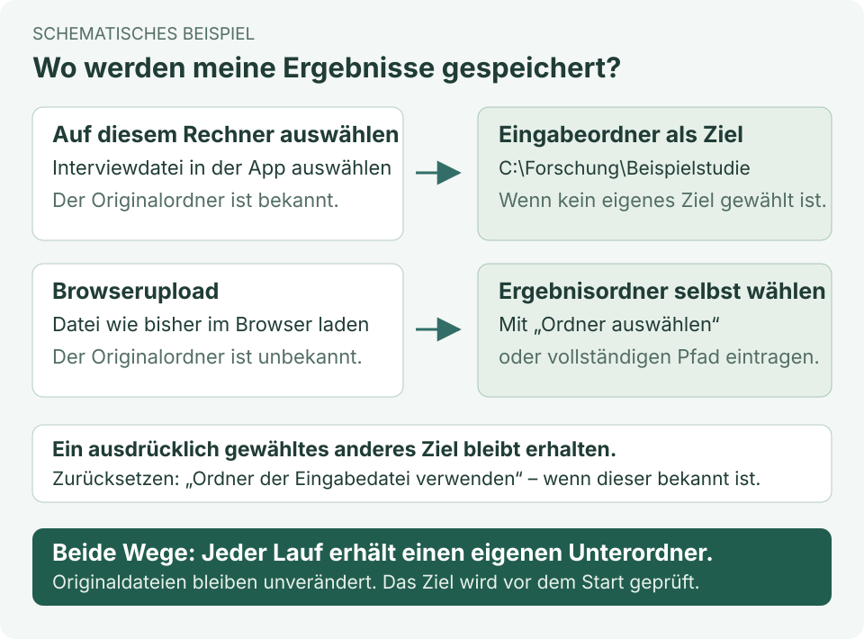

# Handbuch · Qualitative Analyse mit Ollama

Dieses Handbuch begleitet dich vom ersten Start bis zum erneuten Analyselauf mit geprüften Codierungen. Alle Personen, Texte und Beurteilungen in den Beispielen sind erfunden. Stand: 0.4.0-beta.1 · Personenzuordnung und Analysehilfen.

Du erreichst die bebilderte Fassung jederzeit über **Handbuch** neben **Telegram-Updates** in der Seitenleiste. Sie öffnet sich in einem eigenen Tab, damit deine aktuelle Arbeit geöffnet bleibt. Ohne laufende Oberfläche kannst du `docs/HANDBUCH.html` doppelklicken. Den Programmordner einschließlich der Bilder zusammenlassen.

## 1. Einrichten und starten

1. Das vollständige Programm von GitHub herunterladen und entpacken. Einzelne Python-Dateien reichen nicht aus.
2. Für die Source-Version Python ab Version 3.10 installieren. Für lokale KI-Analysen zusätzlich Ollama und ein lokales Modell bereitstellen; dessen Namen anschließend in der Oberfläche eintragen. Der Speicherbedarf hängt vom Modell und vom Kontextfenster ab.
3. Unter Windows einmal `Einrichtung.cmd` starten. Der Schritt installiert Python-Pakete und benötigt Internet, führt aber keine Interviewanalyse aus.
4. `Start_Oberflaeche.cmd` öffnen. Die Bedienung erfolgt im Browser; das Startfenster während eines Laufs geöffnet lassen.
5. Unter **Analyse → Systemprüfung ohne Modellaufruf** die Einrichtung prüfen. **Kurzen Modelltest vorbereiten** ist eine getrennte, optionale Aktion, die eine künstliche Anfrage beim gewählten Anbieter ausführt.

Die Standardkonfiguration verwendet lokales Ollama. Optional lassen sich Cloud-Anbieter je Projekt freigeben; die Datenfreigabe wird im folgenden Abschnitt erklärt. Für eine reine Cloud-Nutzung ist kein lokales Modell nötig. Die API-Zugangsdatei gehört weder ins Repository noch in Beispielprojekte.

### Ollama-Status ohne Modellstart (Entwicklungsstand P03)

Die Oberfläche startet auch ohne installierten oder laufenden Ollama-Server. Nach Auswahl eines lokalen Anbieters wird seine Erreichbarkeit im Hintergrund geprüft. **Ollama erneut prüfen** wiederholt die Abfrage und aktualisiert die lokale Modellliste. Die Anzeige unterscheidet **Ollama erreichbar**, einen erreichbaren Server ohne lokales Modell und **Ollama nicht erreichbar**; der Zeitpunkt kennzeichnet die Momentaufnahme.

Bei Nichterreichbarkeit verschwinden veraltete Vorschläge aus der Modellliste. Dein eingetragener Modellname und die Projekteinstellungen bleiben erhalten. Starte Ollama bzw. stelle ein lokales Modell bereit und prüfe erneut. Bis dahin sind ausgewählte lokale Analysen mit Modellbedarf gesperrt. Reine Coverage-, Information-Loss- und Codebook-Diagnosen bleiben ausführbar, sofern keine modellabhängigen Vorstufen ausgewählt sind. Ausdrücklich freigegebene Cloud-Anbieter sind von der lokalen Erreichbarkeit unabhängig; das Programm wechselt den Anbieter nicht selbst.

Die Statusprüfung liest ausschließlich lokale Modellmetadaten. Sie installiert nichts und startet weder den Server noch ein Modell oder eine Testanfrage. Die separate Speicherschätzung und der ausdrücklich bestätigte kurze Modelltest erfüllen andere Zwecke. Es gibt keine zusätzliche Modellauswahl beim Programmstart und keine neue Paketfreigabe durch diese Statusfunktion.

### Speicher und parallele Anfragen

Unter **Analyse → Speicher und parallele Anfragen** erscheint nach Wahl eines lokalen Ollama-Modells automatisch eine Schätzung. Änderungen am Kontextfenster lösen eine neue Prüfung aus. **Speicherschätzung aktualisieren** liest eine neue Momentaufnahme ein, etwa wenn ein anderes GPU-Programm beendet wurde. Es werden keine Modelle geladen, entladen oder Testtexte gesendet.

Die Anzeige nennt beispielsweise **„Speicherschätzung: bis zu 3 gleichzeitige Anfragen“**, das gewählte Kontextfenster sowie freien VRAM je NVIDIA-GPU und verfügbaren RAM. Das folgende Bild verwendet simulierte Hardware- und Modellwerte, keine Messung eines bestimmten PCs.


Die Schätzung prüft 1 bis 8 Anfragen für vollständig auf GPUs geladene Modelle. Sie berücksichtigt Modellgröße, Kontextcache in f16 und Reserven. Mehr Kontext oder andere GPU-Belegung kann die Zahl verringern. CPU-Auslagerung, AMD und Apple werden nicht geschätzt. Bei fehlenden Modelldaten, nicht unterstützten Architekturen oder einem bereits geladenen Modell erscheint eine Erklärung statt einer ungesicherten Zahl. Ein Wert von 0 bedeutet nur, dass mit der aktuellen Belegung und den Reserven keine reine GPU-Ausführung abgeschätzt werden kann.

Unter **Gleichzeitige Anfragen** wählst du 1 bis 8. **1 ist der Standard** und verwendet deinen bestehenden Ollama-Server. Ab **2** startet der Workflow eine eigene, nur auf diesem PC erreichbare Ollama-Instanz mit `OLLAMA_NUM_PARALLEL` in der gewählten Höhe. Du brauchst dafür keine Servereinstellung von Hand zu ändern. Ollama muss lokal installiert sein; die eigene Instanz verwendet denselben Modellordner (`OLLAMA_MODELS`, falls gesetzt). Es wird kein Modell heruntergeladen.

1. Lokales Modell und Kontext wählen und die Schätzung abwarten.
2. Beispielsweise **2** wählen, wenn die Schätzung mindestens 2 ergibt.
3. Einstellungen speichern, Eingaben prüfen und den Lauf starten. Direkt vor dem Start wird der Speicher erneut geprüft. Bei unbekannter oder zu geringer Kapazität wird der Parallelstart mit einer Erklärung abgewiesen; du kannst mit **1** arbeiten oder Modell, Kontext und Belegung anpassen.

**Was parallel läuft:** Die Clusterbildung arbeitet kategorienweise; Code-Verifikation und Blindcodierung arbeiten mit unabhängigen Textstellen bzw. vollständigen Passage-Gruppen. Pro Einheit bleibt die Verarbeitung samt nötiger Antwortreparatur zusammen. Ergebnisse behalten ihre ursprüngliche Reihenfolge. Abhängige Analysestufen und die Erstellung der Grafiken laufen nacheinander; nicht jede Phase kann daher die gewählte Zahl auslasten. Cloud-Anbieter bleiben bei einer Anfrage.

Die eigene Instanz wird nach Abschluss, Fehler oder einer Pause zwischen Modulen beendet. Bestehende Ollama-Server werden nicht umkonfiguriert. Bei einem Programmabbruch beendet ein Wächter die eigene Instanz; bereits geprüfte Zwischenstände bleiben für die Wiederaufnahme erhalten. Im Laufmanifest steht die verwendete Parallelität. Eine geänderte Einstellung gilt für einen neuen Lauf; eine Wiederaufnahme verwendet die eingefrorene Konfiguration.

Die Anzeige bleibt eine **Speicherschätzung**, keine garantierte Höchstleistung. Andere Prozesse können Speicher belegen, und Ollamas GPU-Verteilung kann die nutzbare Parallelität begrenzen. Zwei echte parallele Slots wurden mit Granite 4.2:8b getestet; andere Modelle und höhere Werte sind damit nicht als Belastungsgrenze bestätigt. Für einen ersten Versuch 2 wählen. Nach einem Programmupdate einen neuen Lauf beginnen, da sich die Code-Prüfsumme ändert.

Grundlagen: [Ollama: parallele Anfragen und Speicher](https://docs.ollama.com/faq#how-does-ollama-handle-concurrent-requests), [Modellmetadaten](https://docs.ollama.com/api-reference/show-model-details).

## 2. Zuerst die Demo kennenlernen

Auf der Startseite **Künstliche Beispieldaten laden** wählen. Das erzeugt ein eigenes Projekt mit 50 Codierzeilen, 43 Passagen und sechs erfundenen Personen. Das Laden sowie die Eingabeprüfung benötigen kein LLM. Unter **Eingaben prüfen** die Spalten kontrollieren und **Einstellungen speichern & Eingaben prüfen** anklicken. Bei Erfolg erscheinen die Zahlen für Codierzeilen, Passagen, Personen und Codepfade.

Für eine überschaubare erste Analyse unter **Analyse → Auswahl leeren** nur **Clusteranalyse** auswählen. Module mit Abhängigkeiten können weitere Vorstufen hinzufügen; die Zusammenfassung unter den Häkchen zeigt die tatsächlich ausgeführten Schritte. Erst **Prüfen & neuen Lauf starten** führt die Modellauswertung aus.

Auch für die Demo vorher unter **Projekt & Dateien → Speicherort für Analyseergebnisse** über **Ordner auswählen** ein vorhandenes Ziel wählen und **Ordner prüfen** anklicken. Ohne Ergebnisziel kann kein neuer Lauf starten.

## 3. Eigenes Projekt und MAXQDA-Dateien

**＋ Neues Projekt** wählen, benennen und zwei Dateien laden: Interviewdatei sowie Kategoriensystem. Du kannst `.xlsx` und `.csv` mischen. Jede Datei darf maximal 20 MB groß sein. Das Programm legt Arbeitskopien an und verändert die ausgewählten Originaldateien nicht.

Mit **Auf diesem Rechner auswählen** öffnest du bei Interviewdatei oder Kategoriensystem die Dateiauswahl innerhalb der Anwendung. Öffne den gewünschten Ordner, markiere eine CSV- oder XLSX-Datei und bestätige mit **Ausgewählte Datei einlesen**. Die Auswahl beginnt im persönlichen Ordner; über die Pfadzeile und **Ordner öffnen** kannst du einen anderen vollständigen Ordnerpfad direkt öffnen. Angezeigt werden nur unmittelbare Einträge. Bei sehr großen Ordnern ist die Anzeige begrenzt; gehe dann gezielt in einen Unterordner. Versteckte Dateien und Verknüpfungen werden nicht angeboten. **Abbrechen** lässt die bisherige Auswahl unverändert.

Bei einer so eingelesenen Interviewdatei wird ihr Ordner automatisch als Ergebnisziel übernommen, sofern kein eigenes Ziel festgelegt ist. Unter **Speicherort für Analyseergebnisse** wählst du mit **Ordner auswählen** einen anderen vorhandenen Forschungsordner und bestätigst mit **Diesen Ordner übernehmen**; alternativ kannst du seinen Pfad eintragen. **Ordner der Eingabedatei verwenden** setzt das Ziel wieder auf den bekannten Eingabeordner. **Ordner prüfen** kontrolliert Verfügbarkeit und Schreibrechte; beim Start wird erneut geprüft.

Der bisherige Browserupload bleibt möglich. Er kennt den ursprünglichen Dateiordner nicht. Ersetzt du damit eine lokal ausgewählte Interviewdatei, wird ein automatisch abgeleitetes Ergebnisziel entfernt; ein selbst gewähltes Ziel bleibt erhalten. Wähle gegebenenfalls ein neues Ziel. Die Dateiauswahl arbeitet immer auf dem Rechner, auf dem die Anwendung läuft, nicht auf dem Dateisystem eines anderen verbundenen Geräts.

Bei mehreren XLSX-Blättern wähle anschließend das passende Blatt. Wird die Originaldatei zwischen Vorschau und Blattauswahl verändert oder ist die Auswahl abgelaufen, wähle die Datei erneut aus. Das Programm speichert den geprüften Originalpfad und einen Inhaltsnachweis nur in den lokalen Projektmetadaten. Analysen verwenden weiter unveränderliche Arbeitskopien; Originaldateien werden nicht überschrieben.



*Schematisches Beispiel, keine Bildschirmaufnahme. Der gezeigte Windows-Pfad ist erfunden; auf macOS gilt dasselbe Prinzip.*


### Textstellen direkt aus MAXQDA exportieren

In MAXQDA die Übersicht/Liste der **codierten Segmente** öffnen und als Excel-Tabelle exportieren. Benötigt wird die Tabelle mit den tatsächlichen Textstellen, nicht nur das Codesystem mit Codenamen. Behalte nach Möglichkeit auch **Dokumentgruppe**, **Anfang** und **Ende** im Export. Die Schaltflächen und Menünamen können je nach MAXQDA-Version abweichen.

Die XLSX-Datei direkt bei **Interviewdatei auswählen** laden. Bei mehreren Tabellenblättern das Datenblatt mit Kopfzeile auswählen; die Blätter werden nicht zusammengeführt. Falls du die Tabelle nach Excel kopiert hast, muss sie dieselbe Struktur haben: eindeutige Spaltenüberschriften in Zeile 1, keine Titelzeilen darüber, keine verbundenen Zellen und keine leeren Fortsetzungszeilen anstelle von Dokumentnamen. Formeln in einer Kopie durch Werte ersetzen.

CSV geht weiterhin: als **UTF-8 mit Semikolon** speichern. Zeilenumbrüche innerhalb einer Textstelle müssen in derselben Zelle bleiben; Excel setzt beim CSV-Export die nötigen Anführungszeichen.

| Feld | Beispiel | Zuordnung |
|---|---|---|
| Dokumentname | Interview_01 | Person / Dokument |
| Code | Lernangebot > Praxis > Übung | Vergebener Code |
| Segment | Die gemeinsame Übung half mir beim Anwenden. | Text / Segment |
| Anfang, Ende | 12, 12 | Automatisch für Passage-Vorschläge erkannt |
| Dokumentgruppe | Gruppe_A | Automatisch zur Trennung der Vorschläge verwendet |
| segment_id | Z001 | Optional: ohne Spalte automatisch erzeugt |
| PassageID | P001 | Vorhandene ID verwenden oder vorbereiten lassen |

Jede Zeile enthält **eine Codierung**. Bei mehreren Codes für dieselbe Textstelle gibt es mehrere Zeilen. Codepfade verwenden ` > ` zwischen den Ebenen. Mehrere Codes in einer Sammelzelle werden nicht automatisch aufgeteilt. Dokument-/Personenkennungen müssen im Projekt eindeutig sein; gleich benannte Dokumente aus unterschiedlichen Gruppen sollten vorher unterscheidbare Namen erhalten.

### Kategoriensystem vorbereiten

Die separate Tabelle braucht mindestens **Code / vollständiger Codepfad oder Kategorie** sowie **Definition**. Optional sind **Unterkategorie**, **Ausprägung**, **Facette**, **Ankerbeispiele**, **Einschlussregeln**, **Ausschlussregeln** und **Abgrenzung / weitere Codierhinweise**. Jede Zeile beschreibt einen vollständigen Codepfad. Höhere Ebenen je Zeile wiederholen; nicht benötigte tiefere Ebenen bleiben leer.

| Kategorie | Unterkategorie | Ausprägung | Definition | Ankerbeispiel |
|---|---|---|---|---|
| Lernangebot | Praxis | Übung | Aussagen über das eigene praktische Erproben. | Ich konnte das Verfahren selbst ausprobieren. |
| Zusammenarbeit | Gruppe | Austausch | Aussagen über gegenseitige fachliche Hilfe. | Die Erklärung eines anderen Teilnehmers half mir. |

Nach dem CSV-Import (UTF-8, Semikolon) öffnet sich die Vorschau der ersten fünf Zeilen. Direkt über der Spaltenzuordnung unter **Eingaben prüfen** wird dieselbe CSV-Vorschau mit Originalüberschriften und den ersten fünf Zeilen angezeigt. Lange Zelltexte werden nur in der Vorschau auf 500 Zeichen begrenzt. Wähle dort selbst aus, welche Quellspalte zu welchem Feld gehört. Die Überschriften müssen nicht den Feldnamen im Programm entsprechen. Nicht vorhandene optionale Felder bleiben **Nicht zugeordnet**. Gespeicherte Zuordnungen werden wiederhergestellt; bei einer neu hochgeladenen Datei beginnt deren Zuordnung erneut.


| Feld im Programm | Beispiel für eine Überschrift in deiner Datei | Erforderlich |
| --- | --- | --- |
| Code / vollständiger Codepfad | Bezeichnung | Codepfad oder Kategorie |
| Kategorie | Hauptkategorie | Kategorie oder Codepfad |
| Definition | Bedeutung | Ja |
| Einschlussregeln | Wann zuordnen | Nein |
| Ausschlussregeln | Wann nicht zuordnen | Nein |
| Ankerbeispiele | Typische Aussage | Nein |
| Abgrenzung / weitere Codierhinweise | Abgrenzende Hinweise | Nein |

Ein vollständiger Codepfad verwendet `>` zwischen bis zu vier Ebenen, beispielsweise `Lernangebot > Begleitung`. Alternativ wählst du Kategorie und die benötigten Hierarchiespalten. Wenn du beides zuordnest, müssen die Pfade übereinstimmen. Jede Quellspalte darf nur einmal zugeordnet werden. Zusätzliche, nicht zugeordnete Spalten fließen nicht in die Analyse ein.

Fehlt Code/Kategorie oder Definition, bleibt **Prüfen & neuen Lauf starten** gesperrt. Die Meldung benennt die fehlende Zuordnung. **Einstellungen speichern & Eingaben prüfen** kontrolliert zusätzlich die vollständige Datei und die Codepfade. Bei Erfolg zeigt die Oberfläche, wie viele Codes Ein-/Ausschlussregeln, weitere Codierhinweise und Ankerbeispiele enthalten. Auch beim Start werden die Eingaben erneut geprüft, bevor Modellanfragen möglich sind.

Die Regeln werden bei Blindcodierung und Codeprüfung berücksichtigt. Einschlussregeln beschreiben, wann der Code zutrifft; Ausschlussregeln grenzen ihn ab. Leere Felder bedeuten keine zusätzlichen Regeln. Ankerbeispiele illustrieren die Bedeutung. Regeln gelten für den Code ihrer Zeile und werden nicht automatisch an Untercodes vererbt. Benötigte übergeordnete Regeln daher ausdrücklich in den betroffenen Zeilen aufführen. Regeländerungen erscheinen im Kategorienvergleich und bleiben in Folgeläufen erhalten. Alte Ergebnisdateien ändern sich dadurch nicht.

Das vollständige Demo-Codebuch enthält Ein-/Ausschlussregeln und Abgrenzungen für alle zwölf Codes und passt zu den 50 mitgelieferten Codierzeilen. In einem neu angelegten Demo-Projekt sind diese Standardspalten bereits zugeordnet. Bestehende Projekte behalten ihre bisherigen Eingabekopien.

Das [künstliche CSV-Formatbeispiel](../demo/Kategoriesystem_mit_Regeln.csv) verwendet bewusst andere Überschriften. Es ist ein eigenständiges Beispiel und passt nicht zu allen Codes des allgemeinen Demo-Interviews. CSV-Felder mit Semikolon, Anführungszeichen oder Zeilenumbrüchen müssen korrekt in Anführungszeichen gesetzt sein; Excel übernimmt das beim CSV-Export. Tabellen aus Word mit verbundenen Zellen müssen vorher in eine Zeile je vollständigem Codepfad überführt werden. Regeln oder Differenzierungen, die in Word als Absätze hinter der Tabelle stehen, müssen vor dem CSV-Export in eigene Spalten beim zugehörigen Code übertragen werden. Sie werden nicht aus dem Begleittext erraten. Der Programmimport akzeptiert weiterhin CSV und XLSX, keine DOCX-Dateien.

Die Definition legt die inhaltliche Bedeutung fest. Ein Beispiel illustriert sie. Offene redaktionelle Notizen wie „überlegen“ gehören nicht unbeabsichtigt in Codepfade. Das Programm muss jeden Code aus der Interviewdatei im Kategoriensystem wiederfinden.

## 4. IDs ohne händisches Nummerieren

**Zeilen-IDs entstehen bereits automatisch**, wenn keine ID-Spalte vorhanden ist. Vorhandene eindeutige IDs können zugeordnet bleiben. Sie kennzeichnen einzelne Codierzeilen, auch wenn derselbe Text mehrfach codiert wurde.

Eine **Passage-ID** verbindet dagegen die Codierzeilen derselben tatsächlichen Textstelle. Für diese Zuordnung gibt es unter **Eingaben prüfen → Passage-IDs vorbereiten** einen Assistenten:

1. Person/Dokument, Text und Code zuordnen. Die Passage-ID zunächst nicht zuordnen, wenn sie fehlt.
2. **Passage-IDs vorbereiten** anklicken. Das Programm vergleicht Dokumentgruppe, Dokumentname, Anfang, Ende und den exakten Segmenttext. Es verwendet kein LLM und keine Ähnlichkeitssuche.
3. Die vorgeschlagenen Gruppen prüfen. Nur Gruppen anhaken, die dieselbe tatsächliche Textstelle abbilden. Bei vielen Vorschlägen mit **Weitere Gruppen** weitergehen; gesetzte Häkchen bleiben erhalten.
4. **IDs mit dieser Gruppierung erstellen** wählen. Alle Zeilen erhalten automatisch IDs in einer neuen Arbeitskopie. Bestätigte Gruppen teilen eine Passage-ID; nicht bestätigte Zeilen bleiben getrennt. Keine Zeile wird gelöscht. Die Oberfläche ordnet die neuen Spalten zu und wählt den Mehrfachvergleich.
5. Anschließend **Einstellungen speichern & Eingaben prüfen** anklicken.


**Warum kurz prüfen?** Bei Textdokumenten sind Anfang und Ende in MAXQDA Absatznummern. Derselbe kurze Satz kann innerhalb eines Absatzes mehrfach vorkommen. Daher beweisen selbst identische Positionen und Texte keine eindeutige gemeinsame Zeichenposition. Die endgültige Gruppierung wird bewusst bestätigt. Bei Unsicherheit den **Zeilenvergleich** verwenden; dieser benötigt keine Passage-ID. Quelle: [MAXQDA: Übersicht codierter Segmente](https://www.maxqda.com/help/segment-retrieval/overview-of-coded-segments).

Beispiel: Zwei Zeilen aus Interview_01, Absatz 12, mit genau demselben Text und den Codes „Übung“ und „Austausch“ können eine Passage bilden. Derselbe Wortlaut in Interview_02 oder Absatz 30 wird nicht vorgeschlagen. Überlappende Ausschnitte mit unterschiedlichem Text bleiben ebenfalls getrennt. Bestehende Passage-IDs werden vom Assistenten nicht überschrieben.

## 5. Spalten und Untersuchung prüfen

Unter **Projekt & Dateien** die Beschreibung der Studie, Teilnehmende und Methodik ausfüllen. Diese Angaben werden später dem Modell mitgegeben. Unter **Eingaben prüfen** alle Spalten kontrollieren; nicht vorhandene optionale Ebenen als **Nicht zugeordnet** belassen.


Die Eingabeprüfung kontrolliert Pflichtfelder, IDs und Codepfade. Sie bewertet noch nicht die fachliche Qualität einer Codierung. Bei Fehlern steht beispielsweise, welche Spalte oder welcher Code fehlt. Nach jeder Änderung erneut prüfen. Ein früherer grüner Prüfbefund gilt nicht für geänderte Eingaben.

Mit **Kategorienversionen vergleichen** lassen sich eine vorher gültige und die aktuelle Tabelle gegenüberstellen. Die Ansicht nennt neue, entfernte und geänderte Kategorien sowie betroffene Codierzeilen. Sie codiert nichts automatisch um.

## 6. Module auswählen


| Modul | Nutzen |
|---|---|
| Clusteranalyse | Gruppiert Inhalte innerhalb eines Codepfads. |
| Code-Verifikation | Prüft die vorhandene menschliche Zuordnung. |
| Blindcodierung | Codiert anhand des Kategoriensystems ohne Vorgabe des menschlichen Codes. |
| Coding Agreement | Vergleicht Zuordnungen rechnerisch, einschließlich Abweichungen. |
| Cluster-Zusammenfassungen | Fasst Cluster inhaltlich zusammen. |
| SWOT und Meta-SWOT | Ordnet und verdichtet Stärken, Schwächen, Chancen und Risiken. |
| Personenanalyse und Personenvergleich | Untersucht einzelne Personen sowie Gemeinsamkeiten und Unterschiede. |
| Kontrast-, Relations- und Ambivalenzanalyse | Sucht Gegenfälle, Zusammenhänge und gegenläufige Aussagen. |
| Evidenz-Audit | Prüft Befunde auf vorhandene Gegenbelege. |
| Prüfliste | Stellt Fälle für die menschliche Nachprüfung zusammen. |
| Gesamtsynthese | Führt vorgelagerte Befunde zusammen. |

Die Oberfläche zeigt die genaue Bezeichnung und benötigte Vorstufen unter jedem Häkchen. Nicht jeder Schritt passt zu jeder Fragestellung. **Codierungen prüfen** stellt eine Auswahl zur Validierung zusammen; für die Rückmeldungsfunktion zusätzlich **Prüfliste** auswählen. Mehr Module können mehr Modellaufrufe und Laufzeit verursachen.

### Datenfreigabe, Anbieter und Schlüssel

Unter **Analyse → 2. Datenfreigabe und Modell** ist **DSGVO-relevantes Material · nur lokal verarbeiten** zunächst angehakt. Damit sind Cloud-Anbieter gesperrt. Lokales Ollama und ein auf diesem PC installiertes Modell bleiben der Standard.

Für Material, das du an einen Cloud-Dienst übermitteln darfst (zum Beispiel geeignete öffentliche Dokumente oder künstliche Testdaten):

1. Das DSGVO-Häkchen abwählen. Die Freigabe gilt für dieses Projekt und wird sofort gespeichert. Sie anonymisiert keine Inhalte und stellt keine datenschutzrechtliche Prüfung dar.
2. **Ollama Cloud**, **OpenAI**, **Anthropic** oder **Hugging Face** wählen. Auch nach Freigabe kann **Ollama · lokal** weiterverwendet werden.
3. Den API-Schlüssel des Anbieters eingeben oder aus einer `.txt`-Datei mit einer einzigen Schlüsselzeile laden. **Schlüssel speichern** anklicken. Ein Chat-Abonnement allein ist kein API-Schlüssel.
4. Ohne Speicher-Häkchen bleibt der Schlüssel nur bis zum Beenden der Oberfläche verfügbar. Unter Windows kann er optional mit deinem Benutzerkonto verschlüsselt gespeichert werden. **Schlüssel entfernen** löscht ihn für diesen Anbieter; zum Wechseln einen neuen Schlüssel eingeben und speichern. Andere Anbieter-Schlüssel bleiben erhalten.
5. Den exakten Modellnamen aus deinem Anbieter-Konto übernehmen. Bei Cloud wird keine Liste lokaler Modelle verwendet. Optional den kurzen Modelltest ausführen, anschließend **Prüfen & neuen Lauf starten**.


Cloud-Anfragen können Textstellen, Kategoriensystem, Projektkontext und frühere Analyseschritte enthalten und API-Kosten verursachen. Hugging Face kann zu weiteren Inference Providern weiterleiten. Das Programm übergibt keine Schlüssel in Projekt-YAML, Bericht oder Prüfexport. Dauerhafte Schlüssel liegen separat in `llm_keys.private.json` im Datenverzeichnis der Oberfläche.

Das DSGVO-Häkchen wieder aktivieren, um neue und fortgesetzte Cloud-Läufe zu sperren. Ein bereits laufender Cloud-Lauf muss vorher abgeschlossen oder nach seinem aktuellen Modul pausiert sein. Bereits übermittelte Daten werden dadurch nicht zurückgerufen. Kategorienvorschläge verwenden den Anbieter des Ursprungslaufs und werden ebenfalls durch die aktuelle Projektsperre geschützt. Der Anbieter eines pausierten Laufs bleibt an seine gespeicherte Konfiguration gebunden; für einen Anbieterwechsel einen neuen Lauf starten.

Bei OpenAI, Anthropic und Hugging Face gelten die jeweiligen Modellstandards für Temperatur und Reasoning; die Ollama-Schalter sind dort deaktiviert. Das Kontextfenster ist bei Cloud eine lokale Eingabegrenze und erweitert kein Anbieterlimit. [Technische Details und Grenzen](KI_ANBIETER.md).

## 7. Start, Fortschritt und Wiederaufnahme

Unter **Lokales Modell auswählen** den installierten Namen eintragen. **Ollama erneut prüfen** liest den Status und die lokale Modellliste ohne Modellaufruf neu ein. Kontextfenster und Antwortlimit zunächst aus der passenden Konfiguration übernehmen. Das Antwortlimit muss kleiner als das Kontextfenster sein; Thinking muss zum Modell passen.

**Prüfen & neuen Lauf starten** speichert die aktuellen Einstellungen, prüft nochmals und erzeugt einen eigenen Lauf. In der Browseransicht siehst du abgeschlossene Module, das aktuelle Modul und – sofern vom Modul gemeldet – bearbeitete Fälle und Modellantworten. Eine längere Modellantwort kann Zeit beanspruchen, ohne dass die Fallzahl steigt.

**Nach diesem Modul pausieren** beendet zuerst das laufende Modul. **Diesen Lauf fortsetzen** verwendet dessen gespeicherte Eingaben und Einstellungen. Ein neuer Lauf verwendet dagegen den aktuellen Projektstand. Erfolgreiche Teilschritte werden bei zulässiger Wiederaufnahme weiterverwendet; geänderte Eingaben oder Programmstände können eine Wiederaufnahme ausschließen. Dann einen neuen Lauf starten und die vorherigen Ergebnisse behalten.

### Programm kontrolliert beenden

Im Entwicklungsstand P02b findest du **Programm beenden** in der Seitenleiste neben Handbuch und Telegram-Updates. Das Schließen eines Browsertabs lässt das Programm und laufende Analysen weiterlaufen. Öffne deshalb diese Funktion, wenn du auch das Programm beenden möchtest.

| Situation | Aktion | Was geschieht? |
|---|---|---|
| Kein Analyselauf aktiv | **Programm jetzt beenden** | Das Programm schließt nach der Prüfung, dass keine eigene Analyse mehr läuft. |
| Analyse soll einen sicheren Zwischenstand erreichen | **Nach aktuellem Modul pausieren und beenden** | Die Pause wird angefordert. Warte auf den Abschluss des aktuellen Moduls; bei Wiederholungsdiagnosen gilt deren dokumentierte Pausegrenze. Danach werden eigene Prozesse aufgeräumt und das Programm beendet. |
| Lauf sofort unterbrechen | **Sofort abbrechen** aufklappen, Bestätigung anhaken und **Jetzt abbrechen und beenden** wählen | Die aktuelle Berechnung wird unterbrochen. Vollständig gespeicherte Ergebnisse bleiben erhalten; nicht gespeicherte Arbeit muss gegebenenfalls erneut berechnet werden. |

**Abbrechen** schließt den Dialog, solange du noch keine Aktion angefordert hast. Während die Anforderung übergeben wird, ist Abbrechen gesperrt. **Dialog schließen** nach einer angenommenen Pause nimmt die Pause nicht zurück. Für eine spätere Wiederaufnahme das Programm neu öffnen und **Diesen Lauf fortsetzen** verwenden; die vorhandenen Eingabe- und Ergebnisprüfungen gelten weiterhin.

Die Auswahl bezieht sich auf den aktuell angezeigten aktiven Lauf, auch wenn du gerade ein anderes Projekt geöffnet hast. Ändert sich der Lauf während der Auswahl, prüfe den aktuellen Status erneut; die Bestätigung für einen Sofortabbruch muss gegebenenfalls neu gesetzt werden. Es wird nicht still ein anderer Lauf abgebrochen.

Der Status unterscheidet **Pause angefordert**, laufende Bereinigung und ein blockiertes Beenden. Eine lange Modulberechnung ist noch kein Fehler. Bei einer Meldung, dass das Programm nicht sicher beendet werden konnte, bleibt es geöffnet: den genannten Hinweis sowie Startfenster und Laufprotokoll prüfen und **Status erneut prüfen** wählen. Während des Beendens oder einer ungeklärten Anforderung startet kein neuer Lauf.

Eine angenommene Anforderung ist noch kein bestätigter Abschluss. Erst die Rückmeldung „Bereinigung bestätigt. Das Programm wird geschlossen.“ bestätigt, dass eigene Analyseprozesse aufgeräumt sind; die Anwendung schließt anschließend. Wenn anschließend die Verbindung verschwindet, nennt die Oberfläche die Anforderung und weist darauf hin, dass der Abschluss dort nicht mehr überprüfbar ist. Eine beliebige Verbindungsunterbrechung wird nicht als erfolgreiche Beendigung ausgegeben. Die Prozessaufsicht räumt nur die vom Programm gestarteten Prozesse auf; andere Anwendungen werden nicht beendet.

Beim Source-Start der Oberfläche im Terminal fordert **Strg+C** bei einer aktiven Analyse ebenfalls eine Pause mit anschließendem Beenden an. Die Oberfläche bleibt während des Wartens erreichbar. Wiederholtes Strg+C löst keinen versteckten Sofortabbruch aus; dafür die bestätigte Aktion in der Oberfläche verwenden. Ohne aktive Analyse beendet Strg+C das Programm geordnet. Diese Beschreibung betrifft den Entwicklungsstand; neue eigenständige Windows-/macOS-Pakete sind damit noch nicht freigegeben.

## 8. Berichte öffnen und später wiederfinden

Der HTML-Gesamtbericht lässt sich als einzelne Datei offline lesen, durchsuchen und über die Druckfunktion als PDF speichern; seine eingebetteten Bilder bleiben enthalten. Die vollständigen Diagnose-JSON-Dateien sind jedoch separate Dateien. Bei langen Diagnosen enthält HTML dieselbe gekennzeichnete Auswahl wie der Markdown-Bericht. Weitere Befunde und Einzelzähler findest du in der Oberfläche unter „Ergebnisse → Einzelberichte und Datendateien“ bei der jeweiligen JSON-Datei. Wer nur die HTML-Datei erhält, erhält diese zusätzlichen JSON-Daten nicht. Für eine vollständige Detailprüfung die benötigten JSON-Dateien gezielt mitgeben; ein PDF enthält nur die gedruckte Ansicht.

Unter **Ergebnisse** bleiben die Läufe des ausgewählten Projekts gespeichert. Nach einem erfolgreichen Abschluss erscheint **Interaktiven Bericht öffnen**. Der Gesamtbericht enthält die Markdown-Berichtsteile der ausgeführten Module und eingebettete unterstützte Diagramme. Rohdaten, Excel-Exporte und die bearbeitbare Prüfliste werden separat geöffnet.


- **Bericht durchsuchen:** Filtert Berichtsteile nach dem Suchbegriff. Navigation zu einem Abschnitt hebt den Suchfilter auf.
- **Alles aufklappen / zuklappen:** Steuert die sichtbaren Abschnitte.
- **Speichern:** Lädt die HTML-Datei herunter. Sie funktioniert offline, einschließlich der eingebetteten Grafiken.
- **Drucken / PDF:** In der heruntergeladenen HTML-Datei verfügbar. Beim Drucken werden alle Berichtsteile aufgeklappt, auch zuvor ausgefilterte.

Zum späteren Wiederöffnen die Oberfläche starten, dasselbe Projekt auswählen und **Ergebnisse** öffnen. Es ist kein erneuter Modellaufruf nötig. HTML entsteht nur nach vollständigem erfolgreichem Lauf; bei Fehler oder Pause stehen bereits fertige Einzelergebnisse zur Verfügung. Fehlende oder zu große Grafiken werden im Bericht kenntlich gemacht.

Alte Läufe vor diesem Patch besitzen noch keinen automatisch erzeugten HTML-Gesamtbericht. Fortgeschrittene können ihn ohne LLM nacherstellen: `python src/html_report.py --run-dir "Pfad zum abgeschlossenen Lauf"`. Eine bestehende HTML-Datei bleibt erhalten; ein weiterer Export erhält einen neuen Namen. Die reguläre Ergebnisansicht kennt den Standardnamen `gesamtbericht.html`.

### Grafiken lesen, als SVG speichern und Textbelege öffnen

Ab 0.3.1 werden Clusterdiagramme und Konfusionsmatrix sowohl als PNG als auch als SVG erzeugt. Im neuen HTML-Bericht wird SVG bevorzugt eingebettet: Konturen und Schrift bleiben beim Vergrößern scharf. Unter dem Diagramm öffnet **SVG speichern** den Einzeldatei-Download. In den Einzeldateien des Laufs lassen sich beide Formate ansehen und speichern. Die SVG-Dateien enthalten auch bei der Konfusionsmatrix echte Vektorformen und benötigen keine externen Schriftdateien.

Vorhandene gespeicherte HTML-Berichte bleiben unverändert. Ohne passende SVG-Datei verwendet der Bericht weiterhin PNG. Das Handbuch enthält zur Erklärung weiterhin Screenshots; diese werden durch SVG nicht zu Vektorgrafiken.

Clusterdiagramme zeigen **Codierzeilen** als ausgefüllte türkisfarbene Balken und **eindeutige Personen je Cluster** als umrandete Balken. Ganzzahlige Skalen, direkt beschriftete Werte und umgebrochene Namen erleichtern das Lesen. Nicht zuordenbare Personen werden als unbekannt ausgewiesen. Eine Person kann in mehreren Clustern vorkommen; Häufigkeit bedeutet keine inhaltliche Wichtigkeit.


Der HTML-Bericht ergänzt bei vorhandenen Clusterergebnissen **Personen und Kategorien**. Eine Zahl öffnet die zugehörigen Textbelege; das Suchfeld filtert vollständige Codepfade. Liegt eine Prüfliste vor, zeigt **Prüfbedarf im Modellergebnis** die Fallklassen. Dieser gespeicherte Stand zeigt nicht den späteren Fortschritt deiner manuellen Prüfung. Dessen aktueller Stand steht weiterhin bei **Codierungen im Projekt prüfen**.


## 9. Codierungen prüfen und Rückmeldung geben

Wenn das Modul **Prüfliste** ausgeführt wurde, unter **Ergebnisse → Codierungen im Projekt prüfen** öffnen. Die kritischen Fälle sind zunächst gefiltert. Suche und Seitennavigation helfen bei größeren Listen.


Pro Fall die Originalstelle, menschliche Codes und Modellvorschläge lesen. Entscheidung, finale Codes und gegebenenfalls Begründung eintragen. Die Anwendung speichert Entscheidungen lokal als Prüfversionen. Den Speicherstatus beachten; **Jetzt speichern** ist zusätzlich möglich. Bei einem Speicherfehler die Meldung beheben und den Entwurf als JSON sichern. **Prüftabelle als Excel exportieren** bietet eine lesbare Arbeits-/Dokumentationsfassung; sie ist kein automatischer MAXQDA-Rückimport.

Die herunterladbare HTML-Prüfliste ist eine separate Offline-Variante. Dortige Änderungen sind nicht automatisch mit dem Projekt synchronisiert. Für die integrierten Folgeläufe die Prüfung innerhalb der Oberfläche verwenden.

## 10. Mit Entscheidungen weiterarbeiten

Nach Abschluss der kritischen Prüfungen bietet die Oberfläche an, **mit geprüften Codierungen einen neuen Lauf vorzubereiten**. Zuerst erscheint eine Vorschau der tatsächlichen Änderungen. Fälle ohne finale Codes müssen gegebenenfalls ausdrücklich aus der neuen codierten Eingabe ausgeschlossen werden.


**Neue Version vorbereiten** erstellt eine neue Eingabeversion und bewahrt Ursprungslauf und Originalcodierungen. Danach die Module prüfen und den neuen Lauf bewusst starten. Deine Entscheidungen ändern die Codierungen der neuen Eingabe; sie trainieren das Modell nicht. Das LLM sieht die korrigierte Grundlage erst bei diesem erneuten Lauf.

**Kategorienvorschläge vorbereiten** ist eine zweite, optionale Funktion. Ein gesonderter Modelllauf verwendet Originalstellen, abgeschlossene Entscheidungen und das bisherige Kategoriensystem. Er schlägt mögliche Definitionsergänzungen, Trennungen oder Zusammenfassungen vor. Nichts davon wird automatisch übernommen. Prüfe die Vorschläge fachlich, bearbeite eine neue Version deiner Kategorientabelle und vergleiche sie anschließend unter **Eingaben prüfen**.

## 11. Telegram-Updates einrichten

Die Fortschrittsmeldung enthält einen Balken für das aktuelle Modul mit Prozent und bearbeiteten Einheiten. Darunter stehen Modellantworten, gleichzeitig aktive Anfragen, das Alter der letzten Antwort und wiederverwendete Zwischenergebnisse, sofern verfügbar. Phasenwechsel und untergeordnete Prüfblöcke werden getrennt angezeigt; auch Fortschritt innerhalb eines Teilabschnitts kann eine neue Meldung auslösen. Ohne belastbare Gesamtzahl wird kein Prozentwert erfunden. Der Balken gilt für das Modul, nicht für die gesamte Laufzeit. Zwischenstände kommen bei Änderungen höchstens alle zwei Minuten; Modulabschlüsse werden zusätzlich zeitnah gemeldet.

Beispiel mit künstlichen Zählern:

```text
📊 Qualitative Analyse · 14:30
Module abgeschlossen: 2/15

Personenanalyse
▰▰▰▰▰▱▱▱▱▱ 50 %
4 von 8 Personen
Davon 2 aus geprüften Zwischenergebnissen wiederverwendet.
Modellantworten: 6
Modellanfragen gleichzeitig aktiv: 2
```


Telegram ist optional. Der Browser zeigt den Fortschritt auch ohne Bot. Bei **Telegram-Updates** einen Bot-Token eingeben oder aus einer Textdatei laden, die Ziel-Chat-ID eintragen, Ereignisse auswählen und speichern. Der Bot muss zuvor im eigenen Telegram-Chat mit `/start` angesprochen worden sein. Die Chat-ID ist nicht die Telefonnummer.

Ein leeres Tokenfeld behält den gespeicherten Token. Eine neue Eingabe ersetzt ihn beim Speichern; **Token entfernen** deaktiviert Benachrichtigungen. Unter Windows kann der Token benutzergebunden verschlüsselt gespeichert werden; sonst gilt er nur für die Sitzung. Die Testnachricht wird erst durch den entsprechenden Knopf versendet. Telegram erhält allgemeine Statusmeldungen, keine Interviewtexte, Codes, Projektnamen oder Dateipfade.

## 12. Aufbewahren, teilen und Probleme lösen

Neue technische Appdaten liegen unter Windows in `%LOCALAPPDATA%\QualitativeAnalyse`, unter macOS in `~/Library/Application Support/QualitativeAnalyse`, unter Linux bei absolut gesetztem `XDG_DATA_HOME` in `$XDG_DATA_HOME/QualitativeAnalyse`, sonst in `~/.local/share/QualitativeAnalyse`. Ein eindeutig vorhandener alter `QualitativeOllama`-Ordner wird weiterverwendet; es wird nichts verschoben. Werden mehrere bestehende Ablagen gefunden, mit `--data-dir` ausdrücklich die gewünschte auswählen.

**Entwicklungsstand P01c – Datei- und Ordnerauswahl:** Über **Auf diesem Rechner auswählen** lädst du Interviewdatei oder Kategoriensystem aus der Dateiauswahl innerhalb der Oberfläche. Bei einer so gewählten Interviewdatei wird deren Ordner als Ergebnisziel übernommen, sofern du kein eigenes Ziel festgelegt hast. Mit **Ordner auswählen** wählst du ein anderes vorhandenes Ziel; **Ordner der Eingabedatei verwenden** wechselt zurück zum bekannten Eingabeordner. **Ordner prüfen** kontrolliert Verfügbarkeit und Schreibrechte. Die Auswahl zeigt Dateien auf dem Rechner der laufenden Anwendung, nicht auf einem anderen Gerät, mit dem du den Browser bedienst. Der bisherige Browserupload und das manuelle Pfadfeld bleiben verfügbar; beim Browserupload ist der ursprüngliche Dateiordner unbekannt und muss als Ziel ausdrücklich ausgewählt werden. Noch keine Freigabe neuer Windows-/macOS-Installationspakete.

Jeder neue App-Lauf bekommt im gewählten Ziel einen eigenen Ordner `QualitativeAnalyse_<Datum>_<Job-ID>/`. Analyseberichte und Moduldateien liegen darunter in `runs/<Lauf-ID>/`; Prüfentscheidungen und deren Versionen in `review/`. Geprüfte Folgeeingaben werden zusätzlich unter `review/followups/<Revision-ID>/` mit `segments.csv`, `codebook.csv`, `review_snapshot.json` und einem Inhaltsnachweis abgelegt. Eine Zieländerung gilt nur für neue Läufe. Wiederaufnahme, Berichtsaufruf und Prüfung bestehender Läufe bleiben an deren ursprünglichen Ordner gebunden. Ist er nicht verfügbar oder passt seine gespeicherte Zuordnung nicht mehr, erscheint ein Hinweis; es gibt keinen Ersatzordner in AppData. Alte Läufe behalten ihre bisherige Ablage und bleiben dort lesbar.

Die technische Projektverwaltung, Einstellungen und unveränderlichen Eingabe-/Konfigurationskopien bleiben im App-Datenordner. Für eine vollständige Sicherung nach Abschluss aller Läufe sowohl diesen Datenordner als auch die gewählten Forschungsordner sichern.

**CLI-Ergebnisordner:** Ohne `--output-dir` erstellt die CLI neben der tatsächlich verwendeten Eingabedatei einen neuen Ordner `QualitativeAnalyse_<Lauf-ID>`. Maßgeblich ist `--csv`, falls angegeben, sonst `paths.input_csv` aus der Konfiguration; relative Konfigurations-Eingaben werden gegen deren Ordner aufgelöst. Ein explizites `--output-dir` bleibt relativ zum aktuellen Arbeitsordner, wird bei Bedarf angelegt und enthält wie bisher Unterordner `<Lauf-ID>`. Vor dem neuen Lauf wird die Beschreibbarkeit geprüft. Bei einem ungültigen oder nicht beschreibbaren Ziel erfolgt eine Fehlermeldung, kein Ausweichen in AppData oder einen temporären Ordner. `--validate-only` prüft die Analysedaten, noch nicht die spätere Schreibbarkeit des Ergebnisziels. Resume verwendet unverändert den ausdrücklich angegebenen bestehenden Laufordner und prüft dessen Herkunft.

Für eine Sicherung nach Ende aller Läufe **Programm beenden** verwenden und anschließend den vollständigen technischen Datenordner sowie die zugehörigen Forschungsordner sichern. Einzelne Ergebnisdateien enthalten nicht alle Eingabe- und Prüfversionen. Das Löschen von Programm-/Projektordnern entfernt möglicherweise gespeicherte Arbeit.

| Situation | Nächster Schritt |
|---|---|
| Oberfläche nicht erreichbar | Startdatei erneut öffnen; den frisch geöffneten Link verwenden. |
| XLSX abgewiesen | Datenblatt, Kopfzeile, Dateigröße und Formeln prüfen; alte XLS als XLSX speichern. |
| Code unbekannt | Vollständigen Pfad einschließlich aller Ebenen und Schreibweise mit dem Kategoriensystem vergleichen. |
| Passage-IDs fehlen | Assistent mit MAXQDA-Positionsspalten verwenden oder Zeilenvergleich wählen. |
| Gleiche Passage-ID mit abweichendem Text | Gruppierung im Export korrigieren; überlappende Ausschnitte nicht künstlich gleichsetzen. |
| Ollama nicht erreichbar | Ollama starten, **Ollama erneut prüfen** wählen und den installierten Modellnamen prüfen. |
| Lauf fehlgeschlagen | Laufprotokoll speichern und Fehlermeldung prüfen; nach Behebung fortsetzen oder neuen Lauf starten. |
| Gesamtbericht fehlt | Status prüfen: HTML entsteht nach erfolgreichem Abschluss; ältere Läufe gegebenenfalls nacherstellen. |
| Bild fehlt im HTML | Hinweis im Bericht lesen und einzelne Grafik öffnen; Exportgrenzen bzw. fehlende Datei prüfen. |

Vor dem Teilen HTML, Excel und Berichte auf enthaltene Originaltexte und Beurteilungen prüfen. Die HTML-Datei enthält die eingebetteten Daten selbst. Reale Studienunterlagen, private Konfigurationen und Schlüssel gehören nicht in ein öffentliches GitHub-Repository. Weitere technische Details: [Bedienoberfläche](BEDIENOBERFLAECHE.md), [Erweiterungen](EXTENSIONS.md) und [Versionshinweise](RELEASE_NOTES.md).


## Große Zusammenfassungen und Antwortreparatur (ab 0.3.5)

Bei einer großen Cluster- oder Gesamtzusammenfassung teilt das Programm den Text automatisch passend zum Kontextfenster auf. Es fasst zunächst alle Teile zusammen und verdichtet sie bei Bedarf erneut, bevor die eigentliche Zusammenfassung entsteht. Dafür brauchst du keine zusätzliche Einstellung. Im Laufprotokoll erscheinen Stufe und Anzahl der Teile. Es entstehen zusätzliche Modellanfragen; bei Cloud-Anbietern können diese Kontingent oder Kosten verbrauchen.

Eine Verdichtung ist eine methodische Zwischenstufe: Alle Textstücke gehen in die Verarbeitung ein, aber einzelne Details können in den Zusammenfassungen verloren gehen. Prüfe zentrale Aussagen, Unterschiede und Gegenbeispiele deshalb weiterhin anhand der Originalstellen. SWOT und Personenanalyse werden durch diesen Patch nicht automatisch aufgeteilt.

Abgeschnittene kurze Zwischenantworten werden mit reserviertem Platz für eine längere Antwort wiederholt. Erfolgreiche Teile werden gespeichert; ein fehlgeschlagener Teil kann bei unverändertem Lauf nachgeholt werden. Kann das Programm keine vollständige Antwort erzeugen oder den Text nicht ausreichend verkleinern, meldet es einen Fehler. Ein größeres Kontextfenster benötigt mehr Speicher, besonders bei mehreren gleichzeitigen Anfragen.

Bei ungültigen Codierantworten bekommt der Reparaturversuch auch die ursprüngliche Textstelle, das Codebuch und seine zugeordneten Regeln. Erfundene Codes werden weiterhin zurückgewiesen. Auch diese längere Reparaturanfrage muss ins eingestellte Kontextfenster passen.

**Lokal geprüft:** `granite4.2:30b` in Q4_K_M mit zwei gleichzeitigen Anfragen bei 8.192 Tokens Kontext auf 12 GB + 16 GB GPU-Speicher. Das ist ein technischer Test mit künstlichen Beispielen, keine Garantie für andere Hardware, größere Kontexte oder die fachliche Qualität. Vor dem Start die aktuelle Speicherschätzung prüfen.

Nach einem Programmupdate einen neuen Lauf anlegen. Alte Berichte bleiben nutzbar; ein unter einer älteren Code-Prüfsumme begonnener Lauf kann nicht unverändert mit neuem Code fortgesetzt werden.


## Kontext vor dem Start prüfen (0.3.5)

**Einstellungen speichern & Eingaben prüfen** kontrolliert nun auch die Größe der bereits bekannten Anfragen. Geprüft werden vollständige Kategoriengruppen beim Clustering und die Textstellen beziehungsweise Passagen mit dem vollständigen Codebuch und den zugeordneten Regeln bei der Codierprüfung. Antwortlimit und eine Reserve zählen mit. Übersteigt eine Anfrage die konservative Rechengrenze, bleibt der Start gesperrt. Das gilt auch bei einem direkten Start des Python-Runners.

Die Meldung nennt das betroffene Modul und seine größte Rechengrenze. Wähle mehr Kontext und prüfe anschließend den GPU-Speicher erneut. Gegebenenfalls sind weniger parallele Anfragen nötig. Ein kleineres Antwortlimit schafft ebenfalls Platz, kann aber Antworten abschneiden. Kürze keine Textstellen oder fachlichen Codierregeln nur, um eine Fehlermeldung zu umgehen.

Unter dem Prüfergebnis stehen **Kontextprüfung vor dem Start** und Hinweise zur Antwortreparatur sowie zu späteren Modulen. Deren Modellbefunde gibt es vorab noch nicht: Ein bestandener Startcheck garantiert deshalb nicht, dass jede spätere Anfrage passt. Die Laufzeitprüfung bleibt aktiv. Die Rechengrenze basiert auf UTF-8-Bytes, nicht auf einer exakten Tokenisierung; sie kann strenger sein als die tatsächliche Modellgrenze. Es wird kein Modell gestartet und keine Datei an einen Anbieter gesendet.

**Lokaler Kapazitätsversuch:** Mit `granite4.2:30b` (Q4_K_M) auf 12 GB + 16 GB GPU-Speicher gelangen zwei gleichzeitige Anfragen bei je 12.288 Tokens vollständig auf den GPUs. Bei je 16.384 Tokens wurden Teile in RAM ausgelagert. Die kurzen künstlichen Testanfragen benötigten ungefähr 13 beziehungsweise 17 Sekunden; das ist kein allgemeiner Benchmark und kein Test mit vollständig gefüllten Kontextfenstern. Die produktive Speicherschätzung ist weiterhin konservativ und kann weniger Parallelität freigeben als ein einzelner kontrollierter Versuch. Der Test überschreibt diese Sperre nur im Entwicklungsversuch; es gibt keine automatische Freigabe unsicherer Einstellungen.


## Fortschritt und Teilfehler (vorbereiteter Patch nach 0.3.5)

Die unter **Speicher und parallele Anfragen** gewählte Anzahl gilt künftig auch für unabhängige SWOT-Kategorien und Personenanalysen. Beispiel: Bei zwei Anfragen werden bis zu zwei Kategorien oder zwei Personen gleichzeitig bearbeitet. Die Gesamtzahl der Verarbeitungsplätze wird dadurch nicht vervielfacht. Abhängige Module warten weiterhin auf ihre benötigten Ergebnisse. Cloud-Anbieter bleiben bei einer Anfrage.

Unter dem Modulfortschritt erscheint beispielsweise **3 von 8 Kategorien bearbeitet**. Darunter steht, wie viele fertige Einheiten aus geprüften Zwischenergebnissen wiederverwendet wurden. Diese zählen als abgeschlossen, erzeugen aber keine neue Modellantwort. Der Balken zeigt Arbeitseinheiten, keine genaue Restzeit: Eine umfangreiche Kategorie kann länger dauern als mehrere kleine.

Bei einem Teilfehler erscheint sofort ein Hinweis. Bereits laufende Anfragen werden noch abgeschlossen und erfolgreiche Teilergebnisse gespeichert. Weitere Teilaufgaben starten nicht. Daher können ein Fehlerhinweis und laufende Modellanfragen gleichzeitig sichtbar sein. Der Gesamtbericht wird erst nach erfolgreichem Abschluss aller gewählten Module erstellt. Ist bei Telegram **Fehler** aktiviert, meldet der vorbereitete Patch auch diesen Teilfehler mit einer allgemeinen Nachricht ohne Studieninhalte.

Nach einem vorübergehenden Fehler kannst du den unveränderten Lauf fortsetzen. Das Programm prüft Eingaben, Code, Modellparameter und gespeicherte Ergebnisse. Veränderte oder beschädigte Zwischenergebnisse werden nicht ungeprüft übernommen. Wenn du Einstellungen oder das Programm geändert hast, lege einen neuen Lauf an.

## Entstandene Eingaben und gemeinsame Clusterkontexte

Vor den SWOT- und Personenanfragen prüft das Programm sämtliche fertig aufgebauten Prompts des jeweiligen Moduls. Die zentrale Anfrageprüfung prüft außerdem jede tatsächliche Anfrage einschließlich ihrer jeweiligen Antwortreserve, auch in späteren Modulen und Reparaturversuchen. Reicht das Kontextfenster nicht, erscheinen die konservative Rechengrenze und der eingestellte Kontext in der Oberfläche; die Rechengrenzen werden auch im Laufprotokoll dokumentiert. Es handelt sich nicht um gemessene Tokenzahlen.

Bei einer Kontextmeldung prüfe das gewählte Modell, das Kontextfenster und den freien Speicher erneut. Ein größeres Fenster kann weniger parallele Anfragen erlauben. Neue Einstellungen benötigen einen neuen Lauf. Das Programm erhöht das reservierte Fenster nicht stillschweigend und kürzt keine Originaltexte, um die Anfrage passend zu machen. Eine automatische Vergrößerung mit nachgewiesener Modell- und Speicherfreigabe ist in diesem Kandidaten noch nicht enthalten.

In Personenprompts steht ein identischer Clusterkontext künftig einmal in einer gemeinsamen Tabelle. Jedes Segment verweist eindeutig auf seine zugehörigen Kontexte. Alle Segment-IDs, Originaltexte und Zuordnungen bleiben erhalten; gleich benannte, aber inhaltlich unterschiedliche Kontexte bleiben getrennt. Dies verkleinert vor allem Prompts mit vielen wiederholten Clusterinformationen. Es garantiert keine bessere fachliche Modellantwort: Die technische Rückführbarkeit auf dieselben Inhalte ist getestet, die Modellqualität ist vor Veröffentlichung noch anhand künstlicher Vergleichsfälle zu prüfen.


## Große Personenvergleiche: zusätzliche Verdichtungsstufe

Ausführliche Personenanalysen können zusammen zu groß für einen einzigen Vergleich werden. Der vorbereitete Patch verdichtet dann jede vollständige Personenanalyse getrennt in mehreren Schritten, bevor das Modell die Personen miteinander vergleicht. Alle Personen bleiben mit ihren ursprünglichen Kennungen vertreten; keine Person wird zur Größenbegrenzung entfernt. Die vollständigen Analysen und ihre Textbelege bleiben gespeichert.

Der Vergleichsbericht weist die Verdichtung ausdrücklich aus. Sie ist ein zusätzlicher methodischer Schritt und kann Details verlieren. Prüfe wesentliche Gemeinsamkeiten, Unterschiede und Typenzuordnungen deshalb an den vollständigen Personenanalysen. Die JSON-Datei dokumentiert die verwendeten Personenverdichtungen und die Prüfsummen ihrer Quellen.

Das eingestellte Kontextfenster und das Antwortlimit für den abschließenden Vergleich bleiben erhalten. Reicht der Platz nicht einmal für getrennte kompakte Einträge aller Personen, meldet das Programm dies. Ein größeres Fenster muss mit Modell und Speicherschätzung geprüft werden; der lokale Patch erhöht es nicht automatisch.

Fehlermeldungen jedes Moduls werden zusätzlich in einer eigenen lokalen Protokolldatei erhalten. Bei einem Abbruch erscheint der letzte Teil dieser Ausgabe auch im herunterladbaren Laufprotokoll. Protokolle können Forschungsinhalte enthalten und gehören nicht ungeprüft in öffentliche Fehlermeldungen.


## Große Meta-SWOT-Auswertungen und stockende Verdichtung

Bei vielen SWOT-Befunden vergleicht das Programm kleinere Blöcke, in denen Befunde aus verschiedenen Quellen abwechselnd angeordnet werden. Jeder ursprüngliche Befund bleibt mit seiner Kennung und seinen Belegen erhalten. Passt ein einzelner Befund nicht in das eingestellte Kontextfenster, wird seine vollständige Eingabe vor dem Vergleich schrittweise verdichtet. Die JSON-Ausgabe dokumentiert Blöcke und gegebenenfalls verdichtete Quellen.

Zwischen verschiedenen Blöcken findet keine zusätzliche globale Zusammenführung statt. Ähnliche Befunde können deshalb getrennt bleiben. Der Bericht weist diese Einschränkung aus; prüfe übergreifende Muster anhand der ursprünglichen Befunde. Verdichtung kann Einzelheiten verlieren und ersetzt keine menschliche Prüfung.

Wenn eine für den Personenvergleich benötigte Verdichtung zunächst nicht kürzer wird, versucht das Programm bis zu drei gezielte Kürzungsanfragen mit der vollständigen Eingabe. Es schneidet keine Textenden ab. Einzelne Personen dürfen ihre Zielgröße überschreiten, wenn alle Personen zusammen einschließlich Antwortbudget und Reserve ins Kontextfenster passen. Das Programm verwendet dabei die kürzeste vollständig verarbeitete Darstellung und dokumentiert die tatsächlichen Größen. Ist die Gesamteingabe weiterhin zu groß, stoppt das Modul mit einer Fehlermeldung; bereits gültige Zwischenergebnisse bleiben gespeichert.


## Wenn ein Modul fehlschlägt

Die Laufkarte nennt das betroffene Modul, eine Einordnung der Ursache und den nächsten sinnvollen Schritt. Die Einordnung typischer Fehlermeldungen ist eine Hilfestellung; bei unbekannten Fehlern ist das Modulprotokoll maßgeblich. Unter „Module warten auf Vorstufen“ siehst du, welche Folgeschritte blockiert sind und welche Ergebnisse ihnen fehlen. Erfolgreiche Ergebnisse bleiben gespeichert. Unabhängige Module werden weiter bearbeitet; ein Lauf mit fehlerhaften oder blockierten Modulen wird nicht als vollständig abgeschlossen ausgegeben.

| Meldung | Vorgehen |
| --- | --- |
| Kontext reicht nicht | Kontext- und Speicherprüfung erneut ausführen. Ein größeres Fenster nur verwenden, wenn Modell und Speicher es unterstützen. Mit geänderten Einstellungen einen neuen Lauf starten. |
| Speicher reicht nicht | Andere GPU-Anwendungen schließen. Falls nötig Parallelität reduzieren oder ein kleineres Modell wählen. |
| Verbindung oder Zeitüberschreitung | Ollama beziehungsweise Anbieter und Verbindung prüfen; anschließend den Lauf fortsetzen. Bei Wiederholung auch Speicher und Parallelität prüfen. |
| Anmeldung oder Kontingent | Schlüssel/Berechtigungen beziehungsweise verfügbares Kontingent beim gewählten Anbieter prüfen. Schlüssel nur im dafür vorgesehenen Feld ändern. |
| Ungültige Antwort oder stockende Verdichtung | Antwortlimit und Kontext zusammen prüfen. Bei wiederholtem Fehler das Modulprotokoll auswerten; nicht unverändert endlos neu starten. |

**Diesen Lauf fortsetzen** nutzt seine ursprünglichen Eingaben und Einstellungen sowie passende geprüfte Zwischenergebnisse. Wenn du Daten, Kategoriensystem, Modell oder Einstellungen änderst, lege einen neuen Lauf an. Ein neuer Lauf überschreibt den vorherigen nicht. Bei einem Programmupdate kann die Herkunftsprüfung eine Wiederaufnahme ablehnen; diese Prüfung nicht umgehen.

**Laufprotokoll herunterladen** liefert technische Details für die Fehlersuche. Es kann Forschungsinhalte, Pfade und Modellantworten enthalten. Vor einer öffentlichen Fehlermeldung diese Angaben und mögliche Zugangsdaten entfernen. Für einen reproduzierbaren Fehler möglichst künstliche Beispieldaten verwenden und Programmversion, Betriebssystem, Modul, Modell und Fehlermeldung nennen.

Unabhängige Meta-SWOT-Blöcke werden innerhalb der eingestellten Parallelität verarbeitet. Ihre Reihenfolge im Ergebnis bleibt stabil und erfolgreiche Blöcke werden einzeln gesichert. Dies erhöht nicht automatisch die Anzahl der vom Modell unterstützten gleichzeitigen Anfragen.


## Umfangreiche Kontrast-, Ambivalenz- und Zusammenhangsanalysen

Wenn vollständige Hintergrundanalysen zu groß werden, kann das Programm sie schrittweise verdichten. Die Originalanalysen bleiben gespeichert; die JSON-Ergebnisse dokumentieren betroffene Quellen und Verdichtungen. Das Modell kann dabei Details verlieren. Die zusätzlichen Hinweise im Bericht gehören zur Interpretation der Ergebnisse.

- **Kontrastanalyse:** Verwendet bei großen Eingaben getrennte Personengruppen und verdichteten Vergleichskontext. Bereits gespeicherte Personenverdichtungen werden nur bei passenden Quellenprüfsummen verwendet. Die Ergebnisse sind eine Zusammenstellung validierter Teilprüfungen; es findet keine zusätzliche globale Synthese statt.
- **Ambivalenzanalyse:** Behält die Originalsegmente bei, teilt sie bei Bedarf aber in getrennte Blöcke je Person. Belege werden nur gegen den jeweiligen Block geprüft. Widersprüche zwischen verschiedenen Blöcken können unerkannt bleiben; die Zahl gefundener Ambivalenzen ist deshalb kein Vollständigkeitsnachweis.
- **Zusammenhangsanalyse:** Verdichtet bei Bedarf umfangreiche Clusterbeschreibungen. Die gemäß der dokumentierten Auswahlregel ausgewählten Originalsegmente, Codepfade und Personenbezüge bleiben unverändert. Der Bericht kennzeichnet diese Kontextverdichtung.

Passt eine einzelne Originalbelegeinheit weiterhin nicht ins konfigurierte Kontextfenster, wird sie nicht abgeschnitten. Das Modul stoppt mit einem Hinweis zur Kontextprüfung. Ein größeres Fenster muss für Modell und Speicher geprüft werden; die lokale Version erhöht es nicht automatisch.


## Belegprüfung mit vielen Gegenbelegen

Die Belegprüfung teilt bei Bedarf sowohl Befunde als auch mögliche Gegenbelege in passende Blöcke. Jedes Befund-Gegenbeleg-Paar wird geprüft; keine Eingabe wird abgeschnitten. Unabhängige Teilprüfungen können im Rahmen der eingestellten Parallelität gleichzeitig laufen. Gültige Teilprüfungen werden zwischengespeichert und bei identischen Eingaben wiederverwendet.

Der Bericht vereinigt die validierten Gegenbeleg-Zuordnungen und kennzeichnet getrennte Teilbegründungen. Er enthält keine zusätzliche globale Synthese dieser Begründungen. Wechselwirkungen zwischen Gegenbelegen aus verschiedenen Blöcken werden nicht gemeinsam beurteilt. Auch eine vollständig abgearbeitete Paarliste belegt deshalb keine fehlerfreie oder vollständige Interpretation; die fachliche Prüfung bleibt erforderlich.

Ist bereits ein einzelnes Befund-Gegenbeleg-Paar zu groß, stoppt das Modul mit einem Kontexthinweis. Das Kontextfenster wird lokal nicht automatisch erhöht.


Die Belegprüfung beschränkt das angeforderte JSON-Antwortformat auf die IDs des jeweiligen Prüfblocks. Auch danach werden alle Zuordnungen validiert. Scheitert die Reparatur einer ungültigen Antwort, folgt höchstens eine neue Anfrage mit der vollständigen ursprünglichen Eingabe. Bleiben IDs ungültig, stoppt das Modul mit Fehler; Gegenbelege werden nicht still entfernt. Anbieter müssen das Antwortschema tatsächlich unterstützen; die nachträgliche Prüfung gilt unabhängig davon.


# Dokumente und Personen zuordnen

Eine Person kann in mehreren exportierten Dokumenten vorkommen, etwa wenn ein Interview in Teilen aufgenommen oder transkribiert wurde. Dokumentnamen sind deshalb nicht automatisch Personenkennungen.

1. Die CSV- oder XLSX-Datei hochladen und die Spalten für Text, Code und Dokumentkennung auswählen.
2. Im Bereich **Dokumente zu Personen zusammenfassen · Pflichtprüfung** die Vorschau öffnen. Sie listet die Dokumentkennungen und ihre Codierzeilen auf.
3. Zusammengehörigen Dokumenten dieselbe Personenkennung geben. Verschiedene Personen benötigen verschiedene Kennungen.
4. Die angezeigte Zahl der Personen prüfen und die Zuordnung ausdrücklich bestätigen. Erst danach können Eingaben gespeichert und der Lauf gestartet werden.

| Dokumentkennung aus dem Export | Personenkennung |
| --- | --- |
| Interview_A_Teil1 | P01 |
| Interview_A_Teil2 | P01 |
| Interview_B | P02 |

In diesem künstlichen Beispiel ergeben drei Dokumente zwei Personen. Sind bereits verlässliche Personen-IDs im Export enthalten, können diese unverändert bestätigt werden. Bei anderen Materialien steht die Kennung für den zu vergleichenden Fall, etwa einen Bildungsplan.

Die Anwendung speichert die bestätigte Zuordnung und zählt Personen danach. Originalspalten und Segment-IDs bleiben erhalten; für die Analyse werden eigene Personenspalten ergänzt. Eine neue Datei oder geänderte Spaltenzuordnung erfordert eine erneute Prüfung. Die Software errät keine Personenidentitäten aus Namen oder Ähnlichkeiten.

Ein bereits berechneter Bericht wird dadurch nicht nachträglich korrigiert. Bei falscher Personenzuordnung einen neuen vollständigen Lauf erstellen. Nach einer manuellen Codierprüfung können Folgeläufe die verifizierten Personenkennungen des Ursprungslaufs übernehmen, da dort nur Codes geändert werden.


## Fortschrittsanzeige

Der obere Balken zählt vollständig abgeschlossene Module. Da die Module unterschiedlich lange dauern, ist er keine Schätzung der verbleibenden Laufzeit. Darunter zeigt das aktive Modul seine abgeschlossenen Arbeitsschritte und einen Prozentwert, wenn eine Gesamtzahl bekannt ist. Ohne Gesamtzahl erscheint eine Aktivitätsanzeige mit dem ausdrücklichen Hinweis, dass kein Prozentwert verfügbar ist. Antwortzähler und Zeitstempel helfen dabei, laufende Verarbeitung von einer unveränderten Anzeige zu unterscheiden. Eine länger dauernde Anfrage ist allein kein Fehlernachweis.

Die Zusammenfassung meldet in neuen Läufen jede abgeschlossene Clusterzusammenfassung und anschließend die Gesamtzusammenfassung als eigenen Schritt. Wiederverwendete geprüfte Ergebnisse zählen als erledigt; eine fehlgeschlagene Gesamtzusammenfassung zählt nicht als abgeschlossen.


Fortschritt bei SWOT: Die reguläre SWOT zählt abgeschlossene Kategorien, Meta-SWOT die vier Dimensionen Stärken, Schwächen, Chancen und Risiken. Eine Kategorie oder Dimension kann mehrere Modellanfragen benötigen. Die Prozentzahl beschreibt erledigte Einheiten, nicht den Zeitanteil. Für eingefrorene ältere Läufe ohne Gesamtzahl bleibt es bei einer ausdrücklich gekennzeichneten Aktivitätsanzeige.

## Beispiele direkt an den Eingabefeldern

„Beispiel ansehen“ öffnet eine Hilfe mit künstlichen Tabellen und Ablaufgrafiken. Die Hilfe verändert keine Eingaben und benötigt keinen Modellaufruf. Sie lässt sich mit „Schließen“ oder Escape schließen; danach liegt der Tastaturfokus wieder auf dem auslösenden Knopf. Auch jedes Analysemodul hat ein eigenes Ergebnisbeispiel. [Alle Beispiele ansehen](BEISPIELE.html).


### Telegram bei langen Synthesen

Die Telegram-Meldung zeigt immer eine Modulübersicht, auch wenn für den aktuellen Abschnitt noch keine Gesamtzahl bekannt ist. Der Modulbalken zählt abgeschlossene Module und schätzt keine Restzeit. Teilbalken beziehen sich auf den jeweiligen Abschnitt; bei hierarchischer Verdichtung wird die Ebene genannt, deren Zähler neu beginnen kann. Antwortzahl, letzter Anfragestart und letzte Antwort zeigen Aktivität, keine Zahl gültiger Codierungen. Bei unverändert laufenden Anfragen wird spätestens nach zehn Minuten eine frische Statusmeldung geschickt; Änderungen bleiben auf höchstens eine Meldung je zwei Minuten begrenzt (Modulwechsel in v5 können sofort gemeldet werden). Voraussetzung: Fortschrittsmeldungen sind aktiviert und der Versand funktioniert. Bei älteren laufenden Analysen ohne Phasenzähler wird kein Prozentwert erfunden.


### Aufrufbudget vor Verdichtungsrunden prüfen

Vor jeder hierarchischen Verdichtungsrunde zählt die Gesamtsynthese die bereits bestimmbaren Teilaufgaben und vergleicht sie mit dem verbleibenden Aufrufbudget. Reicht es nicht, beginnt diese Runde keine weiteren Modellaufrufe. Die Fehlermeldung nennt den Mindestbedarf und das verbleibende Budget. Die Anzahl späterer Runden hängt von den Modellantworten ab und wird jeweils neu geprüft. Antwortreparaturen können zusätzliche Aufrufe benötigen; der Mindestbedarf ist daher keine Zusicherung, dass das Budget für den gesamten Lauf genügt. Das Aufrufbudget ist vom Kontextfenster und Antwortlimit zu unterscheiden.

In der verwendeten YAML-Datei steuert llm.hierarchical_synthesis.max_calls die Grenze. Beispiel: max_calls: 256 erlaubt mehr Aufrufe als max_calls: 64; 256 ist keine allgemeine Empfehlung. Bei Cloud-Anbietern können dadurch zusätzliche Kosten entstehen. Nach einer Konfigurationsänderung in der regulären Oberfläche einen neuen Lauf anlegen: Fortsetzen verwendet die ursprünglichen Einstellungen. Vorhandene Auswertungen bleiben erhalten. Bereits wiederverwendete Teilanalysen behalten ihre Herkunft und zählen mit ihren ursprünglichen Aufrufen im Synthesebudget.


## Direkte Fehlerhilfe

Bei einer erkannten Fehlerart erscheint auf der Laufkarte „Passende Einstellung öffnen“. Der Knopf öffnet den Bereich Analyse, klappt gegebenenfalls die erweiterten Einstellungen auf und markiert das passende Feld. Der Hinweis erklärt Ursache, mögliche Abhilfe und Grenzen. Unbekannte Fehler behalten den Zugang zum Laufprotokoll.

Die Hilfe ändert keine Werte. Passe eine Einstellung bewusst an und wähle „Eingaben erneut prüfen“. Die Prüfung speichert gültige Einstellungen, startet aber keinen Lauf. „Verbindung / System prüfen“ prüft die Einrichtung ohne Modellanfrage. Für einen geänderten API-Schlüssel zuerst „Schlüssel speichern“ verwenden. Die Cloud-Freigabe wird durch die Hilfe nicht aktiviert.

Nach geänderten Einstellungen „Prüfen & neuen Lauf starten“ wählen. „Diesen Lauf fortsetzen“ verwendet weiterhin die ursprüngliche Konfiguration. Vorhandene Ergebnisse werden nicht überschrieben.

Das „Aufrufbudget der Gesamtsynthese“ steht unter den erweiterten Modelleinstellungen. Es zählt Verdichtungsaufrufe einschließlich Antwortreparaturen; die abschließende Syntheseantwort und optionale Klassifikations-, Matrix- und Interpretationsanfragen der Häufigkeitsperspektive kommen hinzu. Beispiel: Meldet die Prüfung mindestens 80 Teilaufgaben bei 64 verbleibenden Aufrufen, reichen 64 nicht. Ein höheres Budget muss auch spätere Runden berücksichtigen; es garantiert keinen erfolgreichen Abschluss. Das Feld ersetzt die Bearbeitung von llm.hierarchical_synthesis.max_calls in der YAML-Datei. Kontextfenster und Antwortlimit sind eigene Grenzen.


## Modul-Prompts ansehen

Unter Analyse hat jedes Modul den Knopf „Prompts ansehen“. Der Dialog zeigt Systemanweisung, Aufgabentext, Platzhalter und eingebundene gemeinsame Regeln. Über die Modulauswahl wechselst du direkt zu einer anderen Vorlage. Schließen ist mit dem Knopf oder Escape möglich; der Tastaturfokus kehrt zurück.

Die Herkunft steht oben: Bei einem neuen Projekt wird die Programmvorlage angezeigt, später die zuletzt gültig gespeicherte Projektkonfiguration. Ungespeicherte Formularänderungen sind nicht enthalten. Bei einer bestehenden Laufkarte öffnet „Prompt-Vorlagen dieses Laufs“ dessen ursprüngliche gespeicherte Konfiguration, auch wenn du die Projekteinstellungen inzwischen geändert hast.

Beispiel: {segments} steht für die später eingefügten Textstellen, {context} für die Projektbeschreibung und {strict_rules_segments} für gemeinsame Regeln. In dieser Ansicht bleiben die Platzhalter erhalten; es werden keine Interviewdaten automatisch eingesetzt. Die Vorlagen sind schreibgeschützt. Das Öffnen ruft kein Modell auf.

Die Ansicht ist kein vollständiges Protokoll einer tatsächlich versendeten Anfrage: dynamisch eingesetzte Daten, Antwortschemata und zusätzliche Verdichtungs- oder Reparaturanweisungen aus dem Programmcode können hinzukommen. Selbst bearbeitete Promptvorlagen können bereits sensible Angaben enthalten; vor dem Teilen prüfen. Codierübereinstimmung und Prüfliste verarbeiten vorhandene Ergebnisse ohne eigenen LLM-Aufruf und werden entsprechend gekennzeichnet.


## Quellen und Originalzitate in der Gesamtsynthese

Die Gesamtsynthese nennt unter „Grundlage aus vorherigen Analysen“ verständliche Modulnamen. „Herkunftsdetails“ klappt im HTML die gespeicherte Zwischenzusammenfassung und die zugehörigen Originaltextstellen auf, soweit deren Segment-IDs in der Herkunftskette gespeichert und im Export verfügbar sind. Diese Textstellen gehören zum Eingabematerial der Verdichtung; sie sind keine automatisch bestätigten Belege für jede einzelne Syntheseaussage. Fehlt eine direkte Zuordnung, zeigt der Bericht das ausdrücklich. Eine Quellengruppe kann Material mehrerer Analysen und Personen enthalten. Die fachliche Prüfung erfolgt an den Originalzitaten und den jeweiligen Modulberichten. Technische N-/L-Kennungen bleiben nur in den Details zur Nachvollziehbarkeit erhalten. Neue HTML-Exporte können diese Hilfe auch für alte Läufe aus deren gespeichertem Quellenregister erzeugen; dafür ist kein erneuter Modelllauf nötig.


## Coverage und Blind Spots

Unter **Analyse → Analysemodule auswählen** lässt sich **Coverage und Blind Spots** zusätzlich aktivieren. Standardmäßig ist es ausgeschaltet. Aufwand: **NIEDRIG · für iterative Arbeit geeignet**. Die Diagnose startet keine zusätzlichen Modellaufrufe oder Vorstufen.

Wähle die Analysen, deren Belegauswahl du untersuchen möchtest, und ergänze Coverage. Es läuft nach den ausgewählten analytischen Modulen und liest ihre abgeschlossenen Ergebnisse. Nicht ausgewählte, fehlgeschlagene oder veränderte Quellen erscheinen als nicht auswertbar. Wenn du ausschließlich Coverage auswählst, erhältst du die Materialverteilung; Analysen aus früheren Läufen werden nicht automatisch übernommen. Dieser reine Diagnoselauf benötigt weder einen laufenden Ollama-Server noch einen API-Schlüssel.

Im Ergebnisbereich stehen `coverage.md` und `coverage.json`; nach erfolgreichem Gesamtworkflow ist die Coverage-Ansicht auch Bestandteil des HTML-Berichts. Sie trennt ausgewählte Segmentbelege, zugeordnetes Clustermaterial und Material zitierter Synthese-Quellengruppen. Personenreferenzen ohne genaue Textzuordnung ergeben keine Segmentabdeckung.

Die Tabelle vergleicht den Anteil jeder Person am Material und an der Evidenzauswahl. Explizite Passage-IDs werden einmal gezählt; ohne diese zählt jede Codierzeile einzeln. Kategorieanteile beziehen sich auf Codierzeilen derselben Hierarchieebene. Wortanteile im JSON beschreiben exportierte Stellen, nicht vollständige Interviews. Seltene oder fehlende Referenzen sind ein Prüfhinweis, kein automatisch festgestellter Qualitätsmangel.

**Ergebnisbeispiel ansehen** zeigt ein künstliches Beispiel: P01 hat eine Passage mit zwei Codes, P02 eine mit einem Code. Beide stellen 50 % der zwei Materialeinheiten; bei ausschließlicher Referenz auf P01 stellt diese Person 100 % der Evidenzauswahl. Es bleiben drei Codierzeilen für die Kategorieauswertung. **Prompts ansehen** erklärt, dass dieses Modul keinen eigenen LLM-Aufruf benötigt.

[Methodik und technische Details](DIAGNOSTICS.md) · [Künstliches Ergebnisbeispiel](BEISPIELE.html#module-coverage).


## Information-Loss-Audit

Unter **Analyse → Analysemodule auswählen** lässt sich **Information-Loss-Audit** ergänzen. Standardmäßig ist das Modul ausgeschaltet. Aufwand: **MITTEL · für iterative Arbeit geeignet**. Der technische Vergleich benötigt keine zusätzlichen Modellaufrufe; die manuelle Prüfung kann Zeit beanspruchen.

Wähle zuerst die Analysen, deren Verdichtung du prüfen möchtest, beispielsweise SWOT und Meta-SWOT, und ergänze den Audit. Er läuft nach den ausgewählten Analysen, aktiviert aber keine Vorstufen. Zwischen unabhängigen Analysezweigen wird kein Übergang erfunden. Ergebnisse früherer Läufe werden nicht automatisch eingelesen.

Unter **Ergebnisse** findest du `information_loss.md` und `information_loss.json`. Nach erfolgreichem Gesamtworkflow ist der Audit auch Bestandteil des HTML-Berichts. Öffne dort den Abschnitt **Information-Loss-Audit**. Er zeigt zunächst das Ausgangsmaterial und fehlende Clusterzuordnungen, dann die Referenzänderungen je Analyseschritt.

Prüfe anschließend die angezeigten Aussagen und Gegenpositionen am Original. Eintragsschlüssel und Segment-IDs führen zu den Stellen in den genannten Zwischenprodukten und im Export. Personenanteile zählen explizite Passagen einmal; ohne Passage-ID zählt jede Codierzeile. Reine Personenreferenzen oder unverknüpfte Quellengruppen ergeben keinen geschätzten Segmentverlust.

Die Sprachprüfung nutzt einfache deutsche Wortlisten. Sie versteht weder Negationen noch Synonyme zuverlässig. Auch die Zahl der Prüfpunkte ist keine Fehlerquote. Aus geringer Häufigkeit folgt keine inhaltliche Minderheitenposition. Der Audit verändert weder Codes noch Ergebnisse automatisch.

Sehr lange Texte erscheinen als gekennzeichnete Vorschau mit höchstens 1.200 Zeichen; maximal 50 mögliche Nachfolgeeinträge werden angezeigt. Die Wortlisten prüfen trotzdem die vollständigen projizierten Texte aller Kandidaten. Weitere Kandidaten und vollständige Texte sind im angegebenen Originalartefakt nachzulesen.

Fehlt eine ausgewählte Quelle wegen eines Fehlers, ist die Diagnose vorläufig. Behebe die gemeldete Ursache und setze den Lauf fort. Ohne ausgewählte Analysen zeigt der Audit nur den Materialbestand und einen Hinweis zur Modulauswahl; ein reiner Diagnoselauf benötigt kein Ollama und keinen API-Schlüssel.

**Ergebnisbeispiel ansehen** öffnet das folgende künstliche Beispiel. **Prompts ansehen** erklärt, dass keine eigene LLM-Abfrage erfolgt. Die fachlichen Grenzen und alle Wortlisten stehen unter [Methodik und technische Details](DIAGNOSTICS.md).

Künstliches Beispiel: SWOT „Vielleicht erleichtern feste Zeiten die Planung teilweise.“ → Meta-SWOT „Feste Zeiten erleichtern immer die Planung.“ Beide nennen S01. Die Referenz bleibt, die Formulierung wird zum Prüfpunkt. Das ist kein bestätigter Fehler; Negation, Synonyme und Originalkontext müssen geprüft werden.

[Künstliches Ergebnisbeispiel](BEISPIELE.html#module-information_loss).


## Codebook-Diagnostik

Wähle unter **Analyse → Analysemodule auswählen** die **Codebook-Diagnostik**. Sie ist standardmäßig ausgeschaltet. Aufwand: **NIEDRIG · für iterative Arbeit geeignet**. Das Modul benötigt keine eigenen Modellaufrufe.

Für eine Prüfung von Häufigkeiten, gleichen Definitionen und Ankertexten reicht das Modul allein. Für Zuordnungsabweichungen wähle auch Code-Verifikation und Blind-Coding, bei Bedarf Coding Agreement und Prüfliste. Diese zusätzlichen Analysen behalten ihren eigenen Rechenaufwand. Die Diagnose aktiviert sie nicht automatisch und übernimmt keine Ergebnisse aus früheren Läufen.

Unter **Ergebnisse** findest du `codebook_diagnostics.md` und `codebook_diagnostics.json`. Nach erfolgreichem Gesamtworkflow enthält auch der HTML-Bericht den Abschnitt **Codebook-Diagnostik**. Prüfe zuerst die Quellenverfügbarkeit, dann die Kategorieübersicht und die konkreten Prüffälle.

Im Mehrfachmodus zählen ausdrücklich zugeordnete Passagen; im Zeilen-/Single-Label-Modus zählt jede Codierzeile. Verifikation zählt immer Zeilen. Technische Fehler, Enthaltung und keine Zuordnung werden getrennt ausgewiesen. Bei mehreren fehlenden und zusätzlichen Codes bleibt die Abweichung eine Codemenge; es werden keine angeblichen einzelnen Verwechslungspaare daraus erfunden.

Weniger als drei Einheiten und ungenutzte Codes sind Prüfhinweise, keine Löschregeln. Gleiche Definitionen oder Ankertexte werden nach Vereinheitlichung von Schreibweise und Leerraum erkannt. Das ist keine semantische Ähnlichkeitsprüfung. Menschliche Codierungen sind Vergleichsreferenz, kein gesicherter Wahrheitsmaßstab. Das Kategoriensystem bleibt unverändert.

Wenn eine gewählte Quelle fehlt oder fehlgeschlagen ist, bleibt die Diagnose vorläufig. Prüfe die Fehlerhilfe der Vorstufe und setze den Lauf nach Behebung fort. Bei geänderten Eingaben oder Kategorien beginne einen neuen Lauf. Bearbeite die gespeicherten Prüfsummen nicht manuell.

Sehr lange Definitionen werden vollständig verglichen; die JSON-Vorschau ist auf 600 Zeichen begrenzt und als gekürzt gekennzeichnet. Überschreitet eine Mehrfachcodierung insgesamt 100.000 Paarereignisse, wird die Paaranalyse ausdrücklich nicht berechnet; die Einzelzahlen bleiben.

Für zusätzliche Hinweise aus Wiederholungen wähle Codebook-Diagnostik und bei Bedarf Stabilität oder Sensitivität. Als Wiederholungsziel muss Blind-Coding oder Code-Verifikation enthalten sein. Die Codebook-Diagnose wartet auf die ausgewählten Diagnosen und verwendet nur abgeschlossene, verifizierte Berichte desselben Laufs mit passendem Material und Kategoriensystem. Sie startet selbst keine weiteren Wiederholungen. Nicht ausgewählte, fehlende oder ungültige Quellen werden benannt und ergeben keine erfundenen Nullwerte.

Die neue Übersicht zeigt je Code und Einstellung, bei wie vielen vergleichbaren Einheiten das Code-Vorkommen zwischen Wiederholungen schwankt. Beispiel: Eine von vier vergleichbaren Textstellen erhält einen Code nur in einer von zwei auswertbaren Wiederholungen; die Tabelle zeigt für diesen Code 1/4 schwankende Einheiten. Technische Fehler und inhaltliche Enthaltungen bleiben getrennt; Verifikationsalternativen zählen nicht als Blindzuordnungen. Unterschiede zwischen Einstellungen sind ein Prüfhinweis, kein Beweis für eine Parameterursache oder einen fehlerhaften Code. Prüfe die angezeigten Originalauszüge und den zugehörigen Stabilitäts- oder Sensitivitätsabschnitt. Die vollständigen Einzelzähler stehen in der separaten JSON-Datei.

[Methodik, Nenner und technische Details](DIAGNOSTICS.md) · [Konfigurationsreferenz](CONFIGURATION.md)

Künstliches Beispiel: Drei Passagen tragen „Zeitplanung“, eine davon zusätzlich „Begleitung“. „Ortswahl“ wird nicht verwendet. Das ergibt vier Codierzeilen, drei Passagen und Prüfhinweise zur geringen Datenbasis bzw. fehlenden Verwendung. Es sind keine automatischen Löschvorschläge.

[Bebildertes Ergebnisbeispiel](BEISPIELE.html#module-codebook_diagnostics).

## Stabilität kontrollierter Wiederholungen

Die Stabilitätsanalyse ist optional und standardmäßig ausgeschaltet. Sie verursacht **hohen zusätzlichen Rechenaufwand** und ist eher für die finale Validierung gedacht. Sie wiederholt ausgewählte Module unter derselben gespeicherten Laufgrundlage; das trainiert kein Modell und ändert keine Originalcodierungen.

1. Aktiviere unter **Analyse** die gewünschten Analysen und zusätzlich **Stabilitätsanalyse**.
2. Wähle im eingeblendeten Bereich die Zielmodule und **2–20 zusätzliche vollständige Wiederholungen** (Vorgabe: 3). Zielmodule und ihre Vorstufen müssen in der Modulauswahl aktiv sein. Andere Diagnosen lassen sich nicht als Wiederholungsziel auswählen.
3. Prüfe die Aufwandvorschau. Beispiel: Blind-Coding mit drei Wiederholungen benötigt zusätzlich dreimal Blind-Coding und dreimal Clustering, also sechs Modulausführungen. Jede Ausführung kann viele Modellanfragen und Reparaturversuche enthalten. Der ursprüngliche Analyselauf kommt hinzu.
4. Prüfe Eingaben, Personen-/Passagenzuordnung und Modell wie gewohnt. **Prüfen & neuen Lauf starten** führt die freigegebenen Module einschließlich Wiederholungen aus. Der gespeicherte Plan wird vor dem Modellstart nochmals geprüft.
5. Öffne unter **Ergebnisse** den HTML-Gesamtbericht; dort steht der Stabilitätsabschnitt. Zusätzlich liegen `stability.md` und das vollständige `stability.json` im Laufordner.

Jede Wiederholung erhält im internen Unterordner `_stability_repetitions` einen eigenen Runner-Lauf. **Nach diesem Modul pausieren** kann bei Stabilität zwischen den Modulen der aktuellen Wiederholung anhalten; fertige Wiederholungen bleiben erhalten. **Diesen Lauf fortsetzen** verwendet deren geprüfte Ergebnisse und setzt fehlende Arbeit fort. Eine Pause wird nicht als Erfolg oder Fehler ausgegeben. Ein Teilbericht bleibt bei Pause/Fehler ausdrücklich unvollständig.

Im Bericht werden Codeentscheidungen, Unsicherheiten, technische Fehler, Cluster-Mitgliedschaften, Belegauswahl, Quellenverteilungen und projizierte Textänderungen getrennt beschrieben. Bei auffälligen Codierungen stehen Person und Textauszug neben den Entscheidungen. Ein hoher Wiederholungswert ist **kein Richtigkeitsnachweis**. Zwei Unsicherheiten ergeben keine bestätigte Codierung. Leere Nenner ergeben keinen Prozentwert.

Parameterprofile zeigen die tatsächlich übertragenen Einstellungen und bekannte Reparaturvarianten. Sie beweisen nicht die serverinterne Durchsetzung. Cloud-Modellgewichte sind nicht unabhängig prüfbar; veränderte beobachtete lokale Modelldigests sperren den gemeinsamen Vergleich. Bei geänderten Daten, Einstellungen, Code oder Abhängigkeiten einen neuen Lauf verwenden und keine Prüfsummen manuell anpassen.

Der Serienbalken zählt abgeschlossene, geprüfte Wiederholungen. Ein separater Bereich zeigt die aktuelle Einstellung und Wiederholung, das aktive Modul sowie dessen gemeldete Arbeitseinheiten und aktive Modellanfragen. Browser und Telegram halten diese Ebenen getrennt: Drei von acht Arbeitseinheiten einer Wiederholung sind kein zusätzlicher Anteil am Serienbalken und keine Schätzung der verbleibenden Zeit. Ist eine Gesamtzahl unbekannt, wird sie nicht als null ausgegeben.

Die innere Statusmeldung behält ihren ursprünglichen Zeitpunkt. Fehlt sie oder kann sie dem Unterlauf nicht sicher zugeordnet werden, bleiben die inneren Zahlen unbeziffert. Eine länger unveränderte Meldung bleibt an ihrem ursprünglichen Zeitpunkt erkennbar. Das bedeutet allein noch keinen Abbruch. Nach Ende des Kindprozesses kann kurz die Prüfung der Ergebnisse angezeigt werden; erst danach gilt die Wiederholung als abgeschlossen. Telegram überträgt nur technische Statusfelder, keine Interviewtexte, Personennamen oder Bezeichnungen der Varianten.

Scheitert eine kontrollierte Wiederholung, zeigen Laufkarte und Teilbericht die gesicherte Fehlerkategorie und passende Schritte, beispielsweise bei zu kleinem Kontextfenster, Speichermangel oder einem Anbieterkontingent. Der Teilbericht nennt die betroffene Wiederholung und das Modul. Alte oder unvollständige Fehlerdaten werden ausdrücklich als unbekannt gekennzeichnet. Rohprotokolle, Eingabetexte und Zugangsdaten werden nicht in diese Hinweise übernommen. Fortsetzen erhält die ursprünglichen Einstellungen; geänderte Einstellungen benötigen einen neuen Lauf.

**Bei Problemen:** Den Stabilitäts-Teilbericht, die Fehlerhilfe und das Serienlog im Unterordner prüfen. Ziel-/Vorstufenauswahl korrigieren oder den technischen Fehler beheben. Nur bei unveränderter Laufgrundlage fortsetzen. Eine neue Konfiguration benötigt einen neuen Lauf.

## Analyseperspektiven je Modul

Im aktuellen Entwicklungsstand kannst du unter **Analyse → Analysemodule auswählen** für zehn Module jeweils **Qualitativ**, **Häufigkeiten** oder **Beide Perspektiven** wählen: Clusteranalyse, Cluster-Zusammenfassungen, SWOT, Meta-SWOT, Personenanalyse, Personenvergleich, Kontrastanalyse, Zusammenhangsanalyse, Ambivalenzanalyse und Gesamtsynthese. Die Programme lassen sich auch über die Workflow-CLI entsprechend konfigurieren. Die Auswahl gilt unabhängig je Modul. Die Gesamtsynthese lässt das Modell vollständige materialbezogene Befunde auswählen und prüft diese in einer neuen Matrix gegen das gesamte bestätigte Originalmaterial. Die Auswahl samt Begründung bleibt menschlich unbestätigt und sichtbar. Beispiel: „Planbare Zeiten erleichtern die Vereinbarkeit“ kann ein Thema sein; „Die Mehrheit nennt planbare Zeiten“ bleibt eine Mengenbehauptung und wird nicht still umformuliert. Mengen-, Gruppen-, Methoden- sowie allgemeine Beziehungsbehauptungen und unklare Aussagen bleiben ungezählter Kontext. Quellenzahlen sind keine Personenzahlen; Herkunftsprüfung beweist keine inhaltliche Richtigkeit. Die Zusammenhangsanalyse trennt inhaltliche Relationsbefunde von vorhandenen Codeüberschneidungen. Dies beschreibt den Entwicklungsstand, keine neue veröffentlichte Version.

**So gehst du vor:** Dokumente zuerst Personen zuordnen und die Personenzahl bestätigen. Dann die gewünschten Module und direkt darunter ihre Perspektive auswählen. „Analyseperspektiven: Inhalte oder Häufigkeiten?“ klappt Beispiele auf. Anschließend die Eingaben prüfen und bewusst einen neuen Lauf starten. Eine Perspektivenwahl bleibt gespeichert, wenn du das Modul abwählst; wird es als Vorstufe benötigt, gilt diese Wahl trotzdem. Bestehende Projekte ohne Moduswahl bleiben qualitativ.

**Qualitativ:** Beschreibt Inhalte, Begründungen und Gegenpositionen in ihrem Zusammenhang. Es entstehen keine zusätzlichen thematischen Zuordnungs- oder Interpretationsanfragen durch diese Option.

**Häufigkeiten:** Ergänzt berechnete Verteilungen und eine darauf bezogene Modellinterpretation. **Beide Perspektiven** zeigt zusätzlich die ursprüngliche qualitative Interpretation als benannte Vergleichsperspektive. Beide teilen pro Modul dieselbe Zählbasis; sie lösen keine doppelte Themenzuordnung aus. Die bisherige Ausgangsanalyse bleibt in jedem Fall nachvollziehbar und die gemeinsame ungewichtete Grundlage nachfolgender Module.

**Künstliches Beispiel:** Acht zugeordnete Passagen stammen von drei Personen. Das sind acht Passagen und drei Personen, keine acht Befragten. Mehrere Dokumentteile derselben Person erhöhen die Personenzahl nicht. Eine Passage ist nicht automatisch genau eine Aussage; für die Auswertung die tatsächliche Einheit benennen. Explizite Passage-IDs werden zusammengeführt, andernfalls zählen Codierzeilen. Gleicher Wortlaut allein wird nicht als gleiche Passage behandelt.

**Was wird gezählt?** Cluster und Cluster-Zusammenfassungen verwenden die vollständige Clusterzuordnung, nicht nur ausgewählte Beispielzitate. Das ist Clusterzugehörigkeit und keine unabhängig bestätigte Themenentscheidung. Freie Gesamtzusammenfassungen erhalten daraus keine erfundenen Themenhäufigkeiten. SWOT prüft für jeden abgeleiteten Befund die Einheiten seines Codepfads. Unterstützung eines solchen Befunds ist nicht automatisch eine wörtliche Nennung durch Befragte. Zustimmende, entgegenstehende, ambivalente und unklare Zuordnungen bleiben unterscheidbar. Die bestätigte Personenzuordnung bestätigt nicht die Modellentscheidungen.

**Meta-SWOT:** Jeder neue Meta-Befund erhält eine eigene vollständige Themenzuordnung im gesamten ausgewerteten SWOT-Material. Die Software addiert keine SWOT-Zähler und behandelt ähnlich klingende Themen nicht automatisch als dasselbe Thema. Zwei Quellbereiche können dieselbe Person betreffen: Zwei Quellen sind dann keine zwei Befragten. Die Matrix prüft die vorhandenen Meta-Befunde; sie entdeckt nicht nachträglich alle Themen, die bei der ursprünglichen blockweisen Verdichtung möglicherweise übersehen wurden.

**Personenanalyse:** Ein Befund wird gegen sämtliche Originaleinheiten der betreffenden Person geprüft. Zehn passende Passagen einer Person ergeben zehn Passagen und höchstens eine Person. Der Personennenner beträgt eins; 1/1 bedeutet hier einen Einzelfall, keine Mehrheit der Untersuchungsgruppe. Gleiche Thementitel verschiedener Personen werden nicht automatisch zusammengezählt. Die Häufigkeitsinterpretation erhält das vollständige Kennzahlenregister aller Themen dieser Person; Themen anderer Personen gehören nicht zu diesem Vergleich. Es werden trotzdem alle Personen ausgewertet. Freie Gesamtverdichtungen erhalten keine eigenen Nennungshäufigkeiten.

**Personenvergleich:** Die zusätzliche Zählung betrifft nur gemeinsame Muster. Jedes feste Muster wird gegen sämtliche Originaleinheiten aller bestätigten Vergleichspersonen geprüft. Gezählt wird Unterstützung oder Gegenposition zu einer analytisch abgeleiteten Aussage, nicht automatisch ihre wörtliche Nennung. Die im ursprünglichen Vergleich ausgewählten Personenreferenzen sind keine vollständige Zählbasis. Beispiel: Ein Muster nennt zunächst P01 und P02; die neue Zuordnung prüft auch die übrigen Personen und kann zusätzliche Unterstützung oder Gegenpositionen zeigen. Typen, zentrale Unterschiede, nicht zugeordnete Personen und Gesamtvergleich bleiben ausdrücklich qualitativ. Es entstehen keine Typenhäufigkeiten oder behauptete vollständige Typenpartition. Die globale Häufigkeitsinterpretation vergleicht alle gezählten gemeinsamen Muster; alle qualitativen Abschnitte bleiben im Originalbericht nachvollziehbar.

**Kontrastanalyse:** Globale Muster werden im gesamten bestätigten Originalmaterial geprüft, eindeutig gebundene Gegenfälle im vollständigen Material ihrer jeweiligen Person. Beispiel: Das Muster „Planbare Zeiten helfen“ kann mehrere Personen betreffen; P03 bevorzugt spontane Gestaltung. Der Gegenfall hat den Personennenner eins und wird nicht vom globalen Zähler abgezogen. Die ursprünglich unter einem Muster ausgewählten Personen sind keine vollständige Zählbasis. Ein Gegenfall muss eindeutig und exakt auf ein vollständig beschriebenes lokales Muster verweisen. Mehrdeutige oder nicht passende Bezüge bleiben mit einer Erklärung ungezählt; das bedeutet nicht null Nennungen. Typenspannungen, Relativierungen und Gesamteinordnung bleiben qualitativ. Fremde Personen oder beschädigte Vorstufen sind dagegen Fehler, die zuerst behoben werden müssen. Die globale Interpretation vergleicht alle globalen Muster und erhält die jeweils gebundenen Gegenfälle als getrennte qualitative Bezüge. Die Fallinterpretation vergleicht alle gezählten Gegenfallthemen dieser Person und erhält das gebundene globale Muster separat. Andere Personen und globale Nenner werden nicht in das Einzelfallregister gemischt. Alle diese Texte bleiben vollständig; keine Gegenposition wird wegen geringer Häufigkeit ausgeblendet.

**Ambivalenzanalyse:** Jedes Paar hat zwei unabhängig geprüfte Seiten A und B. Beispiel: „Planbare Zeiten helfen“ und „Spontane Flexibilität hilft“ können beide bei derselben Person und sogar in derselben Passage gestützt werden. B ist nicht automatisch ein Widerspruch zu A. Die Tabelle „Beide Positionen“ einer Seite zählt Stützung und Widerspruch zu dieser einen Seite, nicht die gemeinsame Nennung von A und B. Seitenzahlen werden nicht voneinander abgezogen. Der Bezug auf die gemeinsame Person bleibt erhalten; die zusätzliche Prüfung behebt keine übersehenen blockübergreifenden Ambivalenzkandidaten. Die bisherige Kandidatenphase verwirft Paare mit identischen A-/B-Belegmengen; die neue Zuordnung prüft nur die verbleibenden Paare. Das Interpretationsregister umfasst sämtliche Themen und A-/B-Seiten dieses Einzelfalls. Es ersetzt keinen Personenvergleich.

**Gesamtsynthese:** Die Gesamtsynthese lässt das Modell vollständige materialbezogene Befunde auswählen und prüft diese in einer neuen Matrix gegen das gesamte bestätigte Originalmaterial. Die Auswahl samt Begründung bleibt menschlich unbestätigt und sichtbar. Beispiel: „Planbare Zeiten erleichtern die Vereinbarkeit“ kann ein Thema sein; „Die Mehrheit nennt planbare Zeiten“ bleibt eine Mengenbehauptung und wird nicht still umformuliert. Mengen-, Gruppen-, Methoden- sowie allgemeine Beziehungsbehauptungen und unklare Aussagen bleiben ungezählter Kontext. Quellenzahlen sind keine Personenzahlen; Herkunftsprüfung beweist keine inhaltliche Richtigkeit. Nur vollständig ausgewählte Originalbefunde erhalten eine neue eigene Matrix. Sie prüft alle Originaleinheiten aller bestätigten Personen; bereits vorhandene Modulzähler werden nicht addiert. Die Interpretation erhält das vollständige Register aller ausgewählten Synthesethemen. Ausgeschlossene Aussagen bleiben einschließlich Auswahlgrund im Bericht sichtbar. Ein technischer Klassifikationsfehler stoppt die Ausführung und wird nicht als inhaltlicher Ausschluss gespeichert.

**Aufwand:** SWOT, Meta-SWOT, Personenanalyse, Personenvergleich, Kontrastanalyse, Zusammenhangsanalyse, Ambivalenzanalyse und Gesamtsynthese benötigen zusätzliche Blöcke für ihre vollständigen Thema-Einheit-Matrizen. Meta-Themen werden im gesamten SWOT-Material und gemeinsame Vergleichsmuster im vollständigen Vergleichsmaterial geprüft; Personenbefunde und jede Ambivalenzseite im jeweiligen Einzelfall. Kontrastmuster werden global, gebundene Gegenfälle innerhalb ihrer Person geprüft. Die Gesamtsynthese benötigt zuvor eine zusätzliche modellseitige Klassifikation vollständiger Befunde; „Beide“ teilt Auswahl und Matrix einmal. Hinzu kommt je Thema eine Häufigkeitsinterpretation; bei Cluster und Zusammenfassungen wird die vorhandene Zuordnung verwendet. Themenzahl, Materialumfang, Kontextfenster und Reparaturen bestimmen zusätzliche Modellanfragen, Laufzeit und gegebenenfalls API-Kosten. „Beide“ teilt die Matrix, macht diese Arbeit aber nicht kostenlos. Benötigte Vorstufen sowie Stabilitäts- und Sensitivitätswiederholungen kommen hinzu. Der Fortschritt zeigt die Synthese-Befundauswahl, bearbeitete Zuordnungsblöcke und Interpretationen als eigene Phasen, keine Restzeit.

**Ergebnisse lesen:** Im Modulbericht und HTML-Gesamtbericht folgt auf die gemeinsame Ausgangsbasis der Abschnitt „Häufigkeitsinformierte Analyseperspektive“. Berechnete Zähler und Nenner stehen getrennt von Modelltexten. Unklare oder fehlende Entscheidungen sind keine Nullnennungen; bei unvollständiger Prüfung sind beobachtete Werte Untergrenzen und exakte Anteile können fehlen. Auch formal gültige Modelltexte können Zahlen falsch auslegen. Prüfe Begründungen, Gegenpositionen und Zahlen nebeneinander; Häufigkeit ist weder eine Qualitätsquote noch statistische Repräsentativität. Für die vollständige strukturierte Prüfung zusätzlich die JSON-Datei des Moduls öffnen oder mitgeben.

**Prompts:** Nach gültigem Speichern zeigt „Prompts ansehen“ die festen Systemanweisungen für die Häufigkeitsinterpretation und bei SWOT, Meta-SWOT, Personenanalyse, Personenvergleich, Kontrastanalyse, Zusammenhangsanalyse, Ambivalenzanalyse und Gesamtsynthese zusätzlich für die vollständige Themenzuordnung. Bei der Gesamtsynthese werden auch die feste Klassifikationsanweisung und ihre Korrekturanweisung angezeigt. Der angezeigte Aufgabenteil beschreibt die dynamischen Eingaben; er enthält nicht die tatsächlich eingesetzten Originaltexte. Die Ansicht ist schreibgeschützt und löst keine Modellanfrage aus.

**Bei gesperrtem Start:** Eine unbekannte oder nicht verfügbare gespeicherte Perspektive korrigieren oder mit „Gespeicherte Auswahl entfernen“ ausdrücklich entfernen. Personenzuordnung erneut bestätigen, wenn Datei oder Spalten geändert wurden. Fehlerhafte Codes mit dem Kategoriensystem abgleichen. Stimmen Vorstufen oder Originaltext-Zuordnung nicht mehr überein, einen neuen Lauf einschließlich der Vorstufen erstellen; keine alten Ergebnisse unter neuen Dateinamen einschleusen.

**Zusammenhangsanalyse:** Inhaltliche Relationsbehauptungen werden gegen alle Originaleinheiten aller bestätigten Personen geprüft. Ausgewählte A/B-Belege dienen nur als Ausgangspunkt. Die Einzelstellenprüfung erfasst nicht automatisch Zusammenhänge, die erst aus mehreren getrennten Aussagen rekonstruiert werden müssten. Rein personenübergreifende Gegenüberstellungen und unvollständige Befunde bleiben sichtbar qualitativ. Eine zweite, getrennte Tabelle zählt vorhandene Codeüberschneidungen: Zwei Codes bei einer Person können in verschiedenen Passagen stehen. Nur eine ausdrücklich identifizierte, mehrfach codierte Passage zählt als gemeinsame Passage; ohne vollständige Passage-IDs bleiben exakte Passagezahlen unbestimmt. Beispiel: Zwölf Personen haben beide Codes, aber in getrennten Stellen – zwölf gemeinsame Personen, null gemeinsame Passagen. Das beweist keine inhaltliche oder kausale Beziehung. Der gespeicherte Auswahlnachweis hält Kandidaten, Begrenzung und tatsächlich verwendete Beispiele fest; ausgelassene Paare sind keine nachgewiesenen Nullrelationen.

**Quellenprüfung:** Meta-SWOT verwendet die originale SWOT-Vorstufe, Personenanalyse die vollständigen Cluster und Zusammenfassungen, Personenvergleich die vollständige Personenanalyse samt passendem Verdichtungsnachweis, Kontrastanalyse die vollständige Personenanalyse und den passenden originalen Personenvergleich samt Verdichtungsnachweisen, Ambivalenzanalyse die vollständige Personenanalyse und Originaltext-Zuordnung. Die Zusammenhangsanalyse benötigt vollständige Cluster, Zusammenfassungen und Originaltext-Zuordnung sowie ihren geprüften Auswahlnachweis. Die Gesamtsynthese bindet frei benannte Quellen an die tatsächlich deklarierten Moduldateien desselben Laufs und prüft deren Originalbezug sowie den vollständigen Verdichtungsweg vor der zusätzlichen Klassifikation. Alte Synthesen ohne gespeicherte Quellprojektions-Hashes bleiben lesbar; für die neue Perspektive einen neuen Lauf mit den benötigten Vorstufen erstellen. Eine ausschließlich qualitative Zusammenhangsanalyse erhält bei Bedarf einen modellfreien Herkunftsnachweis, ohne automatisch eine eigene Häufigkeitsmatrix zu starten. Im regulären Lauf müssen diese Vorstufen als abgeschlossen und unverändert nachgewiesen sein. Veraltete, fremde oder unvollständige Quellen werden abgewiesen. Die bereits gewichtete Zusatzansicht einer Vorstufe ersetzt nicht ihre gemeinsamen qualitativen Ausgangsbefunde. Diagnoseberichte prüfen erforderliche Vorstufen ebenfalls; eine nicht auswertbare Quelle ist kein Nachweis für null Nennungen.

**Bei zu großem Kontext:** Originaltexte, Themenregister und vorhandene Gegenpositionen werden nicht still gekürzt. Ein einzelner zu langer Text oder ein großes Vergleichsregister kann die Prüfung deshalb stoppen. Kontextfenster und Antwortlimit anhand der Meldung prüfen; mehr Kontext muss zum Modell und verfügbaren Speicher passen. Alternativ die Eingabe methodisch begründet überarbeiten oder die zusätzliche Häufigkeitsperspektive abwählen. Keine Belege nur zur Erzielung einer gewünschten Zahl entfernen. Geänderte Daten, Modi oder Modelleinstellungen brauchen einen neuen Lauf. Bei einem rein technischen Ausfall mit unveränderter Grundlage kann das normale Fortsetzen geprüfte Teilblöcke wiederverwenden.

[Methodische Einordnung und Literatur](#aussagen-und-personen-zählen-methodische-einordnung) · [YAML und CLI](CONFIGURATION.md#analyseperspektiven-je-modul) · [Technischer Zählvertrag](THEMATIC_COUNTING.md).

## Aussagen und Personen zählen: methodische Einordnung

**Entwicklungsstand:** Die drei Perspektiven sind für Clusteranalyse, Cluster-Zusammenfassungen, SWOT, Meta-SWOT, Personenanalyse, Personenvergleich, Kontrastanalyse, Zusammenhangsanalyse, Ambivalenzanalyse und Gesamtsynthese umgesetzt. Beim Personenvergleich werden nur gemeinsame Muster gezählt, bei Kontrast globale Muster und eindeutig gebundene Einzelgegenfälle. Das vorangehende Kapitel erklärt ihre Bedienung und Grenzen. Die folgenden methodischen Überlegungen gelten unabhängig davon, welche weiteren Module später integriert werden. Beleg- und Coverage-Zahlen sind weiterhin keine vollständige Themenzählung.

### Warum alle Aussagen berücksichtigen?

Wenn du verstehen möchtest, wie Personen ihre Entscheidung begründen, brauchst du den Zusammenhang ihrer Aussagen. Mehrere Äußerungen derselben Person können unterschiedliche Bedingungen, Veränderungen und Widersprüche zeigen. Eine Reduktion auf „Thema vorhanden“ würde diese Unterschiede verdecken. „Jede Aussage berücksichtigen“ bedeutet hier, das relevante übergebene Material in die Interpretation einzubeziehen; es verspricht weder eine mathematische Gleichgewichtung noch einen Abdruck jeder Aussage im Bericht.

Zählungen ersetzen diese Interpretation nicht. Maxwell beschreibt Zahlen als Ergänzung qualitativer Informationen: Sie können Verteilungsaussagen präzisieren, lassen für sich genommen aber den inhaltlichen Zusammenhang weg. Auch das Zählen macht eine Studie nach seiner Argumentation nicht automatisch zu einer Mixed-Methods-Studie [(Maxwell, 2010, S. 478–479)](https://doi.org/10.1177/1077800410364740).

### Warum Personen und Aussagen getrennt zählen?

Eine Person kann dasselbe Thema häufig ansprechen. Die Personenzahl zeigt, auf wie viele unterschiedliche Fälle sich ein Thema im ausgewerteten Material verteilt. Die Passagenzahl zeigt dagegen, wie viele abgegrenzte Textstellen ihm zugeordnet wurden. Keine der beiden Zahlen misst allein die Bedeutung eines Themas.

**Künstliches Beispiel:** Von zehn Personen spricht eine Person das Thema A in zehn getrennten Passagen an. Alle zehn Personen sprechen Thema B jeweils einmal an. Beide Themen haben zehn Passagen; A hat eine Personenbasis von 1/10, B von 10/10. Die qualitative Interpretation kann dennoch A als wichtigen Einzelfall hervorheben. Die Zählperspektive macht die unterschiedliche Verteilung sichtbar. Sie rechtfertigt nicht, A automatisch zu verwerfen.

Sandelowski erläutert, dass Zahlen qualitative Interpretationen dokumentieren und prüfen helfen können. Zugleich warnt sie vor Überzählung und irreführendem, vom Kontext gelöstem Zählen. Die hier gewählte getrennte Darstellung ist eine Projektentscheidung im Anschluss an diese Überlegungen [(Sandelowski, 2001)](https://doi.org/10.1002/nur.1025). Hier wurde der Verlagsabstract ausgewertet.

### Was die Literatur nicht einheitlich bewertet

Gale, Heath, Cameron, Rashid und Redwood beurteilen Angaben wie „13 von 20“ im Rahmen der Framework Method deutlich kritischer. Sie verweisen auf die gezielte, auf Vielfalt ausgerichtete Fallauswahl statt statistischer Repräsentativität [(Gale, Heath, Cameron, Rashid, & Redwood, 2013, S. 6)](https://doi.org/10.1186/1471-2288-13-117). Das ist keine allgemeine Zustimmung zur Häufigkeitsgewichtung. Unser Ansatz folgt Maxwells begrenztem deskriptivem Gebrauch: Zahlen beschreiben die untersuchte Materialbasis; sie schätzen keine Verbreitung in der Gesamtbevölkerung. Welche Perspektive zur eigenen Studie passt, muss methodisch begründet werden.

### Zählregeln vor der Auswertung festlegen

Die folgenden Regeln operationalisieren den Ansatz für dieses Projekt; die Literatur validiert damit keine bestimmte LLM- oder SWOT-Gewichtungsformel.

- **Personen:** Interviewteile derselben Person zusammenführen und die Zuordnung bestätigen. Pro Thema zählt jede Person einmal. N bezeichnet die dokumentierte Bezugsgruppe; eine themenspezifische Einschränkung muss sichtbar sein.
- **Passagen:** Eine mehrfach codierte Textstelle nicht mehrfach als Nennung zählen. Identischer Wortlaut allein beweist keine identische Passage. Eine Passage kann mehrere Themen enthalten; Themenzahlen sind deshalb nicht beliebig addierbar.
- **Aussagen:** Eine Codierzeile oder Passage ist nicht automatisch genau eine Aussage. Wenn Aussagen gezählt werden sollen, zuvor definieren, wie Sinneinheiten abgegrenzt werden. Im Bericht die tatsächlich verwendete Einheit nennen.
- **Datenabdeckung:** Vollständige Zuordnung eines MAXQDA-Exports bezieht sich auf das exportierte Material. Sie sagt nichts über nicht exportierte Interviewteile. Ausgewählte Beispielzitate erlauben nur Aussagen zur belegten Personenbasis, keine vollständige Nennungshäufigkeit.
- **Erhebung und Gegenpositionen:** Unterschiedliche Leitfragen, Nachfragen und Interviewlängen berücksichtigen. Nicht erwähnt bedeutet weder Ablehnung noch Abwesenheit. Zustimmende, ablehnende und ambivalente Aussagen unterscheiden; seltene Gegenbelege erhalten.
- **Modell und Prüfung:** LLM-Zuordnungen als solche kennzeichnen und ihren menschlichen Prüfstatus angeben. Deterministische Zählung macht fehlerhafte Zuordnungen nicht richtig. In SWOT analytisch abgeleitete Chancen/Risiken von ausdrücklich genannten Themen trennen.

### Beide Perspektiven transparent berichten

Beim Vergleich verwenden beide Perspektiven desselben Moduls dieselbe gespeicherte Daten-, Kategorien- und Personenbasis. Die zusätzliche Interpretation berücksichtigt die dokumentierte Verteilung; die qualitative Perspektive bleibt daneben lesbar. Abweichende Schlussfolgerungen sind Anlass zur Prüfung, kein automatischer Qualitätsgewinn.

**Formulierungsbeispiel zur Anpassung:** „Die Aussagen wurden zunächst im Fall- und Themenzusammenhang interpretiert. Ergänzend wurde je Thema die Anzahl unterschiedlicher Personen mit zugeordneten Passagen im exportierten Material ermittelt. Mehrere Interviewteile wurden derselben Person zugeordnet. Häufigkeiten dienen der Beschreibung dieser Materialbasis; sie wurden nicht als Maß inhaltlicher Bedeutung oder statistischer Repräsentativität verwendet. Gegenpositionen und der Prüfstatus modellgestützter Zuordnungen wurden gesondert dokumentiert.“ Nur verwenden, wenn die eigene Durchführung dem tatsächlich entspricht.

Die bibliografischen Angaben liegen im Quellpaket unter `docs/literature/methods_counting.bib`. Angaben und Quellenzugänge wurden am 14.09.2026 geprüft.

### Literaturverzeichnis (APA 6)

Gale, N. K., Heath, G., Cameron, E., Rashid, S., & Redwood, S. (2013). Using the framework method for the analysis of qualitative data in multi-disciplinary health research. *BMC Medical Research Methodology, 13*, 117. [doi:10.1186/1471-2288-13-117](https://doi.org/10.1186/1471-2288-13-117)

Maxwell, J. A. (2010). Using numbers in qualitative research. *Qualitative Inquiry, 16*(6), 475–482. [doi:10.1177/1077800410364740](https://doi.org/10.1177/1077800410364740)

Sandelowski, M. (2001). Real qualitative researchers do not count: The use of numbers in qualitative research. *Research in Nursing & Health, 24*(3), 230–240. [doi:10.1002/nur.1025](https://doi.org/10.1002/nur.1025)

## Sensitivität: Einstellungen vergleichen

Die **Sensitivitätsanalyse** ist optional und standardmäßig aus. Sie verursacht **sehr hohen zusätzlichen Rechenaufwand** und eignet sich erst nach Abschluss wesentlicher Material- und Codebook-Iterationen. Sie untersucht, welche Ergebnisse sich unter geänderten Einstellungen zeigen. Ein Unterschied ist weder automatisch ein Fehler noch ein Qualitätsnachweis.

### Schritt für Schritt

- Wähle unter **Analyse** die gewünschten Basisanalysen und zusätzlich **Sensitivitätsanalyse**. Wähle unter **Diese Module vergleichen** die zu untersuchenden Module. Ihre notwendigen Vorstufen werden in jeder Wiederholung neu berechnet.
- Stelle **Wiederholungen je Einstellung einschließlich Basis (2–20)** ein. Die aktuellen Modell- und Promptangaben bilden die Basis; der bereits vorhandene Hauptlauf ersetzt keine dieser Wiederholungen.
- Klicke **Variante hinzufügen**. Vergib eine eindeutige Kennung, etwa `temperatur-02`. Sie beginnt mit einem Kleinbuchstaben und darf danach Kleinbuchstaben, Ziffern, Bindestriche und Unterstriche enthalten, insgesamt höchstens 40 Zeichen. `baseline` ist reserviert.
- Trage nur geänderte Werte ein. **Leere Felder übernehmen die Basis.** Zur Auswahl stehen Modell, Temperatur, Kontextfenster, Antwortlimit und Thinking. Beginne möglichst mit einer Änderung je Variante. Bei mehreren Änderungen lässt sich ein Ergebnisunterschied keiner einzelnen Einstellung zuordnen.
- Prüfe die Aufwandvorschau. Mit **Prüfen & neuen Lauf starten** werden zusätzlich sämtliche Varianten, Eingaben und bekannten Kontextgrenzen geprüft. Fehlende, doppelte oder wirkungslose Varianten verhindern den Start. Die Variantenprüfung startet noch kein Modell; erst der erfolgreiche reguläre Start führt die Analysen aus.
- Öffne unter **Ergebnisse** den HTML-Gesamtbericht. Zusätzlich enthält der Laufordner `sensitivity.md` und das vollständige `sensitivity.json`. Alle Wiederholungen liegen getrennt unter `_sensitivity_repetitions`.

### Ein künstliches Beispiel

Basis: Temperatur 0,05. Variante `temperatur-02`: Temperatur 0,2, alle anderen Felder leer. Für Blind-Coding einschließlich Cluster-Vorstufe mit jeweils zwei Wiederholungen ergibt sich: **2 Einstellungen × 2 Wiederholungen × 2 Module = 8 zusätzliche Modulausführungen**. Das sind nicht acht Modellanfragen: Material, Aufteilung und Reparaturen können weitere Anfragen erfordern. Die Basis zählt zusätzlich zum regulären Hauptlauf. Eine zugleich aktivierte Stabilitätsanalyse erzeugt ihre eigenen zusätzlichen Wiederholungen.

Angenommen, Code A erscheint in beiden Basiswiederholungen, bei der Variante aber nur einmal. Dann erscheint er mindestens einmal in **2 von 2 Einstellungen**, aber jedes Mal nur in **1 von 2 Einstellungen**. Der Bericht zeigt diese beiden Fragen getrennt und ergänzt die Schwankungen innerhalb jeder Einstellung.

### Welche Änderungen sind verfügbar?

- Modell und Antwortlimit: beim ausgewählten Anbieter. Ein lokales Modell muss vorhanden und mit der Hardware ausführbar sein. Modelle verschiedener Anbieter lassen sich nicht innerhalb derselben Serie mischen.
- Temperatur und Thinking: in dieser Anwendung nur über Ollama lokal oder Ollama Cloud. Das ausgewählte Modell muss den Thinking-Wert unterstützen. Ein nicht unterstützter Wert darf bei kontrollierten Vergleichen nicht still abgeschaltet werden.
- Kontextfenster: nur bei lokalem Ollama. Die Cloud-Kontextangabe ist eine lokale Eingabegrenze, kein übertragener Modellparameter. Eine bestandene Eingabeprüfung ist keine Zusage ausreichenden GPU-Speichers.
- Anbieter, API-Schlüssel, Datenschutzfreigabe, Eingabedateien, Personenzuordnung und Analyseziele bleiben für alle Einstellungen gleich. Die Variantenfelder erweitern keine Datenfreigabe.

### Optional: gezielte Promptvorlagen ändern

Öffne zunächst beim betreffenden Modul **Prompts ansehen**. Kopiere die vollständige gewünschte Vorlage und ändere ihre Formulierung gezielt. Im Bereich **Optional: gezielte Promptvorlagen ändern** werden Änderungen als JSON mit Vorlagenschlüssel und den Feldern `system` und/oder `user` eingetragen. Dies ist eine fortgeschrittene Option; für Modell- oder Temperaturvergleiche bleibt das Feld leer.

Alle vorhandenen Platzhalter müssen im jeweiligen Feld in derselben Anzahl erhalten bleiben. Nur tatsächlich verwendete Vorlagen der gewählten Analysen oder ihrer Vorstufen sind zulässig. Die YAML-Blindvorlage wird beim Mehrfachcodieren nicht verwendet und ist dort kein Variantenparameter. Bedingte Reparaturvorlagen werden nicht als gezielte Variante angeboten. Unbekannte Felder, leere Vorlagen, unveränderte Texte und unpassende Platzhalter verhindern den Start.

Die Promptansicht zeigt Basisvorlagen und gespeicherte Varianten. Das belegt noch nicht, dass jeder Anfragepfad in einem Lauf tatsächlich benutzt wurde. Auch akzeptierte Parameterquittungen bestätigen die Übertragung, nicht die interne Durchsetzung jedes Parameters durch einen Anbieter.

### Ergebnisse einordnen und Fehler beheben

Fehlgeschlagene Läufe zählen nicht als fehlendes Thema. Der Bericht nennt geplante, auswertbare, ausgeschlossene und vorläufig auswertbare Einstellungen. Eine einzige erfolgreiche Wiederholung kann keinen stabilen Befund belegen. Die zusätzliche vollständige Auswertung berücksichtigt nur Einstellungen mit sämtlichen geplanten Wiederholungen. Enthaltungen, begründet keine Zuordnung und technische Fehler bleiben im Codiervergleich getrennt.

Exakte Textprojektionen sind keine semantisch geprüften Themen. Die Quellenverteilung beschreibt ausgewählte Belege, nicht sämtliche thematischen Nennungen. Wiederholtes Vorkommen zählt Einstellungen oder Läufe, nicht Interviewpersonen. Bei mehreren Dokumentteilen derselben bestätigten Person bleibt die Personenzuordnung unverändert.

Mit **Nach diesem Modul pausieren** kann zwischen den Modulen einer Wiederholung pausiert werden. Fertige Wiederholungen bleiben erhalten. Nach Behebung eines Fehlers verwendet **Diesen Lauf fortsetzen** dieselben unveränderten Einstellungen und setzt fehlende Teile fort. Geänderte Eingaben, Modellgewichte, Vorlagen oder Programmdateien benötigen einen neuen Lauf. Bei Problemen die Fehlerhilfe, den Teilbericht und die Serienlogs prüfen. Der Serienbalken und die aktuelle Wiederholung werden getrennt angezeigt, einschließlich gemeldeter innerer Arbeitseinheiten und Anfragen. Die Anzeige entspricht der oben erklärten Stabilitätsanzeige; alle Zähler beschreiben Arbeitseinheiten, keine Restzeit.

## Aufwandprofile

Die Aufwandklasse beschreibt den relativen zusätzlichen Rechenaufwand des einzelnen Moduls. Sie enthält weder die Erstellung benötigter Vorstufen noch menschliche Prüfzeit und ist keine Minuten-, Stunden- oder Preisprognose. NIEDRIG bedeutet nicht zwangsläufig schnell: Materialmenge, Textlänge, Modell, Hardware, Kontextfenster, Parallelität und Reparaturversuche beeinflussen den tatsächlichen Aufwand. Die Klassen werden nicht zu einer Gesamtnote addiert.

Beispiel: Human–LLM Coding Agreement hat den Eigenaufwand NIEDRIG und benötigt keine eigenen Modellanfragen. Für einen neuen Lauf werden aber Code-Verifikation und Blind-Coding sowie deren Clusteranalyse benötigt. Diese Vorstufen können den größten Teil des Aufwands verursachen. Stabilität und Sensitivität führen ihre ausgewählten Ziele samt Vorstufen mehrfach neu aus. Die Wiederholungspläne nennen daher Modulausführungen, keine vermeintlich exakte Zahl von Modellanfragen.

Die Einsatzempfehlung dient der Arbeitsplanung und ist kein methodisches Qualitätsurteil. Häufiges Wiederholen teurer Diagnosen nach jeder kleinen Änderung ist meist wenig zweckmäßig. Zuerst Material und Kategoriensystem prüfen; umfangreiche Wiederholungen gezielt einplanen. Bereits erfolgreich gespeicherte Teilschritte können bei einer zulässigen Wiederaufnahme den verbleibenden Aufwand reduzieren.

| Modul | Eigenaufwand | Einsatzempfehlung |
|---|---|---|
| Clusteranalyse | HOCH | für iterative Arbeit geeignet |
| Code-Verifikation | HOCH | für Zwischenvalidierung geeignet |
| Blind-Coding | HOCH | für Zwischenvalidierung geeignet |
| Human–LLM Coding Agreement | NIEDRIG | für Zwischenvalidierung geeignet |
| Cluster-Zusammenfassungen | MITTEL | für iterative Arbeit geeignet |
| SWOT-Analysen | HOCH | für Zwischenvalidierung geeignet |
| Meta-SWOT | MITTEL | eher für finale Analyse |
| Personenanalyse | HOCH | für Zwischenvalidierung geeignet |
| Personenvergleich und Typenbildung | HOCH | eher für finale Analyse |
| Kontrast- und Negativfallanalyse | HOCH | eher für finale Analyse |
| Zusammenhangsanalyse | HOCH | eher für finale Analyse |
| Ambivalenz- und Widerspruchsanalyse | HOCH | für Zwischenvalidierung geeignet |
| Evidence-Audit | SEHR HOCH | eher für finale Analyse |
| Prüfliste der Codierungen | NIEDRIG | für iterative Arbeit geeignet |
| Gesamtsynthese | MITTEL | eher für finale Analyse |
| Coverage und Blind Spots | NIEDRIG | für iterative Arbeit geeignet |
| Information-Loss-Audit | MITTEL | für iterative Arbeit geeignet |
| Codebook-Diagnostik | NIEDRIG | für iterative Arbeit geeignet |
| Stabilitätsanalyse | HOCH | erst nach Stabilisierung von Material und Kategoriensystem empfohlen |
| Sensitivitätsanalyse | SEHR HOCH | erst nach Stabilisierung von Material und Kategoriensystem empfohlen |

Eigene Erweiterungen ohne Profil erscheinen als **nicht eingestuft**. Fehlende Profile unveränderter Standardmodule werden auch in alten YAML-Dateien beim Einlesen ergänzt; die Originaldatei wird dabei nicht geändert. Das aktiviert keine Module.

## Finale Validierungsanalyse und Aufwandübersicht

Unter **Analyse → Analysemodule auswählen** zeigt die **Aufwandübersicht für einen neuen Lauf** die aktuelle Auswahl einschließlich benötigter Vorstufen. Die Rechnung trennt den Hauptlauf von zusätzlichen Stabilitäts- und Sensitivitätsläufen. Unter **Ausführungen je Modul ansehen** lässt sich nachvollziehen, wie oft etwa die Clusteranalyse tatsächlich neu ausgeführt wird.

Das optionale Preset **Finale Validierungsanalyse** ergänzt Coverage, Information-Loss-Audit, Codebook-Diagnostik, Stabilität und Sensitivität. Nutze es vorzugsweise, wenn Material, Segmentierung und Kategoriensystem weitgehend feststehen und wesentliche Überarbeitungen abgeschlossen sind. Es verursacht hohen bis sehr hohen zusätzlichen Rechenaufwand. Es ist standardmäßig nicht aktiv.

1. Die gewünschten Analysen auswählen. Für das kleine Beispiel unten zuerst **Auswahl leeren** wählen.
2. **Finale Validierungsanalyse** anklicken. Die vorhandene Auswahl bleibt erhalten; die fünf Diagnosen und benötigte Vorstufen kommen hinzu. Wenn noch keine Wiederholungsziele gewählt sind, schlägt das Preset Blind-Coding vor.
3. Ziele und Wiederholungszahlen prüfen. Vorhandene Werte und Sensitivitätsvarianten werden nicht ersetzt. Bei Sensitivität mindestens eine Variante ausdrücklich hinzufügen und eine unterstützte Einstellung oder tatsächlich verwendete Promptvorlage ändern. Leere, unveränderte oder ungültige Varianten werden bei der Startprüfung abgelehnt.
4. Aufwandübersicht lesen und über **Eingaben prüfen** die Daten und Einstellungen validieren. Der **Geprüfte Ausführungsumfang** verwendet dieselben Wiederholungspläne wie der Runner. Fehlende Varianten oder andere ungültige Eingaben müssen zuerst korrigiert werden.
5. Erst **Prüfen & neuen Lauf starten** startet die Auswertung. Der Preset-Button speichert oder startet nichts. Die ausgewählten Module und Einstellungen werden beim Prüfen bzw. Start projektbezogen gespeichert; es gibt keinen zusätzlichen dauerhaft aktiven Preset-Schalter.

### Rechenbeispiel mit Blind-Coding

Nach **Auswahl leeren → Finale Validierungsanalyse**, mit Blind-Coding als Ziel beider Serien, 3 Stabilitätswiederholungen und 2 Sensitivitätswiederholungen je Einstellung sowie einer zusätzlichen Variante:

| Teil | Berechnung | Modulausführungen |
|---|---|---:|
| Hauptlauf | Clusteranalyse + Blind-Coding + fünf Diagnosen | 7 |
| Stabilität | 1 Einstellung × 3 Wiederholungen × 2 Module | 6 zusätzlich |
| Sensitivität | Basis + 1 Variante = 2 Einstellungen × 2 Wiederholungen × 2 Module | 8 zusätzlich |
| Gesamt | 7 + 6 + 8 | 21 |

Clusteranalyse und Blind-Coding werden dabei jeweils **8-mal** ausgeführt: einmal im Hauptlauf, dreimal für Stabilität und viermal für Sensitivität. Der Hauptlauf wird nicht als Wiederholung angerechnet. Die beiden Serien teilen auch bei gleicher Basiseinstellung keine Ergebnisse. Das verhindert, dass Wiederverwendung eine scheinbare Wiederholbarkeit erzeugt.

**21 Modulausführungen bedeuten nicht 21 Modellanfragen.** Ein Modul kann zahlreiche Anfragen und Reparaturen auslösen; andere Module benötigen keine eigenen Modellanfragen. Es gibt deshalb keine erfundene Anfrage-, Minuten-, Stunden- oder Preisprognose. Die Übersicht zählt einen neuen vollständigen Lauf. Bei Wiederaufnahme können geprüfte Teilschritte bereits erledigt sein. Eigene Module, deren zusätzliche Unterläufe nicht im Plan stehen, führen zu einer ausdrücklich unvollständigen Gesamtzahl.

Das Preset verändert weder Anbieter noch Datenfreigabe, Personenzuordnung oder Originaldateien. Es bescheinigt keine methodische Güte: Wiederholbarkeit ist kein Nachweis der Richtigkeit, und Unterschiede zwischen Varianten sind nicht automatisch Fehler.

Änderst du Einstellungen, während eine Eingabeprüfung noch läuft, wird deren verspätetes Ergebnis nicht als aktuelle Freigabe angezeigt und kein Lauf daraus automatisch gestartet. Prüfe die aktuelle Auswahl anschließend erneut.
