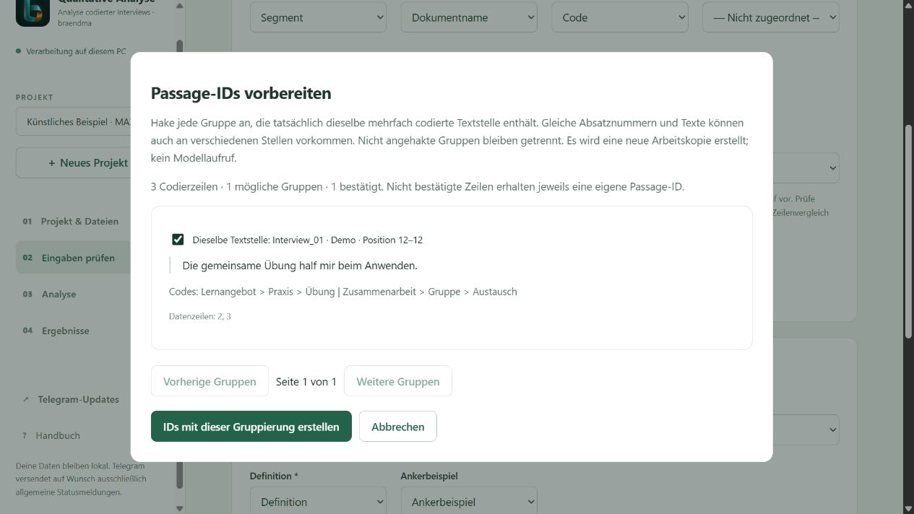

# Handbuch · Qualitative Analyse mit Ollama

Dieses Handbuch begleitet dich vom ersten Start bis zum erneuten Analyselauf mit geprüften Codierungen. Alle Personen, Texte und Beurteilungen in den Beispielen sind erfunden. Stand: 0.3.0-dev, vor der nächsten Beta.

Du erreichst die bebilderte Fassung jederzeit über **Handbuch** neben **Telegram-Updates** in der Seitenleiste. Sie öffnet sich in einem eigenen Tab, damit deine aktuelle Arbeit geöffnet bleibt. Ohne laufende Oberfläche kannst du `docs/HANDBUCH.html` doppelklicken. Den Programmordner einschließlich der Bilder zusammenlassen.

## 1. Einrichten und starten

1. Das vollständige Programm von GitHub herunterladen und entpacken. Einzelne Python-Dateien reichen nicht aus.
2. Python ab Version 3.10 und Ollama installieren. Ein lokales Modell in Ollama bereitstellen; dessen Namen anschließend in der Oberfläche eintragen. Der Speicherbedarf hängt vom Modell und vom Kontextfenster ab.
3. Unter Windows einmal `Einrichtung.cmd` starten. Der Schritt installiert Python-Pakete und benötigt Internet, führt aber keine Interviewanalyse aus.
4. `Start_Oberflaeche.cmd` öffnen. Die Bedienung erfolgt im Browser; das Startfenster während eines Laufs geöffnet lassen.
5. Unter **Analyse → Systemprüfung ohne Modellaufruf** die Einrichtung prüfen. **Kurzen lokalen Modelltest vorbereiten** ist eine getrennte, optionale Aktion, die tatsächlich ein Modell lädt.

Die normale Installation verwendet lokales Ollama. Eine separat eingerichtete Cloud-Testumgebung ist daran zu erkennen, dass ihre Oberfläche ausdrücklich auf Cloud-Nutzung hinweist. Dort ausschließlich künstliche Testdaten verwenden. Deine Zugangsdatei gehört weder ins Repository noch in Beispielprojekte.

## 2. Zuerst die Demo kennenlernen

Auf der Startseite **Künstliche Beispieldaten laden** wählen. Das erzeugt ein eigenes Projekt mit 50 Codierzeilen, 43 Passagen und sechs erfundenen Personen. Das Laden sowie die Eingabeprüfung benötigen kein LLM. Unter **Eingaben prüfen** die Spalten kontrollieren und **Einstellungen speichern & Eingaben prüfen** anklicken. Bei Erfolg erscheinen die Zahlen für Codierzeilen, Passagen, Personen und Codepfade.

Für eine überschaubare erste Analyse unter **Analyse → Auswahl leeren** nur **Clusteranalyse** auswählen. Module mit Abhängigkeiten können weitere Vorstufen hinzufügen; die Zusammenfassung unter den Häkchen zeigt die tatsächlich ausgeführten Schritte. Erst **Prüfen & neuen Lauf starten** führt die Modellauswertung aus.

## 3. Eigenes Projekt und MAXQDA-Dateien

**＋ Neues Projekt** wählen, benennen und zwei Dateien laden: Interviewdatei sowie Kategoriensystem. Du kannst `.xlsx` und `.csv` mischen. Jede Datei darf maximal 20 MB groß sein. Das Programm legt Arbeitskopien an und verändert die ausgewählten Originaldateien nicht.

### Textstellen direkt aus MAXQDA exportieren

In MAXQDA die Übersicht/Liste der **codierten Segmente** öffnen und als Excel-Tabelle exportieren. Benötigt wird die Tabelle mit den tatsächlichen Textstellen, nicht nur das Codesystem mit Codenamen. Behalte nach Möglichkeit auch **Dokumentgruppe**, **Anfang** und **Ende** im Export. Die Schaltflächen und Menünamen können je nach MAXQDA-Version abweichen.

Die XLSX-Datei direkt bei **Interviewdatei auswählen** laden. Bei mehreren Tabellenblättern das Datenblatt mit Kopfzeile auswählen; die Blätter werden nicht zusammengeführt. Falls du die Tabelle nach Excel kopiert hast, muss sie dieselbe Struktur haben: eindeutige Spaltenüberschriften in Zeile 1, keine Titelzeilen darüber, keine verbundenen Zellen und keine leeren Fortsetzungszeilen anstelle von Dokumentnamen. Formeln in einer Kopie durch Werte ersetzen.

CSV geht weiterhin: als **UTF-8 mit Semikolon** speichern. Zeilenumbrüche innerhalb einer Textstelle müssen in derselben Zelle bleiben; Excel setzt beim CSV-Export die nötigen Anführungszeichen.

| Feld | Beispiel | Zuordnung |
|---|---|---|
| Dokumentname | Interview_01 | Person / Dokument |
| Code | Lernangebot > Praxis > Übung | Vergebener Code |
| Segment | Die gemeinsame Übung half mir beim Anwenden. | Text / Segment |
| Anfang, Ende | 12, 12 | Automatisch für Passage-Vorschläge erkannt |
| Dokumentgruppe | Gruppe_A | Automatisch zur Trennung der Vorschläge verwendet |
| segment_id | Z001 | Optional: ohne Spalte automatisch erzeugt |
| PassageID | P001 | Vorhandene ID verwenden oder vorbereiten lassen |

Jede Zeile enthält **eine Codierung**. Bei mehreren Codes für dieselbe Textstelle gibt es mehrere Zeilen. Codepfade verwenden ` > ` zwischen den Ebenen. Mehrere Codes in einer Sammelzelle werden nicht automatisch aufgeteilt. Dokument-/Personenkennungen müssen im Projekt eindeutig sein; gleich benannte Dokumente aus unterschiedlichen Gruppen sollten vorher unterscheidbare Namen erhalten.

### Kategoriensystem vorbereiten

Die separate Tabelle braucht mindestens **Kategorie** und **Definition**. Optional sind **Unterkategorie**, **Ausprägung**, **Facette**, **Ankerbeispiel**. Jede Zeile beschreibt einen vollständigen Codepfad. Höhere Ebenen je Zeile wiederholen; nicht benötigte tiefere Ebenen bleiben leer.

| Kategorie | Unterkategorie | Ausprägung | Definition | Ankerbeispiel |
|---|---|---|---|---|
| Lernangebot | Praxis | Übung | Aussagen über das eigene praktische Erproben. | Ich konnte das Verfahren selbst ausprobieren. |
| Zusammenarbeit | Gruppe | Austausch | Aussagen über gegenseitige fachliche Hilfe. | Die Erklärung eines anderen Teilnehmers half mir. |

Die Definition legt die inhaltliche Bedeutung fest. Ein Beispiel illustriert sie. Offene redaktionelle Notizen wie „überlegen“ gehören nicht unbeabsichtigt in Codepfade. Das Programm muss jeden Code aus der Interviewdatei im Kategoriensystem wiederfinden.

## 4. IDs ohne händisches Nummerieren

**Zeilen-IDs entstehen bereits automatisch**, wenn keine ID-Spalte vorhanden ist. Vorhandene eindeutige IDs können zugeordnet bleiben. Sie kennzeichnen einzelne Codierzeilen, auch wenn derselbe Text mehrfach codiert wurde.

Eine **Passage-ID** verbindet dagegen die Codierzeilen derselben tatsächlichen Textstelle. Für diese Zuordnung gibt es unter **Eingaben prüfen → Passage-IDs vorbereiten** einen Assistenten:

1. Person/Dokument, Text und Code zuordnen. Die Passage-ID zunächst nicht zuordnen, wenn sie fehlt.
2. **Passage-IDs vorbereiten** anklicken. Das Programm vergleicht Dokumentgruppe, Dokumentname, Anfang, Ende und den exakten Segmenttext. Es verwendet kein LLM und keine Ähnlichkeitssuche.
3. Die vorgeschlagenen Gruppen prüfen. Nur Gruppen anhaken, die dieselbe tatsächliche Textstelle abbilden. Bei vielen Vorschlägen mit **Weitere Gruppen** weitergehen; gesetzte Häkchen bleiben erhalten.
4. **IDs mit dieser Gruppierung erstellen** wählen. Alle Zeilen erhalten automatisch IDs in einer neuen Arbeitskopie. Bestätigte Gruppen teilen eine Passage-ID; nicht bestätigte Zeilen bleiben getrennt. Keine Zeile wird gelöscht. Die Oberfläche ordnet die neuen Spalten zu und wählt den Mehrfachvergleich.
5. Anschließend **Einstellungen speichern & Eingaben prüfen** anklicken.

**Warum kurz prüfen?** Bei Textdokumenten sind Anfang und Ende in MAXQDA Absatznummern. Derselbe kurze Satz kann innerhalb eines Absatzes mehrfach vorkommen. Daher beweisen selbst identische Positionen und Texte keine eindeutige gemeinsame Zeichenposition. Die endgültige Gruppierung wird bewusst bestätigt. Bei Unsicherheit den **Zeilenvergleich** verwenden; dieser benötigt keine Passage-ID. Quelle: [MAXQDA: Übersicht codierter Segmente](https://www.maxqda.com/help/segment-retrieval/overview-of-coded-segments).

Beispiel: Zwei Zeilen aus Interview_01, Absatz 12, mit genau demselben Text und den Codes „Übung“ und „Austausch“ können eine Passage bilden. Derselbe Wortlaut in Interview_02 oder Absatz 30 wird nicht vorgeschlagen. Überlappende Ausschnitte mit unterschiedlichem Text bleiben ebenfalls getrennt. Bestehende Passage-IDs werden vom Assistenten nicht überschrieben.

## 5. Spalten und Untersuchung prüfen

Unter **Projekt & Dateien** die Beschreibung der Studie, Teilnehmende und Methodik ausfüllen. Diese Angaben werden später dem Modell mitgegeben. Unter **Eingaben prüfen** alle Spalten kontrollieren; nicht vorhandene optionale Ebenen als **Nicht zugeordnet** belassen.

Die Eingabeprüfung kontrolliert Pflichtfelder, IDs und Codepfade. Sie bewertet noch nicht die fachliche Qualität einer Codierung. Bei Fehlern steht beispielsweise, welche Spalte oder welcher Code fehlt. Nach jeder Änderung erneut prüfen. Ein früherer grüner Prüfbefund gilt nicht für geänderte Eingaben.

Mit **Kategorienversionen vergleichen** lassen sich eine vorher gültige und die aktuelle Tabelle gegenüberstellen. Die Ansicht nennt neue, entfernte und geänderte Kategorien sowie betroffene Codierzeilen. Sie codiert nichts automatisch um.

## 6. Module auswählen

| Modul | Nutzen |
|---|---|
| Clusteranalyse | Gruppiert Inhalte innerhalb eines Codepfads. |
| Code-Verifikation | Prüft die vorhandene menschliche Zuordnung. |
| Blindcodierung | Codiert anhand des Kategoriensystems ohne Vorgabe des menschlichen Codes. |
| Coding Agreement | Vergleicht Zuordnungen rechnerisch, einschließlich Abweichungen. |
| Cluster-Zusammenfassungen | Fasst Cluster inhaltlich zusammen. |
| SWOT und Meta-SWOT | Ordnet und verdichtet Stärken, Schwächen, Chancen und Risiken. |
| Personenanalyse und Personenvergleich | Untersucht einzelne Personen sowie Gemeinsamkeiten und Unterschiede. |
| Kontrast-, Relations- und Ambivalenzanalyse | Sucht Gegenfälle, Zusammenhänge und gegenläufige Aussagen. |
| Evidenz-Audit | Prüft Befunde auf vorhandene Gegenbelege. |
| Prüfliste | Stellt Fälle für die menschliche Nachprüfung zusammen. |
| Gesamtsynthese | Führt vorgelagerte Befunde zusammen. |

Die Oberfläche zeigt die genaue Bezeichnung und benötigte Vorstufen unter jedem Häkchen. Nicht jeder Schritt passt zu jeder Fragestellung. **Codierungen prüfen** stellt eine Auswahl zur Validierung zusammen; für die Rückmeldungsfunktion zusätzlich **Prüfliste** auswählen. Mehr Module können mehr Modellaufrufe und Laufzeit verursachen.

## 7. Start, Fortschritt und Wiederaufnahme

Unter **Lokales Modell auswählen** den installierten Namen eintragen. **Installierte Modelle anzeigen** fragt nur die Liste ab. Kontextfenster und Antwortlimit zunächst aus der passenden Konfiguration übernehmen. Das Antwortlimit muss kleiner als das Kontextfenster sein; Thinking muss zum Modell passen.

**Prüfen & neuen Lauf starten** speichert die aktuellen Einstellungen, prüft nochmals und erzeugt einen eigenen Lauf. In der Browseransicht siehst du abgeschlossene Module, das aktuelle Modul und – sofern vom Modul gemeldet – bearbeitete Fälle und Modellantworten. Eine längere Modellantwort kann Zeit beanspruchen, ohne dass die Fallzahl steigt.

**Nach diesem Modul pausieren** beendet zuerst das laufende Modul. **Diesen Lauf fortsetzen** verwendet dessen gespeicherte Eingaben und Einstellungen. Ein neuer Lauf verwendet dagegen den aktuellen Projektstand. Erfolgreiche Teilschritte werden bei zulässiger Wiederaufnahme weiterverwendet; geänderte Eingaben oder Programmstände können eine Wiederaufnahme ausschließen. Dann einen neuen Lauf starten und die vorherigen Ergebnisse behalten.

## 8. Berichte öffnen und später wiederfinden

Unter **Ergebnisse** bleiben die Läufe des ausgewählten Projekts gespeichert. Nach einem erfolgreichen Abschluss erscheint **Interaktiven Bericht öffnen**. Der Gesamtbericht enthält die Markdown-Berichtsteile der ausgeführten Module und eingebettete unterstützte Diagramme. Rohdaten, Excel-Exporte und die bearbeitbare Prüfliste werden separat geöffnet.

- **Bericht durchsuchen:** Filtert Berichtsteile nach dem Suchbegriff. Navigation zu einem Abschnitt hebt den Suchfilter auf.
- **Alles aufklappen / zuklappen:** Steuert die sichtbaren Abschnitte.
- **Speichern:** Lädt die HTML-Datei herunter. Sie funktioniert offline, einschließlich der eingebetteten Grafiken.
- **Drucken / PDF:** In der heruntergeladenen HTML-Datei verfügbar. Beim Drucken werden alle Berichtsteile aufgeklappt, auch zuvor ausgefilterte.

Zum späteren Wiederöffnen die Oberfläche starten, dasselbe Projekt auswählen und **Ergebnisse** öffnen. Es ist kein erneuter Modellaufruf nötig. HTML entsteht nur nach vollständigem erfolgreichem Lauf; bei Fehler oder Pause stehen bereits fertige Einzelergebnisse zur Verfügung. Fehlende oder zu große Grafiken werden im Bericht kenntlich gemacht.

Alte Läufe vor diesem Patch besitzen noch keinen automatisch erzeugten HTML-Gesamtbericht. Fortgeschrittene können ihn ohne LLM nacherstellen: `python src/html_report.py --run-dir "Pfad zum abgeschlossenen Lauf"`. Eine bestehende HTML-Datei bleibt erhalten; ein weiterer Export erhält einen neuen Namen. Die reguläre Ergebnisansicht kennt den Standardnamen `gesamtbericht.html`.

## 9. Codierungen prüfen und Rückmeldung geben

Wenn das Modul **Prüfliste** ausgeführt wurde, unter **Ergebnisse → Codierungen im Projekt prüfen** öffnen. Die kritischen Fälle sind zunächst gefiltert. Suche und Seitennavigation helfen bei größeren Listen.

Pro Fall die Originalstelle, menschliche Codes und Modellvorschläge lesen. Entscheidung, finale Codes und gegebenenfalls Begründung eintragen. Die Anwendung speichert Entscheidungen lokal als Prüfversionen. Den Speicherstatus beachten; **Jetzt speichern** ist zusätzlich möglich. Bei einem Speicherfehler die Meldung beheben und den Entwurf als JSON sichern. **Prüftabelle als Excel exportieren** bietet eine lesbare Arbeits-/Dokumentationsfassung; sie ist kein automatischer MAXQDA-Rückimport.

Die herunterladbare HTML-Prüfliste ist eine separate Offline-Variante. Dortige Änderungen sind nicht automatisch mit dem Projekt synchronisiert. Für die integrierten Folgeläufe die Prüfung innerhalb der Oberfläche verwenden.

## 10. Mit Entscheidungen weiterarbeiten

Nach Abschluss der kritischen Prüfungen bietet die Oberfläche an, **mit geprüften Codierungen einen neuen Lauf vorzubereiten**. Zuerst erscheint eine Vorschau der tatsächlichen Änderungen. Fälle ohne finale Codes müssen gegebenenfalls ausdrücklich aus der neuen codierten Eingabe ausgeschlossen werden.

**Neue Version vorbereiten** erstellt eine neue Eingabeversion und bewahrt Ursprungslauf und Originalcodierungen. Danach die Module prüfen und den neuen Lauf bewusst starten. Deine Entscheidungen ändern die Codierungen der neuen Eingabe; sie trainieren das Modell nicht. Das LLM sieht die korrigierte Grundlage erst bei diesem erneuten Lauf.

**Kategorienvorschläge vorbereiten** ist eine zweite, optionale Funktion. Ein gesonderter Modelllauf verwendet Originalstellen, abgeschlossene Entscheidungen und das bisherige Kategoriensystem. Er schlägt mögliche Definitionsergänzungen, Trennungen oder Zusammenfassungen vor. Nichts davon wird automatisch übernommen. Prüfe die Vorschläge fachlich, bearbeite eine neue Version deiner Kategorientabelle und vergleiche sie anschließend unter **Eingaben prüfen**.

## 11. Telegram-Updates einrichten

Telegram ist optional. Der Browser zeigt den Fortschritt auch ohne Bot. Bei **Telegram-Updates** einen Bot-Token eingeben oder aus einer Textdatei laden, die Ziel-Chat-ID eintragen, Ereignisse auswählen und speichern. Der Bot muss zuvor im eigenen Telegram-Chat mit `/start` angesprochen worden sein. Die Chat-ID ist nicht die Telefonnummer.

Ein leeres Tokenfeld behält den gespeicherten Token. Eine neue Eingabe ersetzt ihn beim Speichern; **Token entfernen** deaktiviert Benachrichtigungen. Unter Windows kann der Token benutzergebunden verschlüsselt gespeichert werden; sonst gilt er nur für die Sitzung. Die Testnachricht wird erst durch den entsprechenden Knopf versendet. Telegram erhält allgemeine Statusmeldungen, keine Interviewtexte, Codes, Projektnamen oder Dateipfade.

## 12. Aufbewahren, teilen und Probleme lösen

Die Oberfläche speichert Projekte normalerweise im Ordner `local_app_data` beim Programm; ein über `--data-dir` gewählter Speicherort kann davon abweichen. Für eine Sicherung die Anwendung nach Ende aller Läufe schließen und den vollständigen Datenordner sichern. Einzelne Ergebnisdateien enthalten nicht alle Eingabe- und Prüfversionen. Das Löschen von Programm-/Projektordnern entfernt möglicherweise gespeicherte Arbeit.

| Situation | Nächster Schritt |
|---|---|
| Oberfläche nicht erreichbar | Startdatei erneut öffnen; den frisch geöffneten Link verwenden. |
| XLSX abgewiesen | Datenblatt, Kopfzeile, Dateigröße und Formeln prüfen; alte XLS als XLSX speichern. |
| Code unbekannt | Vollständigen Pfad einschließlich aller Ebenen und Schreibweise mit dem Kategoriensystem vergleichen. |
| Passage-IDs fehlen | Assistent mit MAXQDA-Positionsspalten verwenden oder Zeilenvergleich wählen. |
| Gleiche Passage-ID mit abweichendem Text | Gruppierung im Export korrigieren; überlappende Ausschnitte nicht künstlich gleichsetzen. |
| Ollama nicht erreichbar | Ollama starten, Systemprüfung ausführen und installierten Modellnamen prüfen. |
| Lauf fehlgeschlagen | Laufprotokoll speichern und Fehlermeldung prüfen; nach Behebung fortsetzen oder neuen Lauf starten. |
| Gesamtbericht fehlt | Status prüfen: HTML entsteht nach erfolgreichem Abschluss; ältere Läufe gegebenenfalls nacherstellen. |
| Bild fehlt im HTML | Hinweis im Bericht lesen und einzelne Grafik öffnen; Exportgrenzen bzw. fehlende Datei prüfen. |

Vor dem Teilen HTML, Excel und Berichte auf enthaltene Originaltexte und Beurteilungen prüfen. Die HTML-Datei enthält die eingebetteten Daten selbst. Reale Studienunterlagen, private Konfigurationen und Schlüssel gehören nicht in ein öffentliches GitHub-Repository. Weitere technische Details: [Bedienoberfläche](BEDIENOBERFLAECHE.md), [Erweiterungen](EXTENSIONS.md) und [Versionshinweise](RELEASE_NOTES.md).
