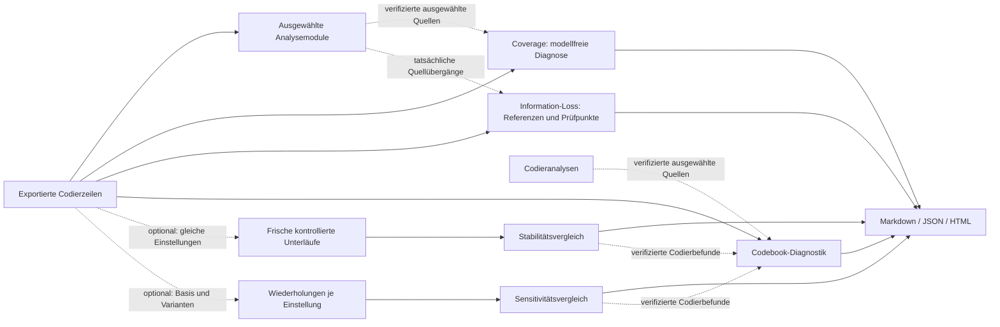

Mehrfachcodierung, Prüfliste und mehrstufige Gesamtsynthese: [EXTENSIONS.md](EXTENSIONS.md). Die folgenden zeilenweisen Kennzahlen beziehen sich auf den Single-Label-Modus.

# Erweiterung: Coding-Validierung

Die 15 Basismodule bleiben verfügbar. Optional ergänzen `coverage` und
`information_loss` sowie `codebook_diagnostics` ihre Ergebnisse. Zusätzlich können
`stability` und `sensitivity` ausdrücklich neue kontrollierte Modellläufe anfordern:



Die gestrichelten Quellenverbindungen zu Coverage, Audit und Codebook schalten
keine Analyse zusätzlich ein. Wiederholungen werden dagegen nur durch die
ausdrücklich aktivierten Diagnosemodule mit ausgewählten Zielen angefordert. Technische
Ausfälle werden im vorläufigen Bericht ausgewiesen und bei Resume erneut geprüft.
Coverage, Audit und Codebook-Diagnostik benötigen keine zusätzlichen Modellaufrufe.
Stabilität und Sensitivität verursachen zusätzliche Modellläufe mit hohem bzw.
sehr hohem Aufwand. Alle fünf sind standardmäßig aus und teilen die vorhandene Ausführungs-/Resume-Logik und den
Überschreibschutz; [Felder und Beispiel](CONFIGURATION.md).

Die in Entwicklung befindlichen wissenschaftlichen Diagnosen verwenden dieselben
deklarativen Modul-Outputs und Run-Manifeste. Die bereits getestete gemeinsame
Quellenprojektion ist in [DIAGNOSTICS.md](DIAGNOSTICS.md) beschrieben; sie fügt keinen
zweiten Workflow-Runner hinzu.

Der YAML-gesteuerte Workflow enthält drei zusätzliche Module. Der generische
Runner `00_WORKFLOW_RUNNER.py` wurde dafür nicht verändert; Aktivierung,
Abhängigkeiten, Argumente, Outputs und Berichtseinbindung stehen ausschließlich
unter `pipeline.modules` in `config/config_v2.yaml`.

## Eingaben

- `maxqda_export.csv` bzw. eigener MAXQDA-Export als UTF-8-CSV mit Semikolon
- `Kategoriesystem.csv` als UTF-8-CSV mit Semikolon
- erwartete Codebuchspalten: `Kategorie`, `Unterkategorie`, `Ausprägung`,
  `Facette`, `Definition`, `Ankerbeispiel`

Übliche alternative Spaltenbezeichnungen werden erkannt. Fehlen notwendige
Spalten oder Dateien, bricht das jeweilige Modul mit einer konkreten Meldung ab.
Leere Hierarchieebenen bleiben bewusst leer, weil das reale Kategoriesystem auch
Codes auf höheren Ebenen enthält. Der vollständige Codepfad wird aus allen
nichtleeren Hierarchiekomponenten mit ` > ` gebildet.

## Module

1. `code_verification.py` prüft den menschlich vergebenen vollständigen
   Codepfad gegen Definition und Ankerbeispiel. Nicht existierende LLM-Codes und
   fremde Segment-IDs werden abgewiesen. Originaltexte werden deterministisch
   aus den tatsächlichen Segmentdaten übernommen.
2. `blind_coding.py` übergibt dem LLM Segment und Codebuch, jedoch nicht den
   menschlich vergebenen Code. Zulässig sind ausschließlich vorhandene
   vollständige Codepfade sowie `unklar` und `keine_zuordnung`.
3. `coding_agreement.py` arbeitet rein deterministisch. Es erzeugt exakte und
   hierarchische Agreement-Werte, Verwechslungspaare, Konfusionsmatrix,
   Falllisten und – sofern methodisch sinnvoll – exploratives Cohen's Kappa für
   single-label nominale exakte Codes. Die Kennzahl ist ausdrücklich als
   **Human–LLM Coding Agreement**, nicht als klassische Interrater-Reliabilität,
   bezeichnet.

## Outputs

```text
code_verification_v1.md
code_verification_v1.json
blind_coding_v1.md
blind_coding_v1.json
coding_agreement_v1.md
coding_agreement_v1.json
coding_agreement_confusion.png   # wenn eine Matrix sinnvoll darstellbar ist
code_verification.log
blind_coding.log
coding_agreement.log
```

Die drei Logdateien enthalten Start und Abschluss des jeweiligen Moduls,
Fallzahlen und Fehlermeldungen. Die LLM-Module protokollieren außerdem
verworfene, nicht im Kategoriesystem vorhandene Alternativcodes. Die Logs
enthalten standardmäßig keine vollständigen Rohantworten des LLM.

`code_verification` und `blind_coding` zeigen während der Verarbeitung außerdem
einen Konsolenfortschritt mit `verarbeitet/gesamt`, Prozentwert, bisheriger
Laufzeit und geschätzter Restzeit. Die Schätzung stabilisiert sich erst nach
mehreren Segmenten und kann bei unterschiedlich langen Reparaturaufrufen
schwanken.

## Optionaler LLM-Raw-Audit

Die unveränderten LLM-Antworten sind standardmäßig deaktiviert:

```yaml
coding_validation:
  log_raw_llm_output: false
```

Mit `true` entstehen zusätzlich:

```text
code_verification_raw.jsonl
blind_coding_raw.jsonl
```

Jede JSONL-Zeile enthält Zeitstempel, Modul, Segment-ID, Aufruftyp
(`initial`/`repair`), den unveränderten Raw-Output sowie den anschließenden
Validierungsstatus. Die Dateien werden fortgeschrieben und können sensible,
aus Interviewmaterial abgeleitete Inhalte enthalten. `coding_agreement` hat
keinen Raw-Audit, weil dieses Modul kein LLM aufruft.

Start des vollständigen Workflows:

```bash
python run_workflow.py
```

Für Tests liegt unter `tests/` ein synthetischer semikolon-getrennter Datensatz
mit Mock-LLM-Antworten. Der Test benötigt kein laufendes Ollama-Modell.


## Fehlerbehandlung, Laufverzeichnisse und Wiederaufnahme

Siehe [ROBUSTNESS.md](ROBUSTNESS.md) für Vorprüfung, vollständige Hierarchien, technische Statusfelder, Checkpoints, Kontextgrenzen und Agreement-Voraussetzungen. Ohne `--output-dir` erstellt die CLI neben der tatsächlich verwendeten Eingabedatei einen neuen Ordner `QualitativeAnalyse_<Lauf-ID>`. Maßgeblich ist `--csv`, falls angegeben, sonst `paths.input_csv` aus der Konfiguration; relative Konfigurations-Eingaben werden gegen deren Ordner aufgelöst. Ein explizites `--output-dir` bleibt relativ zum aktuellen Arbeitsordner, wird bei Bedarf angelegt und enthält wie bisher Unterordner `<Lauf-ID>`. Vor dem neuen Lauf wird die Beschreibbarkeit geprüft. Bei einem ungültigen oder nicht beschreibbaren Ziel erfolgt eine Fehlermeldung, kein Ausweichen in AppData oder einen temporären Ordner. `--validate-only` prüft die Analysedaten, noch nicht die spätere Schreibbarkeit des Ergebnisziels. Resume verwendet unverändert den ausdrücklich angegebenen bestehenden Laufordner und prüft dessen Herkunft. `--resume` akzeptiert nur unveränderte Eingaben und überprüfte Ergebnisse. Die künstlichen Beispieldaten sind in [DEMO_DATA.md](DEMO_DATA.md) beschrieben.

## Optionale kontrollierte Stabilitätsläufe

Das off-default Modul `stability` führt ausgewählte Analysen samt Vorstufen als frische Unterläufe aus und integriert `stability.md` in Markdown- und HTML-Gesamtbericht. Es benötigt `requires_model: true` und `starts_child_runs: true`; Zielauswahl und Anzahl stehen unter `diagnostics.stability`. Der gemeinsame Runner prüft den Plan auch mit `--validate-only`. [Bedienung und Grenzen](HANDBUCH.html#stabilitaet-kontrollierter-wiederholungen), [Konfiguration](CONFIGURATION.md). Es handelt sich um zusätzliche Läufe, keine Wiederverwendung als neue unabhängige Stichprobe.

## Optionale Sensitivitätsläufe

`sensitivity` ist standardmäßig aus. Ziele, Varianten und Wiederholungen stehen unter `diagnostics.sensitivity`. Der bestehende Runner führt Basis und jede Variante in frischen Unterläufen aus, mit Pause/Resume und eigener Serie `_sensitivity_repetitions`. Ausgaben: `sensitivity.json` und `sensitivity.md`, letzteres automatisch im HTML-/Markdown-Gesamtbericht. Aktivierte Stabilität läuft zusätzlich und wird nicht als Sensitivitätsbasis wiederverwendet. Keine Diagnose darf rekursiv als Ziel gewählt werden.

## Aufwand bei der Modulauswahl

Alle Standardmodule zeigen ihren relativen Eigenaufwand und eine Einsatzempfehlung. Vorstufen kommen hinzu; Wiederholungen und Varianten verursachen zusätzliche Ausführungen. Die Klassen enthalten keine Laufzeit- oder Preisgarantie. [Erläuterung und vollständige Übersicht im Handbuch](HANDBUCH.md#aufwandprofile).

## Finale Validierungsanalyse

Das optionale Preset ergänzt die fünf Diagnosen und erforderliche Basisanalysen, ohne einen Lauf zu starten. Bestehende Varianten bleiben erhalten; fehlende Varianten ausdrücklich festlegen. Die neue Aufwandübersicht trennt Hauptlauf und zusätzliche Wiederholungen. [Anleitung und Rechenbeispiel](HANDBUCH.md#finale-validierungsanalyse-und-aufwandübersicht).


## Zusammenhängende Diagnosen und lesbarer Laufstatus

Sind Codebook-Diagnostik und Stabilität/Sensitivität ausgewählt, nutzt die
Codebook-Diagnostik die passenden verifizierten Codiervergleiche desselben Laufs.
Sie zeigt schwankende Code-Vorkommen mit getrennten Nennern und verweist auf den
jeweiligen Diagnoseabschnitt. Die Verbindung schaltet keine Wiederholung ein
und deutet Unterschiede nicht als bewiesene Codefehler.

Der Serienbalken zählt abgeschlossene, geprüfte Wiederholungen. Ein separater Bereich zeigt die aktuelle Einstellung und Wiederholung, das aktive Modul sowie dessen gemeldete Arbeitseinheiten und aktive Modellanfragen. Browser und Telegram halten diese Ebenen getrennt: Drei von acht Arbeitseinheiten einer Wiederholung sind kein zusätzlicher Anteil am Serienbalken und keine Schätzung der verbleibenden Zeit. Ist eine Gesamtzahl unbekannt, wird sie nicht als null ausgegeben.

Scheitert eine kontrollierte Wiederholung, zeigen Laufkarte und Teilbericht die gesicherte Fehlerkategorie und passende Schritte, beispielsweise bei zu kleinem Kontextfenster, Speichermangel oder einem Anbieterkontingent. Der Teilbericht nennt die betroffene Wiederholung und das Modul. Alte oder unvollständige Fehlerdaten werden ausdrücklich als unbekannt gekennzeichnet. Rohprotokolle, Eingabetexte und Zugangsdaten werden nicht in diese Hinweise übernommen. Fortsetzen erhält die ursprünglichen Einstellungen; geänderte Einstellungen benötigen einen neuen Lauf.

Der HTML-Gesamtbericht lässt sich als einzelne Datei offline lesen, durchsuchen und über die Druckfunktion als PDF speichern; seine eingebetteten Bilder bleiben enthalten. Die vollständigen Diagnose-JSON-Dateien sind jedoch separate Dateien. Bei langen Diagnosen enthält HTML dieselbe gekennzeichnete Auswahl wie der Markdown-Bericht. Weitere Befunde und Einzelzähler findest du in der Oberfläche unter „Ergebnisse → Einzelberichte und Datendateien“ bei der jeweiligen JSON-Datei. Wer nur die HTML-Datei erhält, erhält diese zusätzlichen JSON-Daten nicht. Für eine vollständige Detailprüfung die benötigten JSON-Dateien gezielt mitgeben; ein PDF enthält nur die gedruckte Ansicht.


## Ablage im Entwicklungsstand P01b

Neue technische Appdaten liegen unter Windows in `%LOCALAPPDATA%\QualitativeAnalyse`, unter macOS in `~/Library/Application Support/QualitativeAnalyse`, unter Linux bei absolut gesetztem `XDG_DATA_HOME` in `$XDG_DATA_HOME/QualitativeAnalyse`, sonst in `~/.local/share/QualitativeAnalyse`. Ein eindeutig vorhandener alter `QualitativeOllama`-Ordner wird weiterverwendet; es wird nichts verschoben. Werden mehrere bestehende Ablagen gefunden, mit `--data-dir` ausdrücklich die gewünschte auswählen.

**Entwicklungsstand P01b – Ergebnisziel in der Oberfläche:** Vor einem neuen Analyselauf unter **Projekt & Dateien → Speicherort für Analyseergebnisse** den vollständigen Pfad zu einem vorhandenen Ordner eintragen. Dafür den Ordnerpfad aus der Explorer-Adressleiste oder über „Pfadname kopieren“ im Finder kopieren und **Ordner prüfen** wählen. Der Browser kennt den ursprünglichen Ordner einer hochgeladenen Datei nicht. Ein nativer Ordnerauswahldialog ist noch nicht vorhanden; die neue Ablage ist noch keine Freigabe fertiger Windows-/macOS-Installationspakete.

Jeder neue App-Lauf bekommt im gewählten Ziel einen eigenen Ordner `QualitativeAnalyse_<Datum>_<Job-ID>/`. Analyseberichte und Moduldateien liegen darunter in `runs/<Lauf-ID>/`; Prüfentscheidungen und deren Versionen in `review/`. Geprüfte Folgeeingaben werden zusätzlich unter `review/followups/<Revision-ID>/` mit `segments.csv`, `codebook.csv`, `review_snapshot.json` und einem Inhaltsnachweis abgelegt. Eine Zieländerung gilt nur für neue Läufe. Wiederaufnahme, Berichtsaufruf und Prüfung bestehender Läufe bleiben an deren ursprünglichen Ordner gebunden. Ist er nicht verfügbar oder passt seine gespeicherte Zuordnung nicht mehr, erscheint ein Hinweis; es gibt keinen Ersatzordner in AppData. Alte Läufe behalten ihre bisherige Ablage und bleiben dort lesbar.

Die technische Projektverwaltung, Einstellungen und unveränderlichen Eingabe-/Konfigurationskopien bleiben im App-Datenordner. Für eine vollständige Sicherung nach Abschluss aller Läufe sowohl diesen Datenordner als auch die gewählten Forschungsordner sichern.
